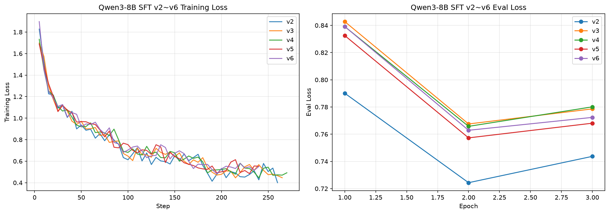
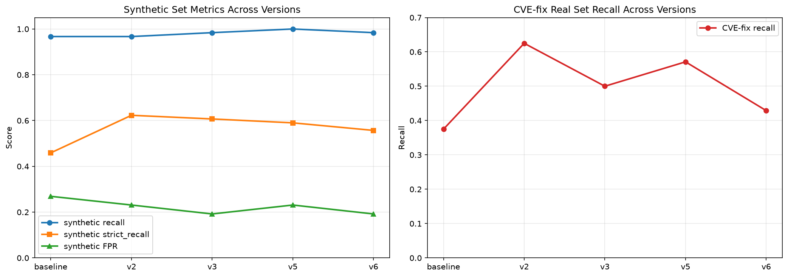

# 基于大语言模型的代码安全分析系统

> 本地部署的开源大语言模型驱动的代码漏洞检测系统，对比传统基于规则的静态分析工具，验证 LLM 在代码安全审计中的语义理解优势。

[](experiments/exp_06_finetune/results/EXPERIMENT_LEDGER.md)
[](docs/方法.md)
[](规划.md)
[]()

## 目录

- [快速开始](#快速开始)
- [使用指南](#使用指南)
  - [Web 界面](#web-界面)
  - [命令行工具 CLI](#命令行工具-cli)
  - [VS Code 插件](#vs-code-插件)
  - [IntelliJ 插件](#intellij-插件)
- [卸载](#卸载)
- [核心结果](#核心结果)
- [当前状态与待决策](#当前状态与待决策)
- [项目简介](#项目简介)
- [实验环境](#实验环境)
- [项目结构](#项目结构)
- [当前进度](#当前进度)
- [研究主线与实验体系](#研究主线与实验体系)
- [技术架构与全栈](#技术架构与全栈)
- [模型部署与版本管理](#模型部署与版本管理)
- [实验复现](#实验复现)
- [评估方法学](#评估方法学)
- [参考资源](#参考资源)
- [故障排查](#故障排查)
- [约定与备注](#约定与备注)

***

## 快速开始

### 前置条件

| 条件 | 要求 | 说明 |
|------|------|------|
| 操作系统 | Windows 10+ / Linux / macOS | 三平台均支持 |
| Python | 3.10+ | 启动脚本会检测并自动安装依赖 |
| pip | 任意可用版本 | 首次运行自动 `pip install -r requirements.txt && pip install -e .` |
| 磁盘空间 | ≥ 8 GB | 模型权重约 5 GB + 依赖包约 2 GB + 向量库缓存 |
| 内存 | ≥ 8 GB | 模型推理需要占用内存；8 GB 为最低线，16 GB 以上更流畅 |
| GPU（可选） | NVIDIA / AMD(ROCm) / Apple Silicon ≥ 4 GB | 无 GPU 时自动回退 CPU 推理（速度约为 GPU 的 1/10~1/20） |
| Ollama | 首次运行自动安装 | 若自动安装失败，请手动从 [ollama.com/download](https://ollama.com/download) 安装 |
| git（可选） | 任意版本 | 仅 GitHub 仓库扫描功能需要 |
| 网络 | 首次需要联网 | 下载依赖包 + Ollama 模型；后续可离线运行 |

> ⚠️ **Windows 下 LlamaCPP 后端暂不支持 RTX 50 系列与 AMD 显卡**
>
> 受 Windows 上 `llama-cpp-python` 预编译二进制与编译工具链限制，**LlamaCPP 后端在 Windows 端暂不支持 RTX 50 系列（Blackwell）与 AMD 显卡**（易报 DLL / 编译类错误）。若你使用这两类显卡：
>
> - **推荐改走默认 Ollama 后端**（兼容性最好，通常无需额外配置）；
> - 或使用 **Linux** 系统运行 LlamaCPP / Transformers 后端（Linux 端支持性较好）。
>
> 完整平台支持见下方「[后端平台支持矩阵](#后端平台支持矩阵)」。

### 路径一：终端用户（只想用扫描器）

适合只想使用漏洞扫描功能、不需要复现实验的用户。一条命令搞定。

```bash
git clone <repo-url> && cd Graduation-Project

# Windows
app\launcher\start_windows.bat

# Linux / macOS
bash app/launcher/start_linux_macos.sh
```

启动脚本会自动完成以下全部步骤：

1. **检测并安装 Python 核心依赖**——首次运行自动执行 `pip install -r requirements.txt && pip install -e .`
2. **选择推理后端**——启动器会提示选择 Ollama / Transformers / LlamaCPP；默认根据环境变量自动解析
3. **自动安装后端专属依赖**——若选择 Transformers / LlamaCPP，启动器会按当前 OS 与 GPU 自动下载正确的 `torch` / `transformers` / `peft` / `bitsandbytes` / `llama-cpp-python`（支持 Windows/Linux/macOS × NVIDIA/AMD/Apple/CPU）
4. **检测并安装 Ollama**——使用 Ollama 后端时自动安装/启动（其他后端跳过）
5. **硬件检测与自适应配置**——自动检测 GPU/CPU/RAM，按显存分档选择推理参数（`num_ctx` / `num_gpu` / 量化等级）
6. **拉取模型**——Ollama 后端自动下载 `garrywhite109909/graduation-vuln-scanner:v9max`（约 5 GB，Q4 量化）；若拉取失败则回退到官方 `qwen3:8b`
7. **启动后端**——FastAPI 服务监听 `http://127.0.0.1:8765`
8. **打开浏览器**——自动跳转到 `http://localhost:8765`

> 首次启动因需下载模型（约 5 GB）或后端依赖（torch 等约 2-4 GB），耗时取决于网速，请耐心等待。后续启动通常 10 秒内完成。

> ⚠️ **Linux 用户：Ollama 模型存储统一到项目目录（只需一次）**
>
> 本项目把 Ollama 模型统一放在项目内 `models/ollama/`（后端调用路径，避免模型落系统目录）。但 Linux 上用官方脚本自动安装的 Ollama 会被注册成 **systemd 服务**（`ollama.service`），它开机自启、始终用系统默认存储（`~/.ollama/models`）占用 `11434` 端口，与项目存储冲突。首次使用前请执行一次：
>
> ```bash
> sudo systemctl disable --now ollama
> ```
>
> 之后启动器会自己用 `OLLAMA_MODELS=models/ollama` 启动 Ollama，模型全部落在项目目录，前端状态一致。
> **Windows / macOS 无需此步骤**（winget/brew 安装不注册系统服务，启动器直接接管）。

### 路径二：开发者 / 复现实验

适合需要复现实验、修改代码或参与开发的用户。需手动管理 conda 环境。

```bash
git clone <repo-url> && cd Graduation-Project

# 1. 创建并激活 conda 环境（推荐）
conda create -n graproj python=3.11 -y
conda activate graproj

# 2. 安装依赖 + 注册核心包
pip install -r requirements.txt
pip install -e .

# 3. 启动扫描器（与路径一相同的启动脚本，但使用当前 conda 环境）
bash app/launcher/start_linux_macos.sh    # Linux / macOS
app\launcher\start_windows.bat            # Windows

# 4. 复现实验（详见「实验复现」章节）
ollama pull qwen2.5-coder:7b              # 实验基座模型
cd experiments/exp_01_basic_scan && python3 run_experiment.py
```

> **环境约定**：所有实验脚本（尤其 exp_03 / exp_04 RAG 相关）依赖 `chromadb`、`sentence-transformers` 等包，这些只在 `graproj` conda 环境中安装。请在运行任何实验前激活该环境，否则会出现 `ModuleNotFoundError`。

### 手动启动（不用启动脚本）

如果不想用启动脚本（例如已在 IDE 中配置好环境），可以手动分步启动：

```bash
# 1. 确保 Ollama 运行
ollama serve &

# 2. 确保模型已拉取
ollama pull garrywhite109909/graduation-vuln-scanner:v9max

# 3. 启动后端
uvicorn app.backend.main:app --host 127.0.0.1 --port 8765

# 4. 浏览器访问
open http://localhost:8765        # macOS
xdg-open http://localhost:8765    # Linux
start http://localhost:8765       # Windows
```

### 切换推理后端

默认使用 **Ollama** 后端（兼容性最好、对硬件要求最低）。如需使用进程内后端复现论文中的 95% CVE-fix recall，可在启动器提示时选择 `Transformers` 或 `LlamaCPP`，或在启动前设置环境变量：

```bash
# Transformers 后端（NF4 基座 + FP16 LoRA，需 6GB+ 显存或足够内存）
export VULN_SCANNER_BACKEND=transformers
export VULN_SCANNER_ADAPTER=/path/to/v9max_lora
bash app/launcher/start_linux_macos.sh

# LlamaCPP 后端（Q4 GGUF + 运行时 LoRA，实验性）
export VULN_SCANNER_BACKEND=llamacpp
export VULN_SCANNER_GGUF=/path/to/qwen3-8b-q4_k_m.gguf
export VULN_SCANNER_ADAPTER=/path/to/v9max_lora
bash app/launcher/start_linux_macos.sh
```

Windows 使用 `set` 代替 `export`。选择进程内后端后，启动器会自动按你的 OS/GPU 下载对应版本的 `torch`、`transformers`、`llama-cpp-python` 等依赖。

> ⚠️ **显存与平台说明**
> - Transformers 后端推荐 NVIDIA/AMD 显存 ≥ 6GB；4GB 显存会被强制走 CPU，速度显著下降。
> - `bitsandbytes` 已支持 NVIDIA CUDA、AMD ROCm（Linux 预览，部分 Windows 预览）、CPU-only（Windows/Linux/macOS）以及 Apple Silicon（慢速 CPU 路径）。启动器会自动安装，但 ROCm/Apple/CPU 上 4bit 速度远慢于 NVIDIA CUDA，追求速度请改用 Ollama 后端。
> - LlamaCPP 后端可纯 CPU 运行（`n_gpu_layers=0`），也可按编译选项启用 CUDA/ROCm/Metal。**Windows 端暂不支持 RTX 50 系列与 AMD 显卡**（见上方提示）。

#### 后端平台支持矩阵

各推理后端在不同平台 / 显卡上的支持情况总结如下（**Windows 端限制较多，Linux 端支持性普遍较好**）：

| 后端 | 平台 | NVIDIA CUDA | RTX 50 系（Blackwell） | AMD(ROCm) | Apple Silicon | 纯 CPU |
|------|------|------------|----------------------|-----------|---------------|--------|
| **Ollama**（默认） | Windows / Linux / macOS | ✅ | ✅（内置运行时自带 CUDA） | ✅ | ✅ | ✅ |
| **Transformers** | Linux | ✅ | ✅ | ✅（ROCm 预览） | ✅（慢速 CPU 路径） | ✅ |
| | Windows | ✅ | ⚠️ 需额外 CUDA Toolkit | ❌（不支持 AMD） | — | ✅ |
| **LlamaCPP** | Linux | ✅ | ✅ | ✅ | ✅ | ✅ |
| | Windows | ✅ | ❌（暂不支持） | ❌（暂不支持） | — | ✅ |

> **结论**：追求设备兼容性优先选 **Ollama** 后端；确认要在 Windows 上使用进程内后端（Transformers / LlamaCPP）时，请先核对上表——**Transformers 的 Windows 端不支持 AMD，LlamaCPP 的 Windows 端暂不支持 RTX 50 系与 AMD**。若你使用上述受限组合，建议改用 Linux 或回退 Ollama。
>
> 💡 现有 RTX 5050 显卡在 Windows 上源码编译 LlamaCPP 均未成功。若你有编译成功经验（例如改用 **Ninja 生成器** 等方案），欢迎分享至 <3284263390@qq.com>。

### 环境变量配置

启动器和后端通过以下环境变量控制行为，按需设置：

| 环境变量 | 默认值 | 说明 |
|----------|--------|------|
| `VULN_SCANNER_BACKEND` | 自动解析 | 推理后端：`ollama` / `transformers` / `llamacpp`；未设置但配了 `VULN_SCANNER_ADAPTER` 或在 `models/` 下探测到 adapter 时自动选 `transformers` |
| `VULN_SCANNER_ADAPTER` | 自动探测 `models/` | Transformers/LlamaCPP 后端：LoRA adapter 目录（含 `adapter_model.safetensors`）。未设置时自动查找项目根目录 `models/` 下的合法 adapter 目录 |
| `VULN_SCANNER_GGUF` | 无 | LlamaCPP 后端必填：Q4 GGUF 基座文件路径 |
| `VULN_SCANNER_MODEL` | `garrywhite109909/graduation-vuln-scanner:v9max` | Ollama 模型名 |
| `VULN_SCANNER_FALLBACK_MODEL` | `qwen3:8b` | 主模型拉取失败时的回退模型 |
| `VULN_SCANNER_AUTO_INSTALL_DEPS` | 未设置 | `1` 强制重新检查/升级依赖；`0` 禁用自动安装（只打印手动命令） |
| `VULN_SCANNER_PIP_INDEX` | 无 | 覆盖 pip 镜像源，例如 `https://pypi.tuna.tsinghua.edu.cn/simple` |
| `VULN_SCANNER_RAG` | `0` | 设为 `1` 启用 RAG 知识库增强 |
| `VULN_SCANNER_PREFILTER` | `1` | 设为 `0` 关闭传统工具预筛 |
| `OLLAMA_BASE_URL` | `http://localhost:11434` | Ollama 服务地址 |
| `VULN_SCANNER_NUM_CTX` | 自动检测 | 模型上下文窗口大小 |
| `VULN_SCANNER_NUM_GPU` | 自动检测 | GPU 层数（0 = 纯 CPU） |
| `VULN_SCANNER_NUM_THREAD` | 自动检测 | CPU 推理线程数 |

***

## 使用指南

系统提供**四种**使用方式：**Web 界面**、**命令行工具**、**VS Code 插件**、**IntelliJ 插件**。四种方式暂时共享同一个后端服务，功能对等。

### Web 界面

启动后端后浏览器访问 `http://localhost:8765`，包含四个页面：

#### 页面总览

| 页面 | 路径 | 功能 |
|------|------|------|
| 仪表盘 | `/index.html` | 扫描历史统计、引擎健康状态、最近发现漏洞一览 |
| 扫描工作台 | `/scan.html` | 核心扫描入口，支持四种输入方式 |
| CWE 样本库 | `/cwe.html` | 16 类常见 CWE 漏洞的代码示例与修复方案（可搜索） |
| 安全态势 | `/posture.html` | 安全态势总览 |

#### 扫描工作台使用

扫描工作台是核心功能页，提供四种扫描输入方式（Tab 切换）：

**1. 粘贴代码**

1. 选择「粘贴代码」Tab
2. 在语言下拉框中选择代码语言（Python / JavaScript / TypeScript / Java / PHP / Go / HTML）
3. 在文本框中粘贴源代码
4. 点击「开始分析」按钮
5. 等待 LLM 推理完成（单文件约 5-15 秒），结果区显示漏洞判定、CWE 类型、风险等级、漏洞说明与修复建议

**2. 上传文件**

1. 选择「上传文件」Tab
2. 将文件拖拽到上传区域，或点击区域选择文件（支持多文件）
3. 点击「开始分析」按钮
4. 批量扫描时显示实时进度条（已扫描 / 总数），逐个文件返回结果
5. 扫描完成后可点击「下载报告」按钮导出 Markdown 格式报告

**3. URL 扫描**

1. 选择「URL」Tab
2. 输入目标站点 URL（如 `https://example.com`）
3. 点击「开始分析」按钮
4. 系统自动抓取页面中的 `<script>` 标签内容，逐个扫描
5. 结果显示页面标题、发现脚本数、各脚本的漏洞分析

**4. GitHub 仓库扫描**

1. 选择「GitHub」Tab
2. 输入仓库地址（如 `https://github.com/user/repo`）
3. 设置最大扫描文件数（默认 20，大仓库建议限制）
4. 点击「开始分析」按钮
5. 系统浅克隆仓库 → 遍历代码文件 → 批量扫描，完成后显示汇总

#### 高级选项

在扫描工作台点击「高级选项」可展开：

| 选项 | 说明 |
|------|------|
| 多模型投票 | 勾选后选择 ≥ 2 个模型，系统顺序加载各模型并投票聚合结果（更准但更慢） |
| 外部工具扫描 | 勾选后同时调用 Bandit / Semgrep / Gitleaks / Trivy 做传统规则扫描，结果与 LLM 分析融合展示 |

#### 结果展示

每个文件的扫描结果包含：

- **漏洞判定**：发现漏洞 / 安全 / 无法判定
- **CWE 类型**：如 CWE-89 SQL 注入
- **风险等级**：Critical / High / Medium / Low
- **Source & Sink**：污点来源与触发点（如适用）
- **漏洞说明**：自然语言解释漏洞原理
- **修复建议**：可执行的修复代码或方案
- **模型原始输出**：LLM 的完整 JSON 输出

#### API 文档

后端提供完整的 REST API，访问 `http://localhost:8765/docs` 查看 Swagger 交互文档。主要端点：

| 方法 | 路径 | 功能 |
|------|------|------|
| GET | `/api/health` | 健康检查（Ollama + vLLM + 外部工具状态） |
| GET | `/api/stats` | 仪表盘统计数据 |
| POST | `/api/analyze` | 单文件分析（JSON body） |
| POST | `/api/batch` | 批量扫描（文件上传，NDJSON 流式进度） |
| POST | `/api/url-scan` | URL 抓取扫描 |
| POST | `/api/github-scan` | GitHub 仓库扫描 |
| POST | `/api/external-scan` | 外部工具扫描（Bandit/Semgrep/Gitleaks/Trivy） |
| POST | `/api/verify-fix` | 修复建议验证（语法校验 + 危险模式检查） |
| POST | `/api/multi-model-scan` | 多模型投票扫描 |
| POST | `/api/vllm-analyze` | vLLM 推理后端单文件分析 |
| GET | `/api/report` | 下载最近批量扫描的 Markdown 报告 |
| POST | `/api/report/single` | 分析并下载单文件 Markdown 报告 |

API 调用示例（以单文件分析为例）：

```bash
curl -X POST http://localhost:8765/api/analyze \
  -H "Content-Type: application/json" \
  -d '{
    "code": "import sqlite3\ndef get_user(name):\n    c = sqlite3.connect(\"db\").cursor()\n    c.execute(\"SELECT * FROM users WHERE name='\''\" + name + \"'\''\")",
    "language": "python",
    "filename": "vuln.py"
  }'
```

### 命令行工具 CLI

CLI 工具直接复用 `Scanner` 引擎，**无需启动 FastAPI 后端**即可使用。适合脚本化批量扫描或 CI/CD 集成。

```bash
python -m app.launcher.vuln_scanner_cli <command> [options]
```

#### 命令一览

| 命令 | 功能 | 示例 |
|------|------|------|
| `health` | 健康检查（Ollama 连接 + 模型可用性） | `python -m app.launcher.vuln_scanner_cli health` |
| `scan <file>` | 扫描单个文件 | `python -m app.launcher.vuln_scanner_cli scan app/main.py` |
| `batch <dir>` | 批量扫描目录下所有代码文件 | `python -m app.launcher.vuln_scanner_cli batch ./src --output report.md` |
| `url <url>` | 扫描 URL 抓取的脚本 | `python -m app.launcher.vuln_scanner_cli url https://example.com` |
| `github <repo>` | 扫描 GitHub 仓库（浅克隆） | `python -m app.launcher.vuln_scanner_cli github https://github.com/user/repo` |

#### 全局参数

| 参数 | 默认值 | 说明 |
|------|--------|------|
| `--model` | `garrywhite109909/graduation-vuln-scanner:v9max` | Ollama 模型名 |
| `--ollama-url` | `http://localhost:11434` | Ollama 服务地址 |
| `--rag` | 关闭 | 启用 RAG 知识库增强（较慢但更准） |
| `--format` | `text` | 输出格式：`text`（终端着色）或 `json`（结构化） |

#### 常用示例

```bash
# 健康检查
python -m app.launcher.vuln_scanner_cli health

# 扫描单个文件，显示详细分析（含说明与修复建议）
python -m app.launcher.vuln_scanner_cli scan app/main.py --verbose

# 扫描单个文件，启用 RAG，输出 JSON 并保存
python -m app.launcher.vuln_scanner_cli scan app/main.py --rag --format json --output result.json

# 批量扫描目录，导出 Markdown 报告
python -m app.launcher.vuln_scanner_cli batch ./src --output report.md

# 批量扫描，限制最多 20 个文件，不递归子目录
python -m app.launcher.vuln_scanner_cli batch ./src --limit 20 --no-recursive

# 扫描 GitHub 仓库，最多 50 个文件
python -m app.launcher.vuln_scanner_cli github https://github.com/user/repo --max-files 50 --output repo_report.md

# 切换模型
python -m app.launcher.vuln_scanner_cli --model qwen2.5-coder:7b scan app/main.py
```

#### 支持的文件类型

`.py` `.js` `.ts` `.jsx` `.tsx` `.java` `.php` `.go` `.html` `.htm` `.vue` `.svelte`

### VS Code 插件

VS Code 插件提供编辑器内直接扫描、诊断标记和工作区批量扫描功能。

#### 安装

**方式 A：从 VSIX 安装（推荐，普通用户）**

1. 下载插件包 [`releases/vuln-scanner-1.2.1.vsix`](releases/vuln-scanner-1.2.1.vsix)（仓库已附带，clone 后可直接使用）
2. 打开 VS Code → 左侧扩展面板 → 右上角 `⋯` → **从 VSIX 安装**
3. 选择 `.vsix` 文件 → 安装完成 → 重载窗口

**方式 B：从源码打包（开发者）**

```bash
cd app/vscode-extension
npm install -g @vscode/vsce
vsce package   # 生成 vuln-scanner-1.2.1.vsix
```

再按方式 A 安装生成的 `.vsix`。

#### 前置条件

1. VS Code ≥ 1.80
2. **后端服务已启动并保持运行**：通过 `start_windows.bat` 启动后端（详见「快速开始」），插件所有扫描都依赖该后端，后端关闭则插件无法工作

#### 命令

| 命令 | 触发方式 | 功能 |
|------|----------|------|
| AI 漏洞扫描: 分析当前文件 | 右键编辑器 / 命令面板 / 编辑器标题栏盾牌图标 | 扫描当前打开的文件 |
| AI 漏洞扫描: 批量扫描工作区 | 命令面板 | 扫描工作区所有代码文件 |
| AI 漏洞扫描: 扫描指定文件夹 | 命令面板 | 弹窗选择文件夹后扫描 |
| AI 漏洞扫描: 清除诊断标记 | 命令面板 | 清除编辑器中的波浪线标记 |

> 打开命令面板：`Ctrl+Shift+P`（Windows/Linux）或 `Cmd+Shift+P`（macOS），搜索"漏洞扫描"即可看到全部命令。

#### 配置项

在 VS Code 设置中搜索 `vulnScanner` 配置：

| 配置项 | 默认值 | 说明 |
|--------|--------|------|
| `vulnScanner.backendUrl` | `http://localhost:8765` | 后端服务地址 |
| `vulnScanner.useRag` | `false` | 是否启用 RAG 知识库增强 |
| `vulnScanner.markDiagnostics` | `true` | 发现漏洞时在编辑器中标记波浪线 |
| `vulnScanner.autoScanOnSave` | `false` | 保存文件时自动扫描（实验性） |
| `vulnScanner.workspaceExclude` | `["**/node_modules/**", ...]` | 批量扫描时排除的 glob 模式 |
| `vulnScanner.workspaceMaxFiles` | `50` | 批量扫描最多扫描文件数 |
| `vulnScanner.requestTimeout` | `300000` | 单次请求超时时间（毫秒） |

#### 使用流程

1. 启动后端服务（双击 `start_windows.bat`，选 Web 模式 / 插件模式 / 全部均可，后端会常驻后台）
2. 在 VS Code 中打开任意项目或单个代码文件
3. 打开代码文件 → 右键 → 「AI 漏洞扫描: 分析当前文件」
4. 扫描结果以 Webview 面板展示，包含漏洞判定、CWE 类型、风险等级、修复建议
5. 若启用诊断标记，漏洞行会显示红色波浪线
6. 如需批量扫描：命令面板 → 「AI 漏洞扫描: 批量扫描工作区」

### IntelliJ 插件

IntelliJ 插件提供编辑器内选中代码的扫描功能，结果以气球通知展示。

#### 安装

**从磁盘安装（唯一方式）**

1. 下载插件包 [`releases/vuln-scanner-0.1.0.zip`](releases/vuln-scanner-0.1.0.zip)（仓库已附带，clone 后可直接使用）
2. 打开 IntelliJ IDEA → `File` → `Settings` → `Plugins`
3. 点击右上角齿轮图标 ⚙️ → **Install Plugin from Disk...**
4. 选择 `vuln-scanner-0.1.0.zip` → 安装 → 重启 IDEA

#### 前置条件

1. **IntelliJ IDEA**（Community 或 Ultimate 均可）
2. **后端服务已启动并保持运行**：通过 `start_windows.bat` 启动后端（详见「快速开始」），插件所有扫描都依赖该后端，后端关闭则插件无法工作

#### 使用方式

1. 启动后端服务（双击 `start_windows.bat`，选 Web 模式 / 插件模式 / 全部均可，后端会常驻后台）
2. 在 IntelliJ IDEA 中打开任意项目或代码文件
3. 在编辑器中**选中要扫描的代码**（未选中时扫描整个文件）
4. 右键 → **AI 漏洞扫描**（或快捷键 `Ctrl+Shift+V`）
5. 等待扫描完成，结果以气球通知形式弹出，显示漏洞类型、风险等级、触发点

#### 与 VS Code 插件的差异

| 特性 | VS Code 插件 | IntelliJ 插件 |
|------|-------------|--------------|
| 结果展示 | Webview 面板（详细） | 气球通知（摘要） |
| 诊断标记 | 红色波浪线 | 暂未实现 |
| 批量扫描 | 支持 | 暂未实现 |
| 后端 API | `/api/analyze` | `/api/analyze` |

> 完整的 IntelliJ 插件文档见 [app/intellij-extension/README.md](app/intellij-extension/README.md)。

## 卸载

### 一键卸载

| 平台 | 入口 |
|---|---|
| Windows | 双击 `uninstall_windows.bat`，或运行 `python uninstall.py` |
| Linux / macOS | 运行 `bash uninstall.sh`，或运行 `python3 uninstall.py` |

常用参数（`python uninstall.py --help` 可查看全部）：

- `--yes`：全自动，跳过所有确认；
- `--dry-run`：模拟，只列出将要删除的内容，不实际删除；
- `--keep-project`：保留项目文件夹（只清依赖和数据）；
- `--keep-ollama`：保留 Ollama 本体与模型；
- `--keep-accel`：保留 CUDA/ROCm 系统组件。

### ⚠️ 必须用安装时的同一个 Python 环境卸载

依赖装进哪个 Python 环境，就必须用哪个环境卸载：

- **路径一（终端用户）**：依赖是启动器用系统 Python 自动安装的，直接运行卸载脚本即可；
- **conda / venv 用户**：安装时先激活过环境，卸载前也必须先激活同一个环境（如 `conda activate graproj`）再运行卸载脚本；
- 卸载脚本只清理“运行它的那个 Python 环境”，换环境运行会提示“未发现本项目相关包”并跳过，等于没有真正卸载。

> 实验/训练环境（`graproj`、`AI` 等）是开发者自用环境，普通用户不需要创建。**不要在实验/训练环境里运行卸载**——它会把训练相关包（transformers、peft、accelerate 等）和共享缓存一并删掉。

### 卸载范围

脚本会按本机实际检测结果动态清理：

1. 后端进程（端口 8765）与 Ollama 服务进程；
2. 当前 Python 环境中的本项目相关包（torch、fastapi、chromadb、sentence-transformers、tree-sitter 等）；
3. Ollama 拉取的模型（`~/.ollama`，以及 `OLLAMA_MODELS` 指定的目录）；
4. Ollama 本体：Windows（winget/官方卸载器）、macOS（Homebrew/官方 App）、Linux（apt/dnf/pacman/zypper/apk/官方脚本）；
5. Linux 系统级 CUDA / ROCm 组件（需 sudo，仅 apt 系发行版）；
6. 本地运行数据：`data/chroma_db`、`outputs/`、`logs/`、`__pycache__`、`*.egg-info`、`.pytest_cache`、HuggingFace/torch/chroma 缓存等；
7. 已安装的 VS Code 扩展（`graduation-project.vuln-scanner`）与 IntelliJ 插件（尽力而为）；
8. 整个项目文件夹（Windows 下同样有效）。

### 不会自动删除的内容

- **外部扫描工具**（bandit / semgrep / gitleaks / trivy）：这些是共享系统工具，可能被其他项目使用，卸载脚本不会动它们；如需删除请按安装方式手动卸载（如 `pip uninstall bandit semgrep`、`choco uninstall gitleaks trivy`）；
- **conda 环境本身**（如 `graproj`、`AI`）：卸载脚本只清当前环境里的包，不会删除任何 conda 环境；开发者如需清理可自行 `conda env remove -n graproj`；
- **npm 全局包**（如 `@vscode/vsce`）：如需删除请手动 `npm uninstall -g @vscode/vsce`。
- **其他项目也在用的通用基础库**（如 urllib3、certifi、typing-extensions 等）：脚本只卸载本项目直接/间接相关的顶层包，保留这类共享基础库，避免影响同一环境里的其他程序。

### 注意事项

- `~/.ollama` 和 `~/.cache/huggingface` 是全局目录，卸载会删除里面**所有**模型/缓存（包括其他项目用到的），`--yes` 模式下不会再次确认，请提前确认；
- Windows 下直接运行 `python uninstall.py` 时脚本会自动切换 UTF-8 输出，双击 bat 也已设置 `chcp 65001`；
- 卸载脚本会逐项检查实际删除结果，失败项会明确报错，不会提示虚假成功；完成后请确认项目文件夹确实已删除。

***

## 核心结果

当前已发布最佳模型 **v9max**（Qwen3-8B-Instruct + 双模型蒸馏数据 7692 条，云端 A800 bf16 全精度 LoRA r=8 + rsLoRA 训练，Q4_K_M 量化部署）。后续训练版本 **Nivis-α0**（8616 条数据，9.3h A800 训练）已完成但**尚无评估数据**，论文/展示请以 v9max 为基准。

下表为 **HF 评估管道**（evaluate.py：NF4 4bit 基座 + FP16 LoRA 增量叠加）的结果：

| 测试集 | 样本数 | recall | FPR | accuracy | strict_recall |
|---|---|---|---|---|---|
| 合成集（87 段） | 87 | **1.000** | 0.423 | 0.874 | **0.607** |
| CVE-fix 真实集 | 20 | **0.950** | - | - | 0.650 |

**发布形态（Ollama GGUF Q4_K_M 合并量化）指标低于上表**——G0 方法学修复重跑（2026-08-08）实测：CVE-fix 真实集 recall **0.75~0.79**（base 15/19 含 1 条 parse_fail；combined 15/20）、合成集 recall 0.93~0.95。缺口来源不是"量化 vs 未量化"，而是**两种 4-bit 管道的差异**：HF 管道 LoRA 增量保持 FP16 精度，Ollama 发布形态把 base+LoRA 合并后整体压进 Q4_K_M，LoRA 信号被一并重量化。新装的 transformers 进程内后端（NF4 基座 + FP16 LoRA，设 `VULN_SCANNER_ADAPTER` 启用）可在部署侧复现 HF 管道精度。

与 Qwen3-8B 零样本锚点基线对比，v9max 将 **合成集 strict_recall 从 0.459 提升到 0.607（+14.8pp）**、recall 保持 1.000（0 FN），同时将 **CVE-fix 真实集 recall 从 0.375 提升到 0.950（+57.5pp，HF 管道；Ollama 发布形态为 0.75~0.79）**，大幅增强真实漏洞检出能力（合成集虚高 59.2pp 的问题在真实集上被有效收敛）。

> FPR（合成集 0.423）偏高，根因是模型"模式匹配 > 深度理解"，对部分防御措施（subprocess 参数化列表、shlex.quote、whitelist+abspath）产生误报；用户结论"误报总比漏报好"，FPR 收敛留待最终模型 Nivis-alpha.1 通过 DPO/GRPO/CoT 教学解决。

```text
strict_recall(合成集):  baseline 0.459 → v5 0.590 → v9max 0.607
CVE-fix recall(真实集):  baseline 0.375 → v5 0.571 → v9max 0.950（HF 管道）
                         v9max Ollama 发布形态（GGUF Q4_K_M）: 0.75~0.79（G0 重跑，2026-08-08）
```
> 完整台账见 [EXPERIMENT_LEDGER.md](experiments/exp_06_finetune/results/EXPERIMENT_LEDGER.md)；v9max 训练与评估详见 [docs/论文/第5章_训练主线.md](docs/论文/第5章_训练主线.md)。

***

## 当前状态与待决策

> **截至 2026-08-10**：exp_01~05 零样本基线 + Prompt 消融已完成；exp_06 完成 P0 parse_fail 修复、P1 CVE-fix 真实集校准、P2 本地 SFT 迭代（v2~v9）、**双模型 API 蒸馏 + 云端 A800 训练 v9max 并已发布**。**v9max 为当前已发布里程碑**。2026-08-09~10 完成后续版本 **Nivis-α0** 训练（8616 条，prompt 统一为 V3_PROMPT），但尚无评估数据，论文请以 v9max 为基准。最终模型 **Nivis-alpha.1** 将在此基础上完成 DPO/GRPO、数据飞轮与 CoT 教学，收敛 FPR 与 CWE 归因。

> **2026-08-08 追加**：`fix_suggestion` 已从"完整可运行修复代码（``` 围栏）"改为
> **行号锚定的单行局部修复建议**（如 `line 3: 应改为 ...`），原因：客户端 6K~8K
> 上下文放不下完整修复代码，且 FixVerifier 已证伪（14/15 空建议是模型没输出，不是
> 验证器问题）。schema/evaluate/verify-fix 已同步新口径，训练数据统一转换脚本见
> `experiments/exp_06_finetune/scripts/convert_fix_to_localized.py`。

| 阶段 | 内容 | 状态 |
|---|---|---|
| v9max 发布 | 双模型蒸馏 7692 条 → A800 bf16 训练 → Q4_K_M 发布为 Ollama 模型 | ✅ 已完成 |
| Nivis-α0 | 继续清洗 8616 条 + prompt 统一为 V3_PROMPT → A800 训练 9.3h | ✅ 已训练，待评估 |
| Nivis-alpha.1 | DPO/GRPO 偏好优化 + 数据飞轮 + CoT 教学，收敛 FPR 0.423 与 CWE 归因 | ⏳ 后续计划 |

***

## 项目简介

利用本地部署的开源大语言模型对源代码进行安全审计，目标是构建一个相比传统静态分析工具（Bandit / Semgrep / CodeQL）具备以下优势的系统：

| 维度   | 传统工具（Bandit/Semgrep） | 本系统（LLM 驱动）          |
| ---- | -------------------- | -------------------- |
| 检测方式 | 固定规则模式匹配             | 代码语义理解、上下文感知         |
| 漏洞覆盖 | 已知漏洞模式               | 可发现变体/非典型漏洞          |
| 输出形式 | 漏洞类型 + 规则编号          | 自然语言解释 + 修复建议 + 修复代码 |
| 多语言  | 工具专属规则集              | 跨语言统一理解              |
| 误报控制 | 规则泛化能力差              | 上下文判断过滤/净化逻辑         |

**核心卖点**：传统工具是"模式匹配"，本系统是"语义理解"。

***

## 实验环境

| 项目 | 配置 |
| --- | --- |
| CPU | AMD Ryzen 5 9600X × 12 |
| 内存 | 32 GB |
| 显卡 | AMD Radeon RX 9060 XT 16 GB |
| 操作系统 | Ubuntu 26.04 LTS（内核 7.0.0-15-generic） |
| 桌面环境 | GNOME 50 / Wayland |
| GPU 驱动 / 计算栈 | ROCm 7.2.4 + PyTorch 2.11.0+rocm7.2 |
| Python 环境 | miniconda `graproj`（Python 3.11） |
| 本地 LLM 服务 | Ollama |

### 模型清单

| 角色 | 模型 | 阶段 |
| --- | --- | --- |
| 推理基座 | `qwen2.5-coder:7b` | exp_01 ~ exp_05 |
| 训练 student(当前/已发布) | `Qwen/Qwen3-8B` + LoRA (r=8, rsLoRA) | exp_06 云端 A800 训练 v9max |
| 训练 student(本地历史) | `Qwen/Qwen3-8B` + 4bit QLoRA (r=8, rsLoRA) | exp_06 P2 本地 SFT v5 |
| 训练 student(历史) | Qwen2.5-Coder-7B-Base → KnItLM CPT (r=64) → merge 到 Instruct | exp_06 Phase 1-3(已归档) |
| PD teacher(已暂缓) | `qwen3-coder:30b`（MoE） | exp_06 Phase 4(已归档) |
| 蒸馏 teacher | DeepSeek V4-Flash / GLM-5.2（Kimi K3 未参与） | 双模型 API 蒸馏（7692 条） |
| 对照模型 | `deepseek-coder-v2:16b` / `qwen2.5-coder:14b` / `gemma4:12b` / `gemma4:26b` / `gpt-oss:20b` | exp_04 多模型对比 |

> 完整环境清单（Embedding 模型、向量库版本、传统工具版本等）见 [规划.md](规划.md) "实验环境"小节；训练与推理全链路技术栈见本文"技术架构与全栈"小节。
>
> 注：模型权重不入库（见 `.gitignore`）。推理基座需 `ollama pull qwen2.5-coder:7b`；训练基座从 HuggingFace 拉取。以上为台式机实验环境，笔记本仅用于代码编辑与文档审查。

***

## 项目结构

> 提示：大模型权重（`*.safetensors`/`*.gguf`）、`__pycache__/`、`*.log`、`outputs/` 中间 checkpoint 以及 `data/chroma_db/` 均已通过 [`.gitignore`](.gitignore) 排除。核心模块为 `graduation_project/`，实验按 `exp_01~06` 分阶段存放。

<details>
<summary>点击展开完整项目结构</summary>

```
Graduation-Project/
├── README.md                              # 本文档
├── .gitignore                             # 排除大模型/缓存/日志/中间 checkpoint
├── pyproject.toml                         # 项目元数据 + 依赖声明（支持 pip install -e .）
├── requirements.txt                       # 锁版本依赖清单
├── uninstall.py                           # 跨平台卸载主脚本（Windows/Linux/macOS）
├── uninstall.sh                           # Linux/macOS 卸载入口
├── uninstall_windows.bat                  # Windows 卸载入口
├── TODO.md                                # 代码审查问题清单（处理进度跟踪）
├── 规划.md                                 # 项目阶段规划与进度（唯一进度源）
├── app/                                   # Web 应用与启动器
│   ├── backend/                           #   FastAPI 后端 + 静态前端页面
│   │   ├── main.py                        #     API 入口（/api/* 路由）
│   │   ├── services/                      #     扫描/抓取/报告服务
│   │   └── static/                        #     HTML 前端（仪表盘/扫描台/CWE/态势）
│   ├── launcher/                          #   一键启动器
│   │   ├── bootstrap.py                   #     检测 Ollama/模型/启动后端/开浏览器
│   │   ├── start_windows.bat              #     Windows 一键启动
│   │   ├── start_linux_macos.sh           #     Linux/macOS 一键启动
│   │   └── vuln_scanner_cli.py            #     命令行扫描入口
│   ├── vscode-extension/                  #   VS Code 插件
│   └── intellij-extension/                #   IntelliJ 插件
├── docs/                                  # 设计文档与改进建议
│   ├── _archive/                          #   历史建议归档
│   │   ├── glm的建议_20260628.md          #     GLM 给出的改进路线建议
│   │   ├── kimi的建议_20260628.md         #     Kimi 给出的智能体分工建议
│   │   ├── 临时提示词_下一步计划_20260706.md #   exp_01~03 时代八大修复建议（已归档）
│   │   ├── wenti_20260719.md              #     r16_e5 时代问题分析笔记（历史快照）
│   │   ├── 方法_20260719_qwen25.md        #     Qwen2.5 时代训练方法体系（已归档）
│   │   ├── cpt_建议_20260719.md           #     CPT 数据策略建议（已归档）
│   │   ├── 改进_历史分析_20260710.md      #     r8_e1 训练问题分析（已归档）
│   │   ├── 脚本审查遗留问题_20260722.md   #     全脚本审查遗留项（已归档）
│   │   ├── 对话_内部备忘.md               #     AI 对话过程记录（内部）
│   │   └── 必须手动学习的地方_内部备忘.md #     手工操作备忘（内部）
│   ├── 项目进展摘要.md                    #   面向导师/评审的一页纸进展摘要 ⭐
│   ├── 方法.md                            #   训练方法体系（QLoRA SFT、rsLoRA、DPO 尝试、评估指标）
│   ├── 过程.md                            #   实验过程记录（exp_01 ~ exp_06 时间线）
│   ├── 论文/                              #   毕业论文章节草稿
│   │   ├── 大纲.md                        #     论文结构与各章节数据映射
│   │   ├── 第1章_绪论.md                  #     研究背景、问题、贡献
│   │   └── 第5章_训练主线.md              #     exp_06 P0-P3 核心实验与结果
├── tools/                                 # 环境工具脚本（ROCm 安装/回滚等）
│   ├── install_rocm_7.2.4.sh              #   ROCm 7.2.4 安装脚本
│   └── revert_rocm_to_ubuntu.sh           #   ROCm 回滚到 Ubuntu 仓库版本脚本
├── graduation_project/                    # 核心代码库（pip install -e . 后可全局 import）
│   ├── __init__.py
│   ├── schema.py                          # 统一输出 schema（VERDICT_SCHEMA 唯一来源 + 解析函数）
│   ├── result_types.py                    # 扫描结果容器（SingleResult/BatchResult，核心层通用）
│   ├── prompts.py                         # 统一 Prompt 模板（SYSTEM_PROMPT + build_user_prompt）
│   ├── llm_client.py                      # Ollama LLM 客户端（支持 RAG 增强）
│   ├── transformers_client.py             # Transformers 进程内推理后端（Q4 基座 + FP16 LoRA）
│   ├── llamacpp_client.py                 # llama.cpp 客户端（GGUF 本地推理）
│   ├── vllm_client.py                     # vLLM 推理加速客户端
│   ├── chroma_manager.py                  # Chroma 向量数据库管理器（add / upsert / query）
│   ├── code_slicer.py                     # AST 代码切片器（tree-sitter，长文件按函数/块切分）
│   ├── prefilter.py                       # 传统规则预筛层（明显漏洞/安全样本短路跳过 LLM）
│   ├── taint_tracker.py                   # 轻量污点分析（同函数 source→sink 启发式匹配）
│   ├── external_scanner.py                # 外部工具扫描（Bandit / Semgrep / Gitleaks / Trivy）
│   ├── two_stage_scanner.py               # 两阶段架构：工具召回候选 + LLM 自一致率裁决
│   ├── fix_verifier.py                    # 修复建议验证（语法校验 + 危险模式移除检查）
│   ├── sarif_report.py                    # SARIF 2.1.0 报告导出
│   ├── paths.py                           # 路径解析（项目根 / 模型 / LoRA adapter）
│   └── semgrep_rules/                     #   Stage 1 工具召回规则（sqli/cmdi/codei taint）
├── app/backend/services/                  # 业务服务层（复用核心包，依赖 app 注册表/编排）
│   ├── scanner.py                         #   扫描编排（LLM 推理 + 切片 + RAG + 预筛）
│   ├── multi_model_scanner.py             #   多模型投票扫描（顺序加载/卸载避免 OOM）
│   ├── model_registry.py                  #   模型注册表（允许模型 + prompt 变体选择）
│   └── reporter.py                        #   扫描报告生成（单文件/汇总）
├── experiments/                           # 实验目录（按阶段编号）
│   ├── exp_01~05_summary.md               #   零样本推理基线五实验核心结论串讲 ⭐
│   ├── utils.py                           #   实验公共工具（manifest 加载 / 指标统计 / 结果落盘）
│   ├── exp_01_basic_scan/                 # 阶段一：LLM 漏洞检测能力摸底
│   │   ├── run_experiment.py              #   批量测试脚本（调 Ollama API + 增量落盘 + 自动卸载显存）
│   │   ├── exp_01_report.md               #   实验报告
│   │   ├── samples/                       #   14 段漏洞代码样本
│   │   │   ├── manifest.json              #     样本清单（含期望标签）
│   │   │   ├── sql_injection_01.py / 02.py
│   │   │   ├── xss_01.php / 02.js
│   │   │   ├── command_injection_01.py / 02.js
│   │   │   ├── path_traversal_01.py / 02.java
│   │   │   ├── hardcoded_secret_01.py / 02.java
│   │   │   ├── insecure_deserialization_01.py / 02.java
│   │   │   ├── safe_01_parameterized_query.py
│   │   │   └── safe_02_subprocess_list.py
│   │       └── results/
│   │           ├── results.qwen2.5-coder-7b.20260630.json   # 14 次推理的完整原始输出（带时间戳）
│   │           └── results.qwen2.5-coder-7b.json            # 同上内容副本
│   ├── exp_02_baseline_tools/             # 阶段二：传统工具对比基线
│   │   ├── run_baseline.py                #   Bandit + Semgrep 批量调用脚本
│   │   ├── exp_02_report.md               #   实验报告（含 LLM vs 传统工具横向对比）
│   │   ├── README.md                      #   实验说明
│   │   └── results/                       #   复用 exp_01 样本，结果按工具分组
│   ├── exp_03_rag_knowledge/              # 阶段三：RAG 知识库增强
│   │   ├── run_rag_experiment.py          #   RAG+LLM 批量对比实验脚本
│   │   ├── exp_03_report.md               #   实验报告（纯 LLM vs RAG+LLM 对比）
│   │   ├── results/                       #   实验结果
│   │   └── knowledge_data/
│   │       ├── knowledge.json             #   漏洞知识条目（手工编写，72 条，覆盖 39 类 CWE）
│   │       ├── build_knowledge.py         #   从 JSON 加载 → upsert 入库 Chroma（幂等可重复运行）
│   │       └── test_rag.py                #   单样本快速验证脚本（正式实验用 run_rag_experiment.py）
│   ├── exp_04_hard_samples/               # 阶段四：难样本压力测试 + 消融实验 + 多模型对比
│   │   ├── samples/                       #   87 段扩展样本（v2/v3，典型 36 + 安全 18 + 难 27 + 噪音 6）
│   │   │   ├── manifest.json              #     12 列 ground truth 标注
│   │   │   ├── typical_*.py/php/js         #     典型漏洞样本
│   │   │   ├── safe_*.py                  #     安全对照样本
│   │   │   ├── hard_bypass_*.py            #     绕过式过滤难样本
│   │   │   ├── hard_crossfile_*_{input,sink}.py  # 跨文件污点流难样本
│   │   │   ├── hard_cve_*.py              #     真实 CVE 片段难样本
│   │   │   ├── hard_longfile_*.py         #     长文件隐藏漏洞难样本
│   │   │   ├── hard_owasp_*.py            #     OWASP/DVWA 风格难样本
│   │   │   └── noise_*.py                 #     混淆/噪音样本
│   │   ├── run_experiment.py              #   P1-4：纯 LLM 重复实验 + 置信区间（--repeat N）
│   │   ├── run_rag_experiment.py          #   P1-5/P2-8：RAG 消融对照（--mode）+ Top-K（--top-k）
│   │   ├── run_v3_qwen7b_all.sh           #   v3 qwen7b 顺序跑 4 组消融 + 3 个 Top-K 的驱动脚本
│   │   ├── run_v3_multi_model.sh          #   v3 多模型横向对比驱动脚本（6 模型 × 87 段）
│   │   ├── rerun_fix_samples.py           #   结果审查修复重跑脚本
│   │   ├── generate_report.py             #   从 results/ 汇总生成 exp_04_report.md
│   │   ├── exp_04_report.md               #   实验报告（P1-4 + P1-5 + P2-8 + 多模型对比综合分析）
│   │   └── results/                       #   所有实验结果 JSON（含 _archive 历史版本）
│   ├── exp_05_prompt_ablation/            # 阶段五：Prompt 工程消融对比
│   │   ├── run_ablation.py                #   零样本 / Few-shot / 思维链 / 安全模式白名单 对比
│   │   ├── exp_05_report.md               #   实验报告
│   │   └── results/                       #   消融实验结果 JSON
│   └── exp_06_finetune/                   # 阶段六：网络安全专用模型训练(Qwen3-8B 路线)
│       ├── data/                          #   训练数据（入库以保证复现性）
│       │   ├── README.md                  #     数据字典：每个 jsonl 的状态与生成方式
│       │   ├── train_chatml_v5_clean.jsonl#     当前最佳 SFT 训练集（749 条）
│       │   ├── train_chatml_v6_hard_neg.jsonl   # v6 hard-negative 失败尝试（已归档）
│       │   ├── dpo_merged.jsonl           #     DPO 训练集（104 条，本地未使用）
│       │   ├── dpo_fp_pairs_v5.jsonl      #     基于 v5 FP 构造的 DPO pair（6 条）
│       │   ├── distill_corpus_annotated_v2.jsonl  # 教师 CoT 蒸馏 400 条（历史资产）
│       │   ├── _archive_cpt/              #     CPT 路线已归档数据
│       │   ├── _archive_supplement/       #     Phase 3 supplement 已归档
│       │   └── supplement_*.jsonl         #     各类对抗性补充样本（历史资产）
│       ├── configs/                       #   TunableOp 离线调优产物（RDNA4 加速）
│       │   ├── tunableop_untuned0.csv     #     Step 1：录制所有 GEMM shape
│       │   └── tunableop_tuned.csv        #     Step 2：调优后的最优 kernel 选择表（训练自动加载）
│       ├── scripts/                       #   训练 / 评估 / 数据生成脚本
│       │   ├── train_qlora.py             #     QLoRA SFT 主训练脚本
│       │   ├── train_dpo.py               #     DPO 训练脚本（本地不可行）
│       │   ├── evaluate.py                #     评估脚本（支持 best/checkpoint-N/final）
│       │   ├── build_dataset.py           #     手写样本 → train_chatml.jsonl
│       │   ├── combine_and_augment.py     #     合并蒸馏 + 手写 + 补充样本
│       │   ├── generate_distill_data.py   #     教师模型 CoT 蒸馏数据生成
│       │   ├── generate_fp_dpo_pairs.py   #     从评估结果提取 FP DPO pair
│       │   ├── merge_dpo_data.py          #     合并多版 DPO 数据
│       │   ├── build_v6_hard_negative.py  #     构建 v6 hard-negative 数据
│       │   ├── audit_leakage_precise.py   #     训练-测试泄漏审计
│       │   ├── compare_results.py         #     多评估结果对比
│       │   ├── prepare_cve_fix_testset.py #     CVE-fix 真实集抓取
│       │   └── run_eval_suite.py          #     评估流水线驱动
│       ├── outputs/                       #   训练产物（不入库；仅保留 best/，中间 checkpoint 已清理）
│       │   ├── lora_r8_a16_e3_lr0.0001_s42_rslora_v5/best/  # 当前最佳 SFT adapter
│       │   ├── lora_r8_a16_e3_lr0.0001_s42_rsloraqwen3_8b_sft_p2_v3/best/  # v3 adapter
│       │   ├── lora_r8_a16_e3_lr0.0001_s42_rsloraqwen3_8b_sft_p2_v4/best/  # v4（泄漏，历史）
│       │   ├── _archive_v6_hard_neg_failed/  # v6 失败归档
│       │   ├── _archive_dpo_failed_4bit_grad_zero/  # DPO 失败归档
│       │   ├── _archive_qwen25_7b/        #     Qwen2.5 时代所有 adapter
│       │   └── knitlm_cpt_r64_a128_e1.0_lr2e-05_rslora/best/  # Phase 3 CPT（历史）
│       ├── results/                       #   评估结果 JSON + 实验台账
│       │   ├── EXPERIMENT_LEDGER.md       #     实验台账（每次评估必登）
│       │   ├── baseline/                  #     Qwen3-8B 零样本基线与参考模型
│       │   ├── v2/                        #     SFT v2 评估结果
│       │   ├── v3/                        #     SFT v3 评估结果
│       │   ├── v4_failed/                 #     SFT v4（已废弃，训练-测试泄漏）
│       │   ├── v5/                        #     SFT v5 评估结果（历史最佳，已被 v9max 超越）
│       │   ├── v6_failed/                 #     SFT v6 hard-negative（已归档）
│       │   ├── phase1_sweep_summary.md    #     Phase 1 sweep 汇总表（历史）
│       │   ├── phase2_summary.md          #     Phase 2 汇总表（历史）
│       │   ├── phase3_summary.md          #     Phase 3 汇总表（历史）
│       │   └── _archive_qwen25/           #     Qwen2.5 时代所有评估结果
│       ├── testset_cve_fix/               #   CVE-fix 独立测试集（真实 commit，需 GITHUB_TOKEN）
│       │   ├── cve_fix_000*.py/js/java    #     修复前代码片段
│       │   └── manifest.json              #     测试集清单
│       └── logs/                          #   训练日志（不入库；train_log_*.json 含 dev_loss 曲线）
└── data/                                  # 本地持久化数据（不入库，见 .gitignore；首次运行 build_knowledge.py 后自动生成）
    └── chroma_db/                         #   Chroma 向量数据库
```

</details>

***

## 当前进度

> **总体状态**：零样本推理基线（exp_01~05）已全部完成；训练主线（exp_06）中，2026-07-22 切换至 Qwen3-8B 后完成 P0 parse_fail 修复、P1 CVE-fix 真实集校准、P2 本地 SFT 迭代（v2→v9）、P3 双模型蒸馏 + 云端 A800 训练 **v9max**（当前已发布最佳）。2026-08-09~10 完成后续版本 **Nivis-α0** 训练（8616 条，prompt 统一为 V3_PROMPT），但尚无评估数据。G0 方法学修复（文件名泄漏等 9 项）已全量重跑。详细进度见 [规划.md](规划.md) 与 [EXPERIMENT_LEDGER.md](experiments/exp_06_finetune/results/EXPERIMENT_LEDGER.md)。

### ✅ 阶段一：LLM 漏洞检测能力摸底（exp_01，2026-06-28）

- **qwen2.5-coder:7b**：14 段典型样本召回率 100%、误报率 0%、准确率 100%，平均 7.65s/样本
- 详见 [exp_01_report.md](experiments/exp_01_basic_scan/exp_01_report.md)

### ✅ 阶段二：传统工具对比基线（exp_02，2026-06-29）

- path_traversal_01.py 由 LLM 唯一检出，体现语义理解对模式匹配的优势；完整耗时与准确率对比见"研究主线与实验体系"小节中的"核心论点与论文定位"
- 详见 [exp_02_report.md](experiments/exp_02_baseline_tools/exp_02_report.md)

### ✅ 阶段三：RAG 知识库增强（exp_03，2026-06-29）

- 知识库 39→72 条，覆盖 39 类 CWE；qwen7b 在 RAG+LLM 下准确率 100%
- 详见 [exp_03_report.md](experiments/exp_03_rag_knowledge/exp_03_report.md)

### ✅ 阶段四：难样本压力测试 + 多模型对比（exp_04 v3，2026-07-05）

- v3 修复后 87 段样本（答案泄露已修复），qwen7b 纯 LLM 多数表决 recall=83.3%、FPR=33.3%、accuracy=78.2%
- 6 模型横向对比：gemma4:12b/26b 最优（准确率 94.3%），deepseek 误报率最高（44.4%）
- 详见 [exp_04_report.md](experiments/exp_04_hard_samples/exp_04_report.md)

### ✅ 阶段五：Prompt 工程消融（exp_05，2026-07-06 首轮；2026-08-02 在 Qwen3-8B 上重做）

- **首轮（qwen2.5-coder:7b）**：对比零样本 / Few-shot / 思维链（CoT）/ 安全模式白名单 四种 Prompt 策略，CoT 在 recall 上表现最优（95%）。
- **重做（Qwen3-8B，`ablation_v2`）**：在 87 段合成集上系统对比 8 种提示词变体，**`+consistency`（一致性约束）综合最优**——recall 0.967 / FPR 0.115 / accuracy 0.943，同时显著优于 base（recall 0.934 / FPR 0.192 / accuracy 0.897）。
- 结论：约束一致性（要求判定理由与结论自洽）能在不牺牲召回的前提下显著压低误报，是零样本条件下最有效的轻量手段；但 Prompt 工程触及天花板，无法替代模型层面的领域知识注入。
- 详见 [exp_05_report.md](experiments/exp_05_prompt_ablation/exp_05_report.md) 与 `experiments/exp_05_prompt_ablation/results/exp_05_prompt_ablation_v2.qwen3-8b.ablation_v2.repeat1.20260802_*.json`

### ✅ 阶段六：网络安全专用模型训练（exp_06 P0-P3，Qwen3-8B 路线，2026-07-27 起）

- **P0 parse_fail 修复**：max_tokens 1024→2048，parse_fail 18/87 → 0/87，新锚点 recall 0.967 / FPR 0.269 / strict_recall 0.459。
- **P1 CVE-fix 真实集校准**：8 样本真实 CVE-fix baseline recall 0.375，确认合成集虚高 59.2pp。
- **P2 本地 SFT 迭代**：v2/v3/v4/v5/v6/v7/v8/v9 多版迭代；v4 因测试集泄漏被废弃；v6 hard-negative 负迁移、v8 对比 CoT 判别焦虑被归档；v7 真实 CVE 泛化飞跃，v9 数据到极限转云端。
- **P3 DPO 本地不可行**：8bit OOM、4bit 梯度失效；DPO 数据保留待云 GPU 复用，成为"本地探索→云端放大"路线的转折点。
- 详见 [规划.md](规划.md) §三/§四、[EXPERIMENT_LEDGER.md](experiments/exp_06_finetune/results/EXPERIMENT_LEDGER.md) 与 [docs/论文/第5章_训练主线.md](docs/论文/第5章_训练主线.md)

### ✅ 阶段七：双模型蒸馏 + 云端 A800 训练 v9max 发布（2026-08-02 ~ 08-07）

- **双模型 API 蒸馏**：DeepSeek V4-Flash / GLM-5.2 双模型 API 蒸馏生成大规模训练数据（Kimi K3 未参与实际蒸馏），原始约 10700 条，经 CWE 归一化、泄漏审计、矛盾/重复清洗后最终 **7692 条**（漏洞 3493 / 安全 4199，安全占比 54.6%）。计划配比 1:3，清洗后实际约 1:1.2。
- **云端 A800 训练**：Qwen3-8B bf16 全精度 LoRA（r=8 + alpha=16 + dropout=0.1 + rsLoRA），train 6539 / dev 1153，2 epoch，lr=1e-4，max_seq 6144，1636 步，约 4.1h，train_loss ≈ 0.529。
- **v9max 评估**（HF 管道：NF4 基座 + FP16 LoRA）：合成集 87 段 recall 1.000 / FPR 0.423 / strict_recall 0.607；真实 CVE-fix 20 段 recall 0.95 / strict_recall 0.65 / fix_extracted 17/20，大幅增强真实漏洞检出。
- **G0 方法学修复重跑（2026-08-08）**：文件名泄漏修复后全量重跑。Ollama 发布形态（GGUF Q4_K_M 合并量化）CVE-fix recall 实测 0.75~0.79（base 15/19 含 1 parse_fail；combined 15/20），与 HF 管道 0.95 的缺口来自 LoRA 增量是否保 FP16 精度；exp_05 消融结论（combined 变体最优）在 v9max 合成集上成立（FPR 19.2%→7.7%），但不迁移到真实 CVE。详见 [docs/过程.md](docs/过程.md) 2026-08-08 节。
- **发布**：Q4_K_M 量化，发布为 Ollama 模型 `garrywhite109909/graduation-vuln-scanner:v9max`。
- 详见 [docs/论文/第5章_训练主线.md](docs/论文/第5章_训练主线.md)、[docs/v9max_数据生成提示词.md](docs/v9max_数据生成提示词.md) 与 [docs/过程.md](docs/过程.md)

***

## 研究主线与实验体系

> 本项目不是简单"用 LLM 跑一遍样本"，而是一条从**零样本推理**到**领域知识注入**再到**推理分布校准**的完整研究链。"当前进度"已给出各阶段结果，本节说明实验之间的逻辑关系、方法演进与论文定位。

### 主线一：零样本与增强推理（exp_01 ~ exp_05）

验证"本地开源 LLM 能否在不做任何训练的情况下完成代码安全审计"，并逐步探索增强手段。

| 实验 | 核心问题 | 关键结论 | 论文定位 |
| --- | --- | --- | --- |
| exp_01 | 典型漏洞检出下限 | qwen2.5-coder:7b 在 14 段典型样本上 recall/FPR/accuracy 均达 100%，证明基座能力足够 | 能力基线 |
| exp_02 | 与传统工具（Bandit / Semgrep）的对比 | LLM 在 path_traversal 等语义依赖场景显著优于规则工具；但单样本耗时更高 | 差异化价值 |
| exp_03 | RAG 知识库能否提升判定质量 | 72 条 CWE/OWASP 知识 + Chroma 检索，典型样本准确率保持 100%，难样本上提供可解释依据 | 知识增强 |
| exp_04 | 难样本压力测试与消融 | v3 87 段样本（修复答案泄露后）上纯 LLM accuracy=78.2%；RAG 消融显示知识相关性价值有限，模型基座已掌握典型模式 | 能力边界 |
| exp_05 | Prompt 工程消融 | Qwen3-8B 上系统对比 8 种变体，`+consistency`（一致性约束）最优：recall 0.967 / FPR 0.115 / accuracy 0.943；CoT 单独召回 88.5% | 工程优化/能力边界 |

### 主线二：网络安全专用模型（exp_06，Qwen3-8B 路线）

当零样本能力触顶后，转入训练主线。2026-07-22 将基座从 Qwen2.5-Coder-7B 切换为 Qwen3-8B，目标是**在 8B 规模上通过高效微调提升 CWE 归因能力**，并保持本地可部署。

| 阶段 | 方法 | 核心变更 | 结果 | 方法论意义 |
| --- | --- | --- | --- | --- |
| P0 | parse_fail 修复 | max_tokens 1024→2048 | parse_fail 18/87 → 0/87；暴露真实 FPR 27% / strict_recall 46% | 评估基础设施必须先修，否则指标被蒙蔽 |
| P1 | CVE-fix 真实集 | NVD-by-CWE 抓取 8 真实 CVE-fix | 合成集 recall 0.967 vs CVE-fix recall 0.375，虚高 59.2pp | 合成集不能替代真实 CVE 泛化评估 |
| P2 v2 | QLoRA SFT | 复用 Qwen2.5 时代 823 条数据 | strict_recall 0.459→0.623；CVE-fix recall 0.375→0.625 | 旧数据兼容 Qwen3，但 CWE 归因仍弱 |
| P2 v3 | SFT + CWE 统一 + CoT 重写 | 36 条 CWE 统一 + 107 条 CoT 重写 + 9 条 LDAP | 合成集 recall 0.984 / FPR 0.192；CVE-fix recall 回退 0.500 | CoT 清单化对真实 CVE 隐蔽模式更钝 |
| P2 v4 | SFT + 反清单式 prompt | 数据流推理导向 prompt + 7 条 CWE-441 | 指标看似改善，但存在训练-测试泄漏 | **数据可信度比指标绝对值更重要** |
| **P2 v5** | **SFT + 泄漏清洗** | 删除 100 条泄漏/近泄漏样本 + 10 条弱密码学 | **recall 1.000 / FPR 0.231 / strict_recall 0.590；CVE-fix recall 0.571** | **首个可信评估基线** |
| P2 v6 | hard-negative SFT | v5 + 6 个 FP 正确拒绝 CoT | FPR↓ 但 recall 和 CVE-fix 泛化受损 | 简单 hard-negative 得不偿失 |
| P2 v7 | 实战专用 SFT | 针对 CWE-90/441/190 盲区 + 反事实 CoT | CVE-fix(20) recall 0.800 / strict_recall 0.650 | 针对真实漏洞盲区补样本 |
| P2 v8 | 对比 CoT SFT | 引入判别性对比 CoT | FN↑、FP 激增（判别焦虑 + 冲突信号） | 对比 CoT 得不偿失 |
| P2 v9 | SFT 收敛 | 清洗冲突样本 + 多样安全代码 + 降 epoch | 数据到极限，转云端放大 | 本地数据量是硬瓶颈 |
| P3 | DPO | `dpo_merged.jsonl` 104 条偏好对 | 本地 16GB GPU 不可行（8bit OOM、4bit 梯度失效） | 消费级 GPU 硬件约束 → 转云 |
| **v9max** | **双模型蒸馏 + A800 训练** | 7692 条蒸馏数据 + bf16 LoRA(r=8,rsLoRA) | **合成集 recall 1.000 / FPR 0.423 / strict_recall 0.607；CVE-fix recall 0.95（HF 管道）；Ollama 发布形态 CVE-fix recall 0.75~0.79（G0 重跑）** | **本地探索 → 云端放大路线验证** |

> 详细数据见 [EXPERIMENT_LEDGER.md](experiments/exp_06_finetune/results/EXPERIMENT_LEDGER.md)；方法体系见 [docs/方法.md](docs/方法.md) 与 [docs/论文/第5章_训练主线.md](docs/论文/第5章_训练主线.md)。

**SFT 训练趋势（v2~v6）**





> 左图：v4/v5/v6 首步 loss 依次降低，反映数据与模型对齐度改善；v5 在 epoch2 取得最低 eval_loss。右图：v5 在合成集 recall 达 1.000，v6 因 hard-negative 引入导致 CVE-fix recall 明显回退。数据来源：`experiments/exp_06_finetune/logs/` 与 [EXPERIMENT_LEDGER.md](experiments/exp_06_finetune/results/EXPERIMENT_LEDGER.md)。

### 方法论演进：从"风格微调"到"数据可信度优先"

本项目在训练主线上完成了一次关键认知升级：

1. **风格微调**（r=8 LoRA SFT）：只能调整输出格式，对强基座而言是轻量校准；Qwen3-8B 上可提升 strict_recall 但无法显著降 FPR。
2. **容量迷信**（r=32 + 高 lr）：增大容量并不能自动带来知识，反而引入过拟合（Qwen2.5 时代 Phase 2 已证伪）。
3. **知识注入尝试**（KnItLM CPT，Qwen2.5 时代）：base 模型 CPT 可注入领域知识，但会引发参数化查询幻觉等副作用；Qwen3-8B 切换后已暂缓。
4. **数据可信度优先**（Qwen3-8B SFT）：v4 因训练-测试泄漏产生漂亮但不可信的指标；v5 清洗后指标更可信，也更能指导后续决策。
5. **偏好优化受限**（DPO）：理论上可降 FPR，但本地 16GB GPU 无法承载 8B DPO 双前向，需在更大显存或云实例上验证。
6. **本地探索 → 云端放大**：消费级 GPU 上完成小规模快速迭代（v2~v9）与方法验证，数据与配置成熟后迁移云端 A800 全精度大规模训练（v9max），兼顾探索效率与最终质量。

### 📌 核心论点与论文定位

#### 1. 速度 vs 质量的权衡论证

LLM 单样本推理耗时高于传统工具，但输出包含自然语言解释与可执行修复代码，可把人工审计理解时间从"逐条核对告警"降到"阅读一段解释"。**核心论点**：将 LLM 定位为"增强审计"工具而非"替代"，衡量整体效率时应计入人工理解成本。

| 指标 | Bandit | Semgrep | LLM (qwen2.5-coder:7b) |
| --- | --- | --- | --- |
| 单样本耗时 | ~0.5s | ~2s | ~7.65s |
| 人工理解时间 | ~30 分钟/漏洞 | ~30 分钟/漏洞 | ~5 分钟/漏洞 |
| 修复代码生成 | ❌ | ❌ | ✅ |
| 典型样本准确率 | 75.0%（8 个 Python 样本） | 78.6%（14 个全语言样本） | 100%（14 个全语言样本） |
| 难样本准确率（P1-5 单次口径） | - | - | 88.5%（RAG K=5）/ 88.5%（纯 LLM） |
| 难样本准确率（P1-4 多数表决） | - | - | 78.2%（纯 LLM，repeat=3） |

#### 2. 配置门槛的应对

| 优化方向 | 方案 | 论文定位 |
| --- | --- | --- |
| 模型轻量化 | qwen2.5-coder:7b 主审（7B dense，约 4-5GB），多模型作为对照 | 降低门槛论证 |
| 专用模型 | Qwen3-8B + QLoRA SFT 迭代 → 网络安全专用 8B 模型 | 核心创新点 |
| 批处理 | vLLM 一次分析多文件 | 摊薄加载时间 |
| 混合架构 | 传统工具先筛，LLM 只审可疑文件 | 工程化优化 |
| 训练效率 | QLoRA + rsLoRA + AOTRITON，16 GB 可训 8B | 可行性论证 |

#### 3. 答辩核心故事线

> 传统静态分析工具在 CI/CD 流水线中表现优秀，但面对复杂业务逻辑、绕过式过滤、跨函数污点等场景时力不从心。本系统利用本地部署的开源大语言模型，通过 RAG 知识库增强、AST 代码切片与语义级代码理解建立基线；进一步切换至 Qwen3-8B，先在本地 16GB 消费级 GPU 上通过 QLoRA 快速迭代 SFT（v2~v9）打磨方法、数据与配置，再以 **DeepSeek V4-Flash / Kimi K3 / GLM-5.2 三模型蒸馏**产出 7692 条训练数据，迁移到**云端 A800 GPU bf16 全精度训练**，发布 **v9max** 模型。v9max 将合成集 strict_recall 从 0.459 提升至 0.607、recall 保持 1.000（0 FN），并将真实 CVE-fix recall 从 0.375 大幅提升至 0.950，同时保留了可解释的修复代码与自然语言解释。FPR 偏高（0.423）的收敛作为最终模型 Nivis-alpha.1（DPO/GRPO + 数据飞轮 + CoT 教学）的后继工作。实验证明了 LLM 在代码安全审计中的差异化价值，并验证了"本地探索→云端放大"的消费级 GPU 训练路线。

***

## 技术架构与全栈

> 本节描述从数据到模型、从训练到推理、从评估到工程化的完整技术链路。硬件与模型清单见"实验环境"，详细方法论文档见 [docs/方法.md](docs/方法.md)。

### 6.1 全链路数据流

```
┌─────────────────────────────────────────────────────────────────────┐
│  数据层                                                              │
│  CVE/CWE/OWASP 知识  +  手写/蒸馏/增强 CoT 样本  +  87 段合成测试集        │
│  + 真实 CVE-fix held-out 测试集 + DPO 偏好对（待云 GPU 复用）              │
└─────────────────────────────────────────────────────────────────────┘
                                  ↓
┌─────────────────────────────────────────────────────────────────────┐
│  训练层（exp_06，Qwen3-8B 路线）                                       │
│  本地 QLoRA SFT 迭代(v2~v9) ──► 三模型蒸馏 7692 条 ──► A800 bf16 训练 v9max │
│                                           │                         │
│                  Nivis-alpha.1: DPO/GRPO + 数据飞轮 + CoT（后续）      │
└─────────────────────────────────────────────────────────────────────┘
                                  ↓
┌─────────────────────────────────────────────────────────────────────┐
│  推理层（exp_01~05 + exp_06 评估）                                      │
│  源代码 ──► AST 切片 ──► RAG 检索 CWE 知识 ──► LLM 推理 ──► 结构化 verdict │
└─────────────────────────────────────────────────────────────────────┘
                                  ↓
┌─────────────────────────────────────────────────────────────────────┐
│  评估层                                                              │
│  严格指标（CWE 对齐） / 合成集 + CVE-fix 真实集 / 错题闭环                │
└─────────────────────────────────────────────────────────────────────┘
```

### 6.2 训练层：高效参数微调与知识注入

| 层级 | 技术 | 作用 | 项目落地 |
| --- | --- | --- | --- |
| 量化 | bitsandbytes 4-bit NF4 + double quant | 8B 模型在 16 GB 显存可训 SFT（本地探索） | `train_qlora.py` |
| LoRA 优化 | **rsLoRA**（缩放因子 1/√r） | 高 rank 训练稳定、效果优于标准 LoRA | v9max 使用 r=8, alpha=16 |
| 监督微调 | **SFT**：Qwen3-8B + LoRA(r=8, rsLoRA) | 提升 CWE 归因与真实 CVE 泛化 | 本地 QLoRA(v2~v9) + 云端 A800 bf16(v9max) |
| 对齐(计划) | **DPO / GRPO**（偏好优化） | 用偏好对降低 FPR、校准判断边界 | Nivis-alpha.1 阶段（云 GPU 放大） |
| 加速 | **AOTRITON** attention、TunableOp 离线调优 | ROCm/RDNA4 上训练加速 | `TORCH_ROCM_AOTRITON_ENABLE_EXPERIMENTAL=1` |
| 数据工程 | CoT 蒸馏、数据增强、泄漏审计、错题闭环 | 保证训练数据质量与可信度 | `build_dataset.py` / `audit_leakage_precise.py` / `generate_fp_dpo_pairs.py` |

### 6.3 推理层：语义理解增强

| 模块 | 技术 | 说明 |
| --- | --- | --- |
| 代码预处理 | tree-sitter + Python `ast` | 长文件按函数/块切片，缓解注意力衰减 |
| 知识检索 | ChromaDB + `all-MiniLM-L6-v2` / `bge-small-en-v1.5` | 72 条 CWE/OWASP 知识，Top-K 注入 prompt |
| LLM 服务 | Ollama（本地推理）、vLLM/llama.cpp（后续扩展） | 支持多模型横向对比与 teacher logits 预计算 |
| Prompt 协议 | SYSTEM_PROMPT + 7 字段 JSON schema | 统一输出格式，支持 CoT / 安全白名单 / 自校验 |

### 6.4 评估层

| 能力 | 实现 |
| --- | --- |
| 指标口径 | 单次口径 + 多数表决口径；严格 recall（CWE 对齐）+ 宽松 recall |
| 置信区间 | Wilson score interval（比例接近 0/1 时更稳定） |
| 消融对照 | RAG / pure / random / irrelevant 四组对照 |
| 错误分析 | 分 CWE 类型统计、幻觉率、CWE 错标数、source/sink 真实性校验 |
| 错题闭环 | `extract_phase3_errors.py` 等脚本支持 Phase N vs Phase N+1 回归追踪 |

### 6.5 工程化层（已落地）

| 方向 | 实现方案 | 状态 |
| --- | --- | --- |
| 后端服务 | FastAPI (`app/backend/main.py`) | ✅ 已上线 |
| 前端界面 | 原生 HTML + Tailwind CSS (`app/backend/static/`) | ✅ 已上线 |
| 批量扫描 | NDJSON 流式响应 + 前端 SSE 解析 | ✅ 已上线 |
| 报告导出 | Markdown（`/api/report`、`/api/report/single`） | ✅ 后端已提供，前端待接入下载按钮 |
| 污点流分析 | 同函数 source→sink 启发式匹配 (`graduation_project/taint_tracker.py`) | ✅ 已集成（默认关闭，可通过 `use_taint_tracking` 开启） |
| 修复建议验证 | 语法校验 + 危险模式移除检查 (`graduation_project/fix_verifier.py` + `/api/verify-fix`) | ✅ 已上线 |
| 外部工具扫描 | Bandit / Semgrep / Gitleaks / Trivy (`graduation_project/external_scanner.py` + `/api/external-scan`) | ✅ 已上线（工具未安装时静默跳过） |
| 多模型投票 | `/api/multi-model-scan`（顺序加载 ≥2 模型投票聚合） | ✅ 已上线 |
| vLLM 推理后端 | `/api/vllm-analyze`（OpenAI 兼容 API） | ✅ 已上线 |

### 6.6 系统架构（运行时）

```
┌──────────────────────────────────────────────────────────────┐
│  用户界面（`app/backend/static/` 纯静态页面）                   │
│  仪表盘 │ 扫描工作台 │ CWE 样本库 │ 安全态势                    │
└──────────────────────────────────────────────────────────────┘
                              ↓
┌──────────────────────────────────────────────────────────────┐
│  后端服务（FastAPI，127.0.0.1:8765）                            │
│  /api/analyze │ /api/batch │ /api/url-scan │ /api/github-scan  │
│  /api/external-scan │ /api/verify-fix │ /api/multi-model-scan │
│  /api/vllm-analyze │ /api/report │ /api/health                 │
└──────────────────────────────────────────────────────────────┘
                              ↓
┌──────────────────────────────────────────────────────────────┐
│  核心分析引擎（`graduation_project/`）                          │
│  ┌──────────┐ ┌──────────┐ ┌──────────┐ ┌──────────────┐    │
│  │ AST 切片   │ │ RAG 检索   │ │ 预筛规则   │ │ 轻量污点追踪     │    │
│  │tree-sitter│ │ Chroma   │ │Prefilter │ │ TaintTracker │    │
│  └──────────┘ └──────────┘ └──────────┘ └──────────────┘    │
│                              ↓                                │
│  ┌─────────────────────────────────────────────────────────┐ │
│  │ LLM 推理：Ollama（默认） / vLLM（可选） / 多模型投票        │ │
│  └─────────────────────────────────────────────────────────┘ │
└──────────────────────────────────────────────────────────────┘
                              ↓
┌──────────────────────────────────────────────────────────────┐
│  训练与评估流水线（`experiments/exp_06_finetune/`）              │
│  本地 SFT(v2~v9) → 三模型蒸馏 → A800 训练 v9max → 下一步 Nivis-alpha.1 │
└──────────────────────────────────────────────────────────────┘
```

***

## 模型部署与版本管理

### 模型发布与部署（给别人用）

当前已发布模型为 **v9max**（`garrywhite109909/graduation-vuln-scanner:v9max`），启动器会自动检测并 pull。历史版本 `:v5` 仍保留，可通过设置 `VULN_SCANNER_MODEL` 切换。

#### 1. 用户侧下载并应用模型

**方式 A：Ollama Registry（推荐，最简单）**

```bash
# 启动器会自动检测并 pull 模型
python -m app.launcher.bootstrap

# 或显式指定（与默认值相同）
VULN_SCANNER_MODEL=garrywhite109909/graduation-vuln-scanner:v9max python -m app.launcher.bootstrap

# 在环境变量/启动脚本中永久设置
export VULN_SCANNER_MODEL=garrywhite109909/graduation-vuln-scanner:v9max
bash app/launcher/start_linux_macos.sh
```

**方式 B：直接下载 GGUF（无法访问 Ollama Registry 时）**

```bash
python tools/download_model.py \
  --source gguf \
  --url https://github.com/<user>/<repo>/releases/download/<tag>/merged_v9max-q4_k_m.gguf \
  --model garrywhite109909/graduation-vuln-scanner:v9max

VULN_SCANNER_MODEL=garrywhite109909/graduation-vuln-scanner:v9max python -m app.launcher.bootstrap
```

#### 2. 8GB 显存适配说明

- 默认使用 **Q4_K_M 量化**，模型权重约 **4.7GB**
- 推理时 activations/KV cache 额外占用，建议 `num_ctx=8192`（已在 `Modelfile` 中设置）
- 若仍报 OOM，可进一步降低 `num_ctx` 到 4096：
  ```bash
  echo 'PARAMETER num_ctx 4096' >> outputs/Modelfile_v9max
  ollama create garrywhite109909/graduation-vuln-scanner:v9max-4k -f outputs/Modelfile_v9max
  VULN_SCANNER_MODEL=garrywhite109909/graduation-vuln-scanner:v9max-4k python -m app.launcher.bootstrap
  ```

#### 3. 模型版本切换

`app/` 所有入口均读取环境变量 `VULN_SCANNER_MODEL`：

| 入口 | 切换方式 |
|---|---|
| Web 后端 | `VULN_SCANNER_MODEL=... uvicorn app.backend.main:app` |
| 启动器 | `VULN_SCANNER_MODEL=... python -m app.launcher.bootstrap` |
| CLI | `VULN_SCANNER_MODEL=... python -m app.launcher.vuln_scanner_cli scan file.py` |
| VS Code 插件 | 在插件设置或启动脚本中设置环境变量 |

缺省模型为 `garrywhite109909/graduation-vuln-scanner:v9max`（v9max，当前已发布版本）。

#### 4. 重新发布模型（开发者/台式机执行）

若后续训练出新版本，可用 `release_model.sh` 重新打包：

```bash
# 合并 LoRA → HF 格式 → GGUF Q4_K_M → Ollama 模型
bash tools/release_model.sh \
  --version v9max \
  --adapter experiments/exp_06_finetune/cloud_train \
  --base Qwen/Qwen3-8B \
  --ollama-name garrywhite109909/graduation-vuln-scanner:v9max

# 推送到 Ollama Registry（可选，需要登录）
ollama push garrywhite109909/graduation-vuln-scanner:v9max
```

脚本会自动：
- 调用 `tools/merge_lora.py` 合并 adapter 到 base 模型
- 克隆/编译 `llama.cpp`
- 转换为 `f16` GGUF，再量化为 `Q4_K_M`（约 4.7GB，**适配 8GB 显存**）
- 生成 `Modelfile` 并执行 `ollama create`

## 实验复现

### 环境准备（所有实验的前置步骤，只需执行一次）

```bash
cd Graduation-Project

# 使用 conda 环境 graproj（项目所有依赖与工具均在此环境中）
source ~/miniconda3/etc/profile.d/conda.sh
conda activate graproj

# 安装依赖 + 注册 graduation_project 为可导入包
pip install -r requirements.txt
pip install -e .

# 确保 Ollama 已运行且默认主模型已下载
ollama pull qwen2.5-coder:7b
ollama serve   # 若未启动
```

> **环境约定**：所有实验脚本（尤其 exp\_03 / exp\_04 RAG 相关）依赖 `chromadb`、`sentence-transformers` 等包，这些只在 `graproj` conda 环境中安装。请在运行任何实验前激活该环境，否则会出现 `ModuleNotFoundError`。
>
> **离线运行约定**：`graduation_project/chroma_manager.py` 已强制离线模式（`HF_HUB_OFFLINE=1` / `TRANSFORMERS_OFFLINE=1`），运行时不会从 HuggingFace 下载 embedding 模型。首次使用前请确保 `bge-small-en-v1.5` 已缓存到本地：
>
> ```bash
> # 在有网络的环境执行一次即可（国内可用 HF 镜像: HF_ENDPOINT=https://hf-mirror.com）
> python -c "from sentence_transformers import SentenceTransformer; SentenceTransformer('BAAI/bge-small-en-v1.5')"
> # 默认缓存到 ~/.cache/huggingface/hub/models--BAAI--bge-small-en-v1.5
> ```
>
> 若缓存路径非默认，可设置 `export CHROMA_EMBEDDING_MODEL_PATH=/path/to/local/model`。

### 跑第一阶段实验（exp\_01）

```bash
cd experiments/exp_01_basic_scan

python3 run_experiment.py                       # 跑全部 14 个样本（默认 qwen2.5-coder:7b）
python3 run_experiment.py --limit 3             # 只跑前 3 个（快速调试）
python3 run_experiment.py --model deepseek-coder-v2:16b --temperature 0.1   # 切换对照模型
python3 run_experiment.py --keep-loaded         # 跑完保留模型在显存（默认卸载）
```

结果默认写入 `results/exp_01_basic_scan.<model>.<timestamp>.json`，每跑完一个样本即增量落盘，中途可断点查看。历史主结果见 `results/results.qwen2.5-coder-7b.20260630.json`。

### 跑第二阶段实验（exp\_02，传统工具对比基线）

```bash
cd experiments/exp_02_baseline_tools

# 需先安装工具：pip install bandit semgrep
python3 run_baseline.py                         # Bandit + Semgrep 都跑
python3 run_baseline.py --tool bandit           # 只跑 Bandit
python3 run_baseline.py --tool semgrep          # 只跑 Semgrep
python3 run_baseline.py --limit 3               # 只跑前 3 个样本（调试）
```

复用 exp\_01 的 14 段样本，结果按工具分组写入 `results/results.json`。

### 跑第三阶段实验（exp\_03，RAG 知识库增强）

```bash
# 1. 构建漏洞知识库（首次运行，会下载 embedding 模型）
cd experiments/exp_03_rag_knowledge/knowledge_data
python3 build_knowledge.py                      # 从 knowledge.json upsert 72 条知识 → Chroma

# 2. 批量对比实验：纯 LLM vs RAG+LLM
cd ..
python3 run_rag_experiment.py                   # 跑全部 14 个样本（默认 qwen2.5-coder:7b）
python3 run_rag_experiment.py --top-k 5         # 检索 Top-5 知识
python3 run_rag_experiment.py --limit 3         # 只跑前 3 个（调试）
python3 run_rag_experiment.py --model deepseek-coder-v2:16b  # 切换对照模型

# 3. 单样本快速验证（可选，正式实验用 run_rag_experiment.py）
cd knowledge_data
python3 test_rag.py
```

### 跑第四阶段实验（exp\_04，难样本压力测试 + 消融对照）

```bash
cd experiments/exp_04_hard_samples

# P1-4：纯 LLM 重复实验 + 95% 置信区间（默认 --repeat 3，约 95 分钟）
python3 run_experiment.py --repeat 3
python3 run_experiment.py --repeat 3 --limit 3      # 只跑前 3 个样本（调试）

# P1-5：RAG 消融对照（4 组分别运行，每组约 30 分钟）
python3 run_rag_experiment.py --mode rag            # A 组：RAG+LLM
python3 run_rag_experiment.py --mode pure           # B 组：纯 LLM
python3 run_rag_experiment.py --mode random         # C 组：随机知识注入
python3 run_rag_experiment.py --mode irrelevant     # D 组：等长无关文本注入

# P2-8：Top-K 对比（K=1,3,5,10）
python3 run_rag_experiment.py --mode rag --top-k 1
python3 run_rag_experiment.py --mode rag --top-k 5
python3 run_rag_experiment.py --mode rag --top-k 10

# 一键顺序跑完 P1-5 + P2-8（约 4 小时，需 P1-4 已完成释放显存）
nohup bash run_ablation_and_topk.sh > results/ablation_topk.run.log 2>&1 &

# 生成最终报告
python3 generate_report.py
```

***

## 参考资源

### 工具与平台

- **传统代码审计**：[Semgrep](https://semgrep.dev/) / [CodeQL](https://codeql.github.com/) / [Bandit](https://bandit.readthedocs.io/)
- **LLM 安全应用**：[Garak](https://github.com/leondz/garak) / Promptmap
- **漏洞管理平台**：[OpenVAS](https://www.openvas.org/) / [Nuclei](https://github.com/projectdiscovery/nuclei)
- **数据集来源**：[OWASP WebGoat](https://owasp.org/www-project-webgoat/) / CVE PoC 仓库 / CodeQL 测试用例

### 难样本设计参考（exp\_04）

以下资料用于设计 exp\_04 中的真实 CVE 片段与 OWASP 风格难样本（详见 `experiments/exp_04_hard_samples/samples/manifest.json`）：

- **CVE-2017-7494 Samba 远程命令执行**：`hard_cve_01_samba_2017_7494.py` 的设计依据
- **Python 日志注入（原引用 CVE-2021-44228 Log4j，已重命名去除误导）**：`hard_cve_02_python_log_injection.py` 的设计依据
- **CVE-2025-4517 Python tarfile 路径穿越**：`hard_cve_03_tarfile_2025_4517.py` 的设计依据
- **Python urllib SSRF（原引用 CVE-2025-54381 BentoML，已重命名去除误导）**：`hard_cve_04_ssrf_urllib.py` 的设计依据
- **Top 10 Python Security Vulnerabilities** (aikido.dev)：典型 Python 漏洞模式参考
- **Insecure Deserialization in Python** (semgrep.dev)：pickle / yaml 反序列化样本参考
- **Vulnerable Web Application examples** (offensive360.com)：OWASP/DVWA 风格样本参考
- **aiohttp CVE-2024-23334 路径穿越 PoC** (exploit-db.com)：路径穿越绕过样本参考

> 每段 CVE 样本文件头部的注释中标注了对应的 CVE 编号与原始漏洞描述，便于追溯。

### 训练与微调方法（exp_06）

本项目在训练主线上借鉴并落地了以下近期 PEFT / 知识注入 / 显存优化方法：

| 方法 | 核心思想 | 本项目用途 | 来源 |
| --- | --- | --- | --- |
| **rsLoRA** | LoRA 缩放因子从 `1/r` 改为 `1/√r`，高 rank 更稳定 | v5 SFT 使用 r=8, alpha=16 | Hayou et al. 2024 |
| **QLoRA** | 4bit 量化 + LoRA，大模型在消费级 GPU 可训 | Qwen3-8B SFT 训练 | Dettmers et al. 2023 |
| **DPO** | 直接偏好优化，用偏好对校准模型 | 尝试降低 FPR（本地 16GB 不可行，数据保留） | Rafailov et al. 2023 |
| **AOTRITON / TunableOp** | ROCm 上的 Triton Flash Attention 与 GEMM 离线调优 | RDNA4 训练加速 | AMD / PyTorch 官方博客 |
| **KnItLM** (历史) | base 模型 CPT + LoRA → merge 到 Instruct | Qwen2.5 时代 Phase 3 核心突破，已归档 | ICLR 2026 投稿 |
| **Prompt Distillation** (历史) | 用 teacher 的 token 分布蒸馏 student | Qwen2.5 时代 Phase 4，已归档 | TMLR 2025 |

> 更系统的文献梳理与适用性分析见 [docs/方法.md](docs/方法.md) §8 与 §10。

***

## 评估方法学

为保证实验结果在论文/答辩中可被复现与质疑，本项目的指标定义、置信区间、口径选择都遵循以下规则。

### 9.1 混淆矩阵与基础指标

| 预测 \ 实际   | 漏洞（expected\_present=True） | 安全（expected\_present=False） |
| --------- | -------------------------- | --------------------------- |
| **判定为漏洞** | TP（真阳性）                    | FP（误报）                      |
| **判定为安全** | FN（漏报）                     | TN（真阴性）                     |

- **召回率（Recall）** = TP / (TP + FN)：漏洞样本被检出的比例
- **误报率（FPR）** = FP / (FP + TN)：安全样本被误判为漏洞的比例
- **准确率（Accuracy）** = (TP + TN) / (TP + TN + FP + FN)：总体判定正确率
- **无效样本**：模型输出无法解析为有效 JSON 时计入 invalid，不计入 TP/FP/FN/TN

### 9.2 重复实验与多数表决（P1-4）

`temperature=0.1` 不等于确定性输出，模型每次推理仍有随机性。每个样本连续跑 N 次（默认 N=3）：

- **多数表决**：N 次中判定为漏洞的比例 ≥ 50% 则最终判为漏洞；平票时保守判 True
- **一致率**：max(True 次数, False 次数) / 有效次数，反映模型对该样本的判定稳定性
- 一致率 < 2/3 的样本在报告中单独列出，作为"模型判定不稳定"的证据

### 9.3 置信区间（Wilson score interval）

采用 Wilson score interval 而非正态近似，因前者在比例接近 0 或 1（如 100% 召回率）时更稳定：

```
center = (p + z²/(2n)) / (1 + z²/n)
margin = z · √(p(1-p)/n + z²/(4n²)) / (1 + z²/n)
CI = [center - margin, center + margin]
```

其中 `p` 为样本比例，`n` 为样本数，`z=1.96` 对应 95% 置信度。例如 8/10 准确率的 95% CI 为 \[49.0%, 94.3%]，而非简单的 80% ± x。

### 9.4 耗时统计

单点耗时无意义，报告中同时给出：

- **均值**：所有样本耗时的算术平均
- **中位数**：更稳健，不受异常值影响（论文引用推荐用此）
- **标准差**：反映耗时波动
- **p95**：95 分位数，反映长尾
- **最长/最短**：异常值定位（如 safe\_02 因模型对安全样本过度分析导致耗时最长）

### 9.5 RAG 消融对照（P1-5）

为证明 RAG 提升来自知识相关性而非"prompt 变长"，对比 4 组：

| 组别               | 注入内容              | 验证目的             |
| ---------------- | ----------------- | ---------------- |
| A 组 (rag)        | 按代码语义检索 Top-K 知识  | 当前实现（baseline）   |
| B 组 (pure)       | 无 RAG 上下文         | 排除 RAG 干扰        |
| C 组 (random)     | 知识库随机抽 K 条（与样本无关） | 排除"注入任何知识都有用"    |
| D 组 (irrelevant) | 与漏洞无关但长度相近的文本     | 排除"prompt 变长就有用" |

**论证逻辑**：只有当 A 组显著优于 B/C/D 三组时，才能论证 RAG 真正有用；若 A ≈ C 或 A ≈ D，则提升仅来自 prompt 变长或随机注入。

### 9.6 评估口径

每个实验同时给出两种口径：

- **单次口径**：所有 run 拉平统计（如 42 样本 × 3 次 = 126 次判定），适合和 exp\_01\~03 历史数据对比
- **多数表决口径**：每个样本 N 次投票后的最终判定，更贴近实际使用场景

***

## 故障排查

### 启动相关

| 问题 | 原因 | 解决方案 |
|------|------|----------|
| `ModuleNotFoundError: No module named 'app.launcher.bootstrap'` | 未在项目根目录 `Graduation-Project/` 下运行 | 确保 `cd Graduation-Project` 后再执行启动脚本；`start_windows.bat` 已内置 `cd /d "%~dp0\..\.."` 自动切到根目录 |
| `pip install` 找不到 `requirements.txt` 或 `pyproject.toml` | 当前目录不是项目根目录 | `cd Graduation-Project` 后再 `pip install -r requirements.txt && pip install -e .` |
| `ModuleNotFoundError: No module named 'fastapi'`（或 `chromadb` / `tree_sitter` 等） | 依赖未安装或未激活正确的 conda 环境 | 路径一：重新运行启动脚本（会自动安装）；路径二：`conda activate graproj` 后重新 `pip install -r requirements.txt` |
| 启动器提示 `Ollama 自动安装失败` | winget/brew 不可用或网络问题 | 手动从 [ollama.com/download](https://ollama.com/download) 下载安装，安装后重启终端再运行启动脚本 |
| 启动器提示 `Ollama 已安装但不在 PATH 中` | 安装后 PATH 未刷新 | 重启终端；或手动将 Ollama 安装路径加入系统 PATH |
| 后端启动超时 | 端口 8765 被占用 | 检查端口：`netstat -ano \| findstr 8765`（Windows）/ `lsof -i :8765`（Linux/macOS），杀掉占用进程后重试 |
| Linux 上模型没统一到项目目录 / 前端状态不一致 | 系统级 `ollama.service`（systemd）仍用系统存储占用 11434 | 执行一次 `sudo systemctl disable --now ollama`，再由启动器用 `OLLAMA_MODELS=models/ollama` 启动（详见「快速开始」Linux 提示） |

### 模型相关

| 问题 | 原因 | 解决方案 |
|------|------|----------|
| 模型下载超时或失败 | 网络不稳定或 Ollama Registry 不可达 | 手动重试：`ollama pull garrywhite109909/graduation-vuln-scanner:v9max`；若持续失败可改用回退模型：`set VULN_SCANNER_MODEL=qwen3:8b` |
| 扫描结果全为"无法判定" | 模型未正确加载或输出格式不匹配 | 运行 `python -m app.launcher.vuln_scanner_cli health` 检查模型可用性；确认模型名与 Ollama 中一致 |
| 推理速度极慢（> 60s/文件） | 无 GPU 回退到 CPU 推理 | 检查启动日志中 `[硬件检测]` 行；CPU 模式约为 GPU 的 1/10 速度，属正常现象 |
| OOM（显存溢出） | `num_ctx` 过大或显存不足 | 降低上下文窗口：创建 4K 版模型（见「模型部署与版本管理」§8GB 显存适配说明） |
| Transformers/LlamaCPP 后端报 DLL / 编译类错误（RTX 50 系列） | Blackwell 架构缺少对应 CUDA Toolkit | 在 Linux 上运行（Linux 端支持性较好），或改用默认 Ollama 后端；Windows 下 LlamaCPP 暂不支持 RTX 50 系列与 AMD 显卡（见「后端平台支持矩阵」） |

### RAG / 向量库相关

| 问题 | 原因 | 解决方案 |
|------|------|----------|
| `ModuleNotFoundError: No module named 'chromadb'` | 未安装 RAG 依赖 | `pip install -r requirements.txt`（chromadb 在依赖列表中） |
| RAG 扫描报错 `embedding model not found` | embedding 模型未缓存到本地 | 在有网络的环境执行一次：`python -c "from sentence_transformers import SentenceTransformer; SentenceTransformer('BAAI/bge-small-en-v1.5')"`；国内可用 `HF_ENDPOINT=https://hf-mirror.com` 镜像 |
| RAG 向量库为空 | 未运行 `build_knowledge.py` 初始化知识库 | `cd experiments/exp_03_rag_knowledge/knowledge_data && python3 build_knowledge.py` |
| 自定义 embedding 缓存路径 | 默认缓存路径 `~/.cache/huggingface/` 不可写 | `export CHROMA_EMBEDDING_MODEL_PATH=/path/to/local/model` |

### 插件相关

| 问题 | 原因 | 解决方案 |
|------|------|----------|
| VS Code 插件扫描无响应 | 后端未启动或地址不匹配 | 确认 `http://localhost:8765/api/health` 可访问；检查 VS Code 设置中 `vulnScanner.backendUrl` 是否正确 |
| VS Code 插件请求超时 | 大文件推理耗时长 | 在设置中将 `vulnScanner.requestTimeout` 调大（默认 300000ms = 5 分钟） |
| IntelliJ 插件编译失败 | JDK 版本低于 17 或 Gradle 同步失败 | 确认 JDK 17+；在 IDEA 中重新同步 Gradle |
| IntelliJ 插件通知不弹出 | 后端地址不匹配 | 编辑 `VulnScannerAction.java` 中的 `BACKEND_URL` 常量后重新构建 |

### IDE 报红（不影响运行）

| 问题 | 原因 | 解决方案 |
|------|------|----------|
| VS Code / PyCharm 中大量红色错误标记 | Python 解释器选错、依赖未安装、模块路径未配置 | 1. 选择正确的 conda 环境解释器；2. 在项目根目录执行 `pip install -e .`；3. 在 `.vscode/settings.json` 中配置 `python.analysis.extraPaths` 指向项目根目录 |
| 类型检查器报类型不匹配 | Pyright/mypy 严格模式误报 | 不影响运行，可在 `pyproject.toml` 中调整类型检查严格度 |

***

## 约定与备注

- 本阶段聚焦核心算法验证与专用模型训练，前后端工程化框架已落地（详见"技术架构与全栈"§6.5）。仪表盘等页面仍有部分静态占位数据待接入后端。
- 所有实验过程、Prompt 迭代与训练日志均已保留，作为后续论文撰写的原始依据。
- 模型名称需与 Ollama 中实际可用的模型名一致。
- **显存管理约定**：每次实验脚本跑完必须主动从显存卸载模型（Ollama `keep_alive=0`），多模型场景下避免爆显存。`run_experiment.py` 默认在末尾卸载，如需保留加 `--keep-loaded`。
- 大模型文件（`.gguf` / `.bin` / `.safetensors` 等）绝不入库，见 `.gitignore`。
- **RAG 向量库**：`data/chroma_db/` 为本地持久化数据，不入库（见 `.gitignore`），需在本地通过 `build_knowledge.py` 自行构建。
