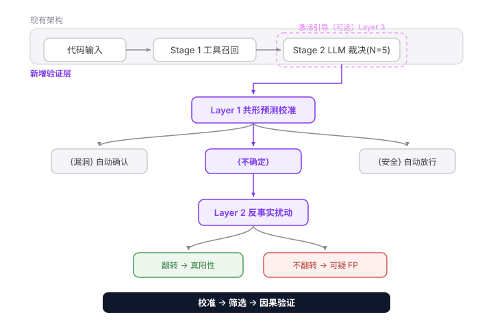

# 技术研究报告（清理版）

> 本文件由原始 AI 对话记录精简而来，仅保留关键报告内容，已去除 AI 思考过程、研究规划与绘图代码。

---

# 报告一：激活引导（Activation Steering）应用于代码模型与安全任务

## 1. 什么是激活引导？技术原理

激活引导（Activation Steering）是一类**推理时干预技术**，通过在 Transformer 的残差流（residual stream）中添加一个方向向量来改变模型行为，**无需重新训练模型，也无需修改提示词** [1]。

### 核心数学公式

最常见的 CAA（Contrastive Activation Addition）公式 [1][3]：

设模型在第 $l$ 层的隐藏状态为 $a_l(x) \in \mathbb{R}^d$。给定对比数据集 $D = \{(x_i, p_i, n_i)\}$，其中 $p_i$ 是触发目标行为的提示，$n_i$ 是不触发的对照提示：

**第一步 — 提取方向向量：**
$$s_l = \frac{1}{|D|} \sum_{i} \left( a_l(p_i) - a_l(n_i) \right)$$

即两组激活的**均值之差**。通常取每个提示最后一个 token 位置的激活。

**第二步 — 推理时注入：**
$$a_l(x) \leftarrow a_l(x) + \lambda \cdot s_l$$

其中 $\lambda$ 控制干预强度（正值增强目标行为，负值抑制）。常见范围 $\lambda \in [-10, 10]$（对归一化向量而言）[1]。

### 理论基础：线性表示假说

核心技术假说是：**LLM 中的高级概念以近似线性的方向编码在激活空间中**。如果"愤怒"是一个模型内部表示的概念，那么存在某个方向 $v$，使得激活在 $v$ 上的投影近似表示"愤怒程度"。沿 $v$ 方向添加标量倍数即可让模型生成更愤怒的文本 [1]。

### 方法谱系对比

| 方法                     | 方向来源                | 典型样本量         | 可解释性         |
| ------------------------ | ----------------------- | ------------------ | ---------------- |
| **ActAdd** (Turner 2023) | 单个对比提示对          | 1对                | 隐式，提示定义   |
| **CAA** (Rimsky 2023)    | 多对激活差值的均值      | 数十到数千对       | 隐式，数据集定义 |
| **RepE** (Zou 2023)      | 刺激集的 PCA 第一主成分 | 数百个刺激         | 中等             |
| **探针方向引导**         | 训练的线性探针权重      | 数百到数千标注样本 | 与标注概念绑定   |
| **SAE 特征引导**         | 稀疏自编码器解码器列    | 单个特征           | 高度可解释       |

---

## 2. 在代码生成模型上的应用

**已有明确的研究成果。** 这是该领域最直接相关的发现：

### 论文一：Understanding How CodeLLMs (Mis)Predict Types with Activation Steering
- **作者**：Francesca Lucchetti & Arjun Guha (Northeastern University)
- **arXiv**：2404.01903 (2024年4月，2024年9月更新)
- **模型**：StarCoderBase 1B 和 7B
- **核心发现**：
  - CodeLLM 在类型预测任务中，即使语义等价的代码编辑（如重命名变量）也会导致预测错误
  - **通过激活引导可以将模型"引导"回正确预测**，使其对语义无关的提示特征更鲁棒
  - 引导效果与直接微调相当
  - **跨语言迁移**：从 Python 代码提取的引导向量能有效纠正 TypeScript 的类型误预测，反之亦然——这首次证明了 CodeLLM 学到的任务表示可以跨语言迁移 [2]
- **方法细节**：使用 FIM (Fill-in-the-Middle) 格式构造对比对 $(x^+, x^-, t)$，$x^+$ 是模型预测正确的提示，$x^-$ 是经过语义保持编辑后模型预测错误的提示。对 ManyTypes4Py (Python) 和 The Stack (TypeScript) 数据集采样构建引导数据集 [2]

### 论文二：Steering Code LLMs with Activation Directions for Language and Library Control
- **arXiv**：2603.23629 (2026年3月)
- **作者**：Md Mahbubur Rahman (Iowa State), Arjun Guha (Northeastern), Harshitha Menon (LLNL)
- **内容**：使用激活方向引导 Code LLM 选择特定的编程语言和库，包括层间方向估计、模型干预、最佳方向(层)选择等 [4]

### 关键启示
代码模型中的激活引导已被验证有效，且**提取的方向具有语义抽象性**（跨语言迁移），这为在安全/漏洞检测场景中提取"防御意识"方向提供了直接的方法论支撑。

---

## 3. 在安全相关任务上的应用

### 3.1 安全对齐与越狱风险

激活引导在安全领域的研究主要集中在**安全对齐的脆弱性**上：

- **The Rogue Scalpel: Activation Steering Compromises LLM Safety** (arXiv:2509.22067, 2025年9月)：证明即使是**随机方向**的引导也能将有害合规概率从 0% 提升到 2-27%；从 SAE 提取的良性特征引导会进一步增加 2-4%；20个随机采样的越狱向量可组合成通用攻击 [5]

- **Steering Externalities** (arXiv:2602.04896, 2026年2月)：发现来自**完全良性数据集**的引导向量（如强制合规或JSON输出格式）会无意中侵蚀安全防护栏，使越狱攻击成功率超过 80% [6]

- **ACL 2025 Tutorial**：将推理时引导列为安全方法之一，包括系统提示、引导向量、断路器 (Circuit Breakers)、稀疏自编码器等 [7]

### 3.2 正向安全应用

- **拒绝行为由单一方向介导**：Arditi et al. (2024) 证明在13个开源聊天模型中，拒绝有害请求由**单个方向**介导——这意味着可以精确控制安全行为 [1][8]

- **Inference-Time Intervention (ITI)** (Kenneth Li et al., NeurIPS 2023 spotlight)：通过在推理时沿学到的方向移动激活，将 Alpaca (LLaMA) 在 TruthfulQA 上的真实性从 32.5 提升到 65.1，仅需几百个示例定位 truthful 方向 [9]

### 3.3 漏洞检测误报问题

虽然未发现将引导向量直接用于减少漏洞检测误报的论文，但找到了高度相关的误报问题研究：

- **BlueCodeAgent** (arXiv:2510.18131, 2025年10月)：明确指出"基础模型倾向于过度保守，将安全代码误分类为不安全"，通过动态分析有效减少误报 [10]
- **Sifting the Noise** (arXiv:2601.22952)：LLM agent 可将 OWASP Benchmark 上 92% 的误报率降至 6.3% [11]
- **Reducing False Positives in Static Bug Detection with LLMs** (ICSE-SEIP '26, Fudan/Tencent) [12]

**结论：误报减少是公认的真实问题，但用引导向量解决是全新方向——具有新颖性。**

---

## 4. Qwen3-8B + LoRA + 量化的兼容性

### 4.1 Qwen3 架构兼容性 — 已验证

**关键发现**：arXiv:2608.03892 (2026年8月) 论文 "Intertemporal Preference Steering in Qwen3 via Contrastive Activation Addition" 已在 **Qwen3-32B** 上成功应用 CAA，证明 Qwen3 架构完全支持激活引导 [13]。该方法使用对比线性探针在 Qwen3 残差流中找到短期/长期方向，并在保留的二元选择任务上成功引导。

**Qwen3-8B 属于同一架构家族**，引导方法可直接迁移。

### 4.2 与 LoRA 适配器兼容

激活引导与 LoRA **完全兼容且正交**：
- LoRA 修改的是权重（低秩适配器叠加在权重矩阵上）
- 激活引导修改的是推理时的激活值（通过 forward hook）
- 两者作用于不同层面，可以同时使用：LoRA 微调后的模型上提取和注入引导向量完全没有冲突
- 实际上，nnsight 和 pyvene 都支持在任意 PyTorch 模型上注册干预 hook，与 PEFT/LoRA 无冲突

### 4.3 与量化模型的兼容性 — 关键技术分析

这是最关键的实践问题，需要区分两种量化路径：

**路径 A：bitsandbytes 4-bit (NF4) — 完全可行 ✅**
- bitsandbytes 4-bit 量化在 PyTorch 中运行，模型仍然是 `nn.Module`
- 权重在推理时按需反量化，但**残差流激活值是全精度 (fp16/bf16)**
- 可以通过 `register_forward_hook` 或 nnsight/pyvene 在残差流上注入引导向量
- Qwen3-8B 4-bit 约占 **~5-6GB VRAM**，8GB VRAM 可运行
- 这是最推荐的路径

**路径 B：GPTQ/AWQ — 可行 ✅**
- 同样在 PyTorch 中运行，支持 forward hook
- AutoGPTQ/AutoAWQ 加载的模型保留模块结构

**路径 C：GGUF / llama.cpp — 困难 ⚠️**
- llama.cpp 是 C++ 推理引擎，原生不支持 PyTorch hook
- llama-cpp-python 的自定义 hook 支持有限
- **替代方案**：如果必须用 GGUF，可考虑：
  1. 用 bitsandbytes 4-bit 替代 GGUF（PyTorch 生态，8B 模型可放入 8GB VRAM）
  2. 或在 llama.cpp 的 C++ 层面修改以支持激活注入（工程量大）
  3. 或使用 exllamav2（NVIDIA GPU 专用，比 llama.cpp 快 50-85%，支持自定义 hook）

**实际案例佐证**：Outcry AI 项目报告在一个 80 亿参数模型上本地运行 CAA，证实了 8B 模型本地激活引导的可行性 [14]。

### 4.4 8GB VRAM 可行性评估

| 组件                      | 显存占用                  |
| ------------------------- | ------------------------- |
| Qwen3-8B 4-bit (NF4) 权重 | ~5-6 GB                   |
| KV Cache (4K context)     | ~0.5-1 GB                 |
| 激活值 + 引导向量         | ~0.1 GB (一个 $d$ 维向量) |
| **总计**                  | **~6-7 GB**               |

**结论：8GB VRAM 下用 bitsandbytes 4-bit 运行 Qwen3-8B + 激活引导是可行的**，但上下文长度受限（建议 ≤4K tokens）。

---

## 5. 工具与库

| 库                  | 来源                                 | 特点                                                         | 适用性                                         |
| ------------------- | ------------------------------------ | ------------------------------------------------------------ | ---------------------------------------------- |
| **TransformerLens** | Neel Nanda 等                        | 专门为可解释性设计，统一接口，但需手动适配每个架构           | 支持 Qwen 需检查；适合研究                     |
| **nnsight**         | NDIF/Bau lab (arXiv:2407.14561)      | 开源 Python 包，通过计算图表达任意 PyTorch 模型干预，支持 NDIF 远程大模型访问 [15] | **推荐**：灵活，支持任意 PyTorch 模型          |
| **pyvene**          | Stanford HAI (2024年6月)             | 开源库，支持可定制的模型干预，覆盖模型编辑、引导、鲁棒性、可解释性 [16] | **推荐**：与 HuggingFace transformers 深度集成 |
| **nnterp**          | ndif-team                            | 基于 nnsight 的统一接口，跨架构标准化 [17]                   | 补充工具                                       |
| **CAA 官方代码**    | nrimsky/CAA (GitHub)                 | Rimsky 等的 Llama 2 CAA 官方实现 [18]                        | 直接参考实现                                   |
| **RepE 官方代码**   | andyzoujm/representation-engineering | Zou 等的 RepE 官方实现 [19]                                  | 直接参考实现                                   |

**推荐技术栈**：`transformers` + `bitsandbytes` (4-bit 加载) + `pyvene` 或 `nnsight` (激活干预) + `peft` (LoRA)

---

## 6. 引导向量减少漏洞检测误报的可行性分析

### 核心设想
从"安全代码 vs 漏洞代码"对比对中提取"防御意识"方向，在推理时注入以提升模型对防御机制的感知，从而减少误报。

### 可行性评估：**高度可行，具有新颖性**

**支持论据：**

1. **方法论已验证**：Lucchetti & Guha [2] 已证明从代码对比对中提取引导向量可以恢复 CodeLLM 的正确类型预测——**你的设想在方法论上完全平行**，只是将"类型预测正确性"替换为"安全/漏洞判别正确性"

2. **概念可线性表示**：RepE 框架 [19] 和 ITI [9] 已证明诚实性、有害性等抽象概念可表示为线性方向。"防御意识"作为一种语义概念，理论上也可被提取

3. **跨语言迁移证据**：Lucchetti 发现引导向量跨编程语言迁移有效 [2]，这暗示代码层面的抽象概念（包括安全模式）可能以类似方式编码

4. **误报问题真实且重要**：BlueCodeAgent [10] 和多项研究 [11][12] 确认基础模型过度保守是公认问题

5. **训练免费**：只需几十到几百对安全/漏洞代码样本即可提取方向，无需反向传播

### 具体实现方案

```
步骤1：构建对比数据集
  - D = {(安全代码_i, 对应漏洞版本_i)}
  - 来源：CVE 修复前后 diff、SAST 工具标注的 TP/FP 样本对
  - 每对代码应尽量相似（仅防御机制不同）

步骤2：提取引导向量
  - 在 Qwen3-8B 上对每对代码运行前向传播
  - 取中间层（如第 15-20 层）残差流最后一个 token 的激活
  - s_l = mean(activation(漏洞代码) - activation(安全代码))
  - 或反向：s_l = mean(activation(安全代码) - activation(漏洞代码))

步骤3：推理时注入
  - 对待检测代码运行前向传播
  - 在选定层添加：a_l(x) += λ * s_l（正值增强"防御意识"）
  - 用 logit 变化或生成输出来判断漏洞/安全

步骤4：层选择与超参调优
  - 遍历各层（如 10-28 层），选择引导效果最佳的层
  - 在验证集上搜索最优 λ
```

### 预期效果
- 可能将"防御意识"方向注入后，模型对含有防御机制的代码更倾向于判为安全（减少误报）
- 但需注意：可能同时增加漏报（false negatives），需要仔细平衡 λ

---

## 7. 免训练 (Training-Free) 可行性

**完全可行。** 激活引导本质上是推理时技术：

- **无需反向传播**：提取引导向量只需前向传播收集激活 [1][3]
- **无需标注训练数据**：对比对本身即是监督信号 [1]
- **计算成本极低**：提取阶段只需对几十到几百个样本做一次前向传播；推理时每次只增加一个向量加法
- **即时可逆**：引导可随时添加或移除，不改变模型权重
- **数据高效**：ITI [9] 证明仅需几百个示例即可定位方向；CAA [3] 使用数十到数百对

**提取阶段计算量**：对 Qwen3-8B，200 对样本 × 前向传播 ≈ 几分钟（单 GPU）

---

## 8. 风险与局限性

### 8.1 技术风险

| 风险                            | 说明                                                         | 来源                 |
| ------------------------------- | ------------------------------------------------------------ | -------------------- |
| **非满射性 (Non-Surjectivity)** | 引导后的激活状态可能不在任何文本提示可达的流形上——意味着引导效果可能与提示工程不可比较，评估协议需谨慎 | [8] arXiv:2604.09839 |
| **安全护栏侵蚀**                | 良性引导向量可能无意中削弱安全对齐，使越狱成功率升至 80%+    | [6] arXiv:2602.04896 |
| **随机方向也可越狱**            | 即使随机方向的引导也能增加有害合规概率 2-27%                 | [5] arXiv:2509.22067 |
| **超参敏感**                    | 层选择和 λ 对效果影响巨大，不同模型/任务需重新调参           | [1]                  |
| **持续干预开销**                | 传统激活引导需在每个 token 生成步骤持续干预（除非用 cache steering [20]） | arXiv:2507.08799     |
| **概念纠缠**                    | "防御意识"方向可能与其他概念（如代码质量、复杂度）纠缠，导致副作用 | RepE 综述 [21]       |

### 8.2 对你具体场景的风险

1. **误报减少可能伴随漏报增加**：增强"防御意识"可能让模型将真正的漏洞也判为安全。必须在验证集上同时监控 FP 和 FN 指标

2. **方向提取质量依赖数据**：对比对的质量至关重要。如果安全/漏洞代码对差异过大（不仅是防御机制），提取的方向会包含噪声

3. **量化模型上的精度问题**：4-bit 量化可能影响激活值的精度，进而影响引导向量质量。建议在提取阶段使用 fp16（如果显存允许）或至少验证 4-bit 下的效果

4. **GGUF 不兼容**：如前所述，llama.cpp/GGUF 路径下难以实现激活引导。如果当前部署用 GGUF，需要迁移到 bitsandbytes 4-bit

5. **可解释性 vs 可控性的悖论**：The Rogue Scalpel [5] 的核心警告——"对模型内部的精确控制并不保证对模型行为的精确控制"

### 8.3 缓解措施

- 使用**正交控制方向**验证引导向量的特异性（参考 arXiv:2608.03892 的随机正交控制实验 [13]）
- 在多个层和多个 λ 值上做消融实验
- 使用 cache steering [20] 减少持续干预的开销和超参敏感性
- 建立 FP/FN 权衡曲线，选择帕累托最优的 λ

---

## 总结与建议

| 问题                   | 结论                                                         |
| ---------------------- | ------------------------------------------------------------ |
| 激活引导是否成熟技术？ | 是，2023年至今大量论文，已有商业产品 (Goodfire Ember, Golden Gate Claude) |
| 是否应用于代码模型？   | **是**，Lucchetti & Guha 在 StarCoder 上验证有效，含跨语言迁移 |
| 是否应用于安全任务？   | 主要用于安全研究（越狱/对齐脆弱性），**正向安全增强应用较少** |
| Qwen3-8B 可行？        | **可行**，CAA 已在 Qwen3-32B 验证 [13]，8B 同架构            |
| LoRA 兼容？            | **完全兼容**，两者正交                                       |
| 4-bit 量化兼容？       | **bitsandbytes 4-bit 可行**；GGUF/llama.cpp 困难             |
| 8GB VRAM 可行？        | **可行**，4-bit 8B 约占 6-7GB                                |
| 减少误报可行？         | **高度可行且新颖**，方法论有 Lucchetti 论文支撑，但无直接先例 |
| 免训练？               | **是**，纯推理时技术                                         |
| 主要风险？             | 安全护栏侵蚀、FP-FN 权衡、超参敏感、量化精度                 |

**建议技术路线**：Qwen3-8B + bitsandbytes 4-bit + pyvene/nnsight + 从 CVE 修复 diff 提取"防御意识"引导向量 + 在验证集上做 FP/FN 权衡分析。这是一个**具有毕业设计级别创新性的研究方向**，既有坚实的文献基础，又有明确的技术新颖性。

### 报告一 Sources

1. [Activation steering - AI Wiki](https://aiwiki.ai/wiki/activation_steering)
2. [Understanding How CodeLLMs (Mis)Predict Types with Activation Steering (Lucchetti & Guha, arXiv:2404.01903)](https://arxiv.org/pdf/2404.01903)
3. [Steering Llama 2 with Contrastive Activation Addition - CAA GitHub (Rimsky et al.)](https://github.com/nrimsky/CAA)
4. [Steering Code LLMs with Activation Directions for Language and Library Control (arXiv:2603.23629)](https://arxiv.org/html/2603.23629v2/)
5. [The Rogue Scalpel: Activation Steering Compromises LLM Safety (arXiv:2509.22067)](https://arxiv.org/html/2509.22067v1/)
6. [Steering Externalities: Benign Activation Steering Unintentionally Increases Jailbreak Risk (arXiv:2602.04896)](https://arxiv.org/html/2602.04896v1/)
7. [ACL 2025 Tutorial - Inference-Time Steering for Safety (PDF)](https://llm-guardrails-security.github.io/presentations/ACL_2025_Tutorial_LLM_Guardrails_Security_Inference_Steering.pdf)
8. [Steered LLM Activations are Non-Surjective (arXiv:2604.09839)](https://arxiv.org/html/2604.09839v1/)
9. [Inference-Time Intervention: Eliciting Truthful Answers from a Language Model (Kenneth Li et al., NeurIPS 2023)](https://openreview.net/forum?id=aLLuYpn83y)
10. [BlueCodeAgent: A Blue Teaming Agent Enabled by Automated Red Teaming for CodeGen AI (arXiv:2510.18131)](https://arxiv.org/html/2510.18131v1)
11. [Sifting the Noise: LLM Agents in Vulnerability False Positive Filtering (arXiv:2601.22952)](https://arxiv.org/html/2601.22952v2/)
12. [Reducing False Positives in Static Bug Detection with LLMs (ICSE-SEIP '26)](https://dl.acm.org/doi/10.1145/3786583.3786910)
13. [Intertemporal Preference Steering in Qwen3 via Contrastive Activation Addition (arXiv:2608.03892)](https://arxiv.org/html/2608.03892v1/)
14. [The Geometry of Revolution: CAA on 8B model locally (Outcry AI)](https://www.outcryai.com/research/shift-a-models-political-ideology-with-a-16kb-file)
15. [NNsight and NDIF: Democratizing Access to Foundation Model Internals (arXiv:2407.14561)](https://arxiv.org/pdf/2407.14561v1.pdf)
16. [pyvene: A Library for Understanding and Improving PyTorch Models via Interventions (Stanford HAI)](https://hai.stanford.edu/research/pyvene-a-library-for-understanding-and-improving-pytorch-models-via-interventions)
17. [nnterp: A Standardized Interface for Mechanistic Interpretability (arXiv:2511.14465)](https://arxiv.org/pdf/2511.14465)
18. [Contrastive Activation Addition (CAA) - learnmechinterp.com](https://learnmechinterp.com/topics/caa-method/)
19. [Representation Engineering (RepE) - Official GitHub (Zou et al.)](https://github.com/andyzoujm/representation-engineering/blob/main/README.md)
20. [KV Cache Steering for Controlling Frozen LLMs (arXiv:2507.08799)](https://arxiv.org/html/2507.08799v2)
21. [Taxonomy, Opportunities, and Challenges of Representation Engineering for LLMs (arXiv:2502.19649)](https://arxiv.org/pdf/2502.19649v2)

---

# 报告二：反事实代码扰动 & 共形预测在LLM漏洞检测中的应用研究

## 一、技术1：反事实代码扰动用于漏洞验证

### 1.1 现有工作现状

**直接相关工作——VulnAgent-R2的CER模块** [1]

最接近你设想的工作是 VulnAgent-R2（arXiv:2603.13384v3, 2026年6月）中的 **Counterfactual Evidence Reweighting (CER)** 模块。CER的核心逻辑是：

- 对LLM Agent输出的证据元组（claim），生成最多4种扰动：
  - `C^{-π}`：遮蔽被引用的代码段
  - `C^{+san}`：注入已验证的sanitizer/guard事实
  - `C^{swap}`：替换非支配性caller
  - `C^{hist}`：用历史已修复版本替换当前区域
- 用独立的证据评分器（CodeT5+交叉编码器）计算扰动前后分数差 `Δ_z = 1 - |s(e,C) - s(e,C^z)|`
- 将差异作为可靠性特征：如果claim在扰动后分数变化大 → 证据脆弱 → 降低权重

**关键区别**：CER扰动的是**上下文/证据**，而非直接修改代码本身的防御措施。你的设想是生成**防御性代码扰动**（如添加 `shlex.quote`、参数化查询、输入验证），然后检查LLM的**最终裁决是否翻转**。这个差异很重要——CER验证的是"证据是否鲁棒"，你的方法验证的是"模型是否真正理解漏洞因果链"。

**另一相关工作——Patched-Counterfactual Oracles** [2]

"From Runnable to Verifiable"（arXiv:2608.09567, 2026年8月）提出了patched-counterfactual验证方法：在已修复的构建上检查漏洞信号是否消失。关键发现：**20/30（66.7%）的patched-counterfactual审计在已修复构建上仍然产生了声称的信号**，oracle的敏感度仅60%、特异度仅45%[2]。这说明：

- 反事实验证的思想在安全领域已被提出，但现有实现（在PoC/artifact层面）可靠性很低
- 你的方法在**LLM裁决层面**做反事实验证，避开了PoC执行不可靠的问题

### 1.2 与传统Mutation Testing的区别

| 维度             | 传统变异测试                        | 你的反事实扰动方法                      |
| ---------------- | ----------------------------------- | --------------------------------------- |
| **目的**         | 评估测试套件质量（杀死变异体）      | 验证LLM裁决的因果理解能力               |
| **变异类型**     | 随机语义变异（如`+`→`-`，`>`→`>=`） | 定向防御性修复（添加sanitizer、参数化） |
| **判定标准**     | 变异体是否被测试杀死                | LLM裁决是否从"有漏洞"翻转为"安全"       |
| **理论基础**     | 变异充分性                          | 反事实推理（因果推断）                  |
| **等价变异问题** | 语义等价变异体无法杀死              | 语义等价的修复不改变裁决→模型不理解     |

传统变异测试关注的是**测试覆盖率**，你的方法关注的是**模型理解的因果性**——这更接近因果推断中的反事实推理框架（"如果施加干预X，结果Y是否会改变？"）。

### 1.3 新颖性评估

**在安全领域的新颖性：高**

现有工作的空白：
1. VulnAgent-R2的CER [1] 扰动的是上下文而非代码本身的防御措施
2. Patched-counterfactual [2] 在PoC执行层面验证，不在LLM裁决层面
3. EquiBench [3] 证明LLM在程序语义等价性检查上表现很差（最难类别仅63.8%准确率，接近50%随机基线），支持你的假设——LLM可能在模式匹配而非理解数据流

**你的独特贡献点**：
- 首次将"防御性代码扰动→裁决翻转检查"作为LLM漏洞检测的**假阳性过滤器**
- 将反事实因果推理框架引入LLM安全审计
- 与你的fix_verifier.py天然集成——扰动生成器本身就是fix suggestion的变体

### 1.4 实现复杂度

**中等偏低**，因为你的项目已有基础设施：

```
输入: LLM裁决"有漏洞"的函数 + fix_suggestion
  ↓
步骤1: 从fix_suggestion提取防御性修复模式（或用规则库: shlex.quote/参数化/输入验证/边界检查）
  ↓
步骤2: 对原代码应用最小扰动（AST级别插入，非全量重写）
  ↓
步骤3: 将扰动后代码重新送入LLM裁决（单次推理，无需5次采样）
  ↓
步骤4: 判定
  - 裁决翻转(漏洞→安全) → 模型理解防御 → 保留原裁决(真阳性)
  - 裁决不变 → 模型可能在模式匹配 → 标记为可疑假阳性
```

**关键挑战**：
- 扰动生成需要保证语义保持（不引入新漏洞或破坏功能）
- 需要针对不同CWE类型设计不同的扰动模板
- 增加一次LLM推理的延迟成本（但对降低FPR可能很值得）

### 1.5 对FPR 0.423的预期效果

**可能提供"惊人效果"**。理由：

如果FPR=0.423的主要来源是LLM在模式匹配（如看到`eval()`、`os.system()`就标记为漏洞，不分析输入是否可信），那么：

- 对这些假阳性，添加输入验证后LLM应该翻转裁决
- 如果不翻转，说明模型不理解数据流 → 高置信度假阳性
- 你的项目已有 `fix_verifier.py` 和 `taint_tracker.py`，可以与扰动验证形成闭环

---

## 二、技术2：共形预测用于校准置信度

### 2.1 现有工作现状

**ConU: Conformal Uncertainty in LLMs** [4]

ConU（arXiv:2407.00499, 2024）是首个将共形预测应用于LLM并保证正确性覆盖率的工作。核心方法：
- 基于self-consistency理论构建非一致性分数（Nonconformity Score, NS）
- 在校准集上计算所有样本的NS分位数 q̂
- 用 q̂ 作为阈值构建预测集，保证覆盖率 ≥ 1-α

**LofreeCP: "API Is Enough"** [5]

LofreeCP（arXiv:2403.01216, 2024）是**首个无需logit访问的LLM共形预测方法**，这对你的本地模型场景特别重要：

- **频率作为排序代理**：用多次采样的响应频率代替真实概率（因为Lemma 3.1证明直接近似概率需要≥9604个样本，不可行）
- **细粒度不确定性度量**：
  - 归一化熵（NE）：衡量prompt级别的自洽性
  - 语义相似度（SS）：衡量response级别的相似度
- **综合非一致性分数**：`N = -F(频率) + λ₁·H(熵) - λ₂·SS(相似度)`
- **三阶段流程**：校准（找分位数）→ 验证（选超参）→ 测试（构建预测集）

**共形预测综述**：GitHub上有专门的"Uncertainty-Aware LLMs: A Scoping Review of Conformal Prediction Methods"仓库 [6]，说明这是一个活跃的研究方向。

### 2.2 数学框架

共形预测的数学框架简洁而严谨：

1. **可交换性（Exchangeability）**：校准集和测试集的数据需要可交换（比i.i.d.更弱的条件）
2. **非一致性分数（Nonconformity Score）**：`s_i = α(x_i, y_i)`，衡量样本"不符合"的程度
3. **分位数计算**：在校准集上，`q̂ = ⌈(n+1)(1-α)⌉/n` 分位数
4. **预测集构建**：`C(x_test) = {y : α(x_test, y) ≤ q̂}`
5. **覆盖率保证**：`P(y_test ∈ C(x_test)) ≥ 1-α`（有限样本保证，无需分布假设）

**对于二元分类（漏洞/安全）的可行性：极高**

二元分类是共形预测最简单的应用场景。预测集只有三种可能：
- `{漏洞}` → 高置信度真阳性
- `{安全}` → 高置信度真阴性
- `{漏洞, 安全}` → 不确定（可触发人工审查或工具复审）

这天然提供了一个**带统计保证的拒绝学习（learning to reject）机制**。

### 2.3 非一致性分数设计（针对你的场景）

你当前用5次采样的self-consistency ratio（如4/5）作为置信度。可以转化为非一致性分数：

```python
# 方案A：直接用投票一致性
def nonconformity_score(votes):
    # votes: ["vulnerable", "safe", "vulnerable", "vulnerable", "safe"]
    majority = max(set(votes), key=votes.count)
    agreement = votes.count(majority) / len(votes)
    return 1 - agreement  # 不一致性越高，分数越大

# 方案B：结合语义一致性（LofreeCP风格）
def nonconformity_score_enhanced(votes, embeddings):
    freq = max(vote_counts) / n  # 频率
    entropy = normalized_entropy(votes)  # 归一化熵
    similarity = avg_cosine_sim(embeddings, top1)  # 语义相似度
    return -freq + λ1 * entropy - λ2 * similarity
```

### 2.4 Logit置信度 vs Self-consistency：哪个更校准？

根据Xiong等人的系统研究 [7]（arXiv:2306.13063）和Lyu等人的工作 [8]（arXiv:2402.13904）：

| 维度               | Logit-based                            | Self-consistency                                             |
| ------------------ | -------------------------------------- | ------------------------------------------------------------ |
| **校准质量**       | 较差，LLM logits存在系统性过度自信 [7] | 更好，consistency-based方法在大多数任务上优于verbalized confidence [7] |
| **信息层次**       | 仅捕获next-token不确定性               | 捕获claim-level可靠性                                        |
| **闭源模型可用性** | 不可用（GPT-4等API不返回logits）       | 可用（仅需多次采样）                                         |
| **成本**           | 单次推理                               | N次采样（你已用N=5）                                         |
| **与CoT结合**      | 无法结合                               | CoT + consistency效果最佳 [8]                                |
| **混合方法**       | -                                      | Hybrid(verbalized + consistency)在20个case中13个最优 [7]     |

**结论**：你当前使用的self-consistency（N=5投票）比logit-based方法**更适合LLM校准**。但self-consistency本身缺乏形式化统计保证——这正是共形预测能补充的。

### 2.5 新颖性评估

**在安全领域的新颖性：中等偏高**

- 共形预测已应用于LLM（ConU [4]、LofreeCP [5]），但**未见在漏洞检测裁决中应用的公开工作**
- 将共形预测与两阶段扫描器（工具召回 + LLM裁决）结合是新颖的
- 用共形预测替代简单的投票比例（4/5）作为置信度，提供数学保证

### 2.6 实现复杂度

**低**。你已有的基础设施几乎直接可用：

```
步骤1: 准备校准集（你已有标注数据，分出一部分作为校准集）
  ↓
步骤2: 对校准集每个样本运行5次LLM裁决，计算非一致性分数
  ↓
步骤3: 计算分位数 q̂（一行代码：np.quantile(scores, (1-α)*(n+1)/n)）
  ↓
步骤4: 测试时，计算测试样本的非一致性分数，与 q̂ 比较
  ↓
步骤5: 输出预测集 + 覆盖率保证
```

**无需修改模型、无需额外训练、无需logit访问**——只需后处理已有的5次采样结果。

### 2.7 对FPR 0.423的预期效果

**中等效果，但提供可解释性和统计保证**：

- 共形预测本身**不直接降低FPR**，它提供的是"这个预测有多可靠"的校准估计
- 但通过设置合适的α（如α=0.1），可以将"不确定"的样本（预测集={漏洞,安全}）路由到更严格的验证（如技术1的反事实扰动）
- **两技术协同**：共形预测筛选出不确定样本 → 反事实扰动验证这些样本 → 大幅降低FPR

---

## 三、语义等价性检查（补充研究）

### 3.1 轻量级AST方法

- **EquiBench** [3]（arXiv:2502.12466, Stanford/Google, 2025）：测试19个SOTA LLM在程序等价性检查上的能力，最难类别准确率仅63.8%（接近50%随机基线），证明**LLM依赖语法相似性而非语义理解**
- **LLM用于等价变异检测** [9]（arXiv:2408.01760, 2024）：LLM在等价变异检测上F1提升35.69%，但仍有大量误判
- **IBM watsonx Code Assistant** [10] 提供了商业级的"semantic equivalence validation"功能，基于AST + 符号执行

### 3.2 对你项目的启示

你的 `fix_verifier.py` 如果要做轻量级语义等价检查：
- **tree-sitter AST diff**：检查扰动前后AST结构差异是否仅在预期位置（如新增了 `shlex.quote()` 调用）
- **不需要完整的程序等价性证明**——只需验证"扰动是最小化的防御性修改，未改变核心逻辑"
- 这比EquiBench的全程序等价性检查简单得多

---

## 四、综合评估与建议

| 维度                      | 技术1：反事实代码扰动          | 技术2：共形预测              |
| ------------------------- | ------------------------------ | ---------------------------- |
| **安全领域新颖性**        | 高（首次用于LLM裁决验证）      | 中高（首次用于漏洞裁决校准） |
| **实现复杂度**            | 中（需设计扰动模板）           | 低（后处理现有投票结果）     |
| **对FPR 0.423的直接效果** | 高（直接识别模式匹配型假阳性） | 中（提供校准但不直接降FPR）  |
| **理论深度**              | 因果推理 + 反事实              | 统计学习理论                 |
| **与现有架构集成**        | 与fix_verifier.py天然集成      | 与N=5投票机制天然集成        |
| **论文贡献潜力**          | 强（新方法+新评估范式）        | 中等（方法应用+领域迁移）    |
| **"惊人效果"可能性**      | 高（如果FPR主要来自模式匹配）  | 低-中（主要是校准改善）      |

### 推荐策略

1. **优先实现技术1（反事实扰动）**：它直接攻击FPR问题的根源——模型不理解数据流。且与你的fix_verifier.py和taint_tracker.py形成闭环。实现路径清晰，论文故事性强。

2. **技术2作为技术1的补充**：用共形预测筛选出"不确定"的样本（预测集={漏洞,安全}），只对这些样本做反事实扰动验证。这样：
   - 避免对每个阳性都做扰动验证（节省推理成本）
   - 提供统计保证的置信度（论文理论深度）
   - 形成"校准→筛选→验证"的三层架构

3. **论文叙事**：可以构建"因果验证的LLM漏洞检测"框架，核心创新是"用反事实扰动检验LLM是否真正理解漏洞因果链，而非模式匹配"。共形预测提供不确定性的形式化保证，反事实扰动提供因果验证。

### 注意事项

- VulnAgent-R2 [1] 的CER是最近的竞争工作，论文中需要明确区分你的方法与CER的差异（代码级防御扰动 vs 上下文扰动）
- 共形预测的覆盖率保证依赖于校准集与测试集的可交换性——如果漏洞分布有漂移（如训练集偏重C/C++，测试集有Python），保证可能失效
- 建议先在小样本上验证技术1的扰动翻转率（有多少假阳性的裁决会翻转），再决定是否全量集成

### 报告二 Sources

1. VulnAgent-R2: Evidence-Calibrated Multi-Agent Auditing for Repository-Level Vulnerability Detection. arXiv:2603.13384v3. https://arxiv.org/html/2603.13384v3
2. From Runnable to Verifiable: An Independent Reproducibility Study of LLM/Agent-Driven Vulnerability Validation Artifacts. arXiv:2608.09567. https://arxiv.org/pdf/2608.09567
3. EquiBench: Benchmarking Large Language Models' Understanding of Program Semantics via Equivalence Checking. arXiv:2502.12466. https://arxiv.org/html/2502.12466v2
4. ConU: Conformal Uncertainty in Large Language Models with Correctness Coverage Guarantees. arXiv:2407.00499. https://www.arxiv.org/pdf/2407.00499
5. API Is Enough: Conformal Prediction for Large Language Models Without Logit-Access. arXiv:2403.01216. https://www.themoonlight.io/zh/review/api-is-enough-conformal-prediction-for-large-language-models-without-logit-access
6. Uncertainty-Aware Large Language Models: A Scoping Review of Conformal Prediction Methods. https://github.com/aliceinlatentspace/conformal-llm-review
7. Can LLMs Express Their Uncertainty? An Empirical Evaluation of Confidence Elicitation in LLMs. arXiv:2306.13063. https://ar5iv.labs.arxiv.org/html/2306.13063
8. Calibrating Large Language Models with Sample Consistency. arXiv:2402.13904. https://arxiv.org/pdf/2402.13904
9. Large Language Models for Equivalent Mutant Detection: How Far Are We? arXiv:2408.01760. https://arxiv.org/html/2408.01760v1
10. Quality assurance with IBM watsonx Code Assistant. https://developer.ibm.com/articles/awb-qa-unit-testing-ibm-watsonx-code-assistant/

---

# 报告三：LLM 代码漏洞检测：2025-2026 最新技术与研究空白分析

## 一、领域总体概况

### 1.1 主流方法综述

当前 LLM 漏洞检测的主流方法可归纳为以下几类：

| 方法类别               | 代表工作                                          | 核心思路                                           |
| ---------------------- | ------------------------------------------------- | -------------------------------------------------- |
| **LLM 直接检测**       | GPT/Claude/Gemini zero/few-shot 函数级检测        | 直接提示 LLM 判断代码是否有漏洞                    |
| **LLM + SAST 混合**    | SAST-Genius [1], Hybrid SAST-LLM [2], TitanCA [3] | SAST 高召回 + LLM 分诊过滤误报                     |
| **LLM Agent 迭代推理** | Sifting the Noise [4], LLMpatronous [5]           | ReAct/Aider/OpenHands agent 多轮推理过滤 SAST 误报 |
| **知识增强 RAG**       | Vul-RAG [6]                                       | 从 CVE 知识库检索增强 LLM 漏洞检测                 |
| **过程奖励模型**       | SecCodePRM [7]                                    | 步骤级安全评分，支持流式生成中实时检测             |
| **对抗式多智能体**     | Refute-or-Promote [8]                             | 对抗性 kill 机制 + 跨模型审查减少误报              |

**关键发现**：2026年最新研究 [9] 测试了 GPT-5.4、Claude Opus 4.6 等前沿模型，发现**所有模型的白盒检测误报率仍在 10-50%**，系统性过度预测漏洞。领域专用模型可将 FPR 降至 9.7%，但通用 LLM 表现仍不理想。

### 1.2 基准测试现状

- **PrimeVul** [10]：高质量漏洞数据集，解决了标签不准和数据重复问题，是当前主流评测基准
- **VulBench V3** [11]：200个真实CVE的 find-and-fix 基准，评测27个模型
- **JITVUL** [12]：879个CVE、91种漏洞类型的 JIT 漏洞检测基准，链接漏洞引入和修复提交
- **OmniVul/DiagVuln** [13]：2000个CVE的多轮对话评估基准，top-1 准确率低于50%
- **SV-TrustEval-C** [14]：评估LLM代码漏洞分析的结构语义推理能力

---

## 二、九大技术方向的逐一分析

### 技术1：Conformal Prediction（共形预测）用于校准置信度

**(a) 是否已应用于 LLM 漏洞检测？**
**部分应用，但存在重大空白。**
- OmniVul/DiagVuln [13] 使用 conformal prediction，但仅用于**基准数据质量保证**（校准 LLM-as-a-Judge 的标注过滤），而非用于漏洞检测模型本身的置信度校准
- UNGOML [15]（2023）在 Go 语言 unsafe 用途分类中使用了 set-valued conformal prediction，但这是传统 ML 分类器，非 LLM
- Siddiq et al. [16]（2026年6月）做了 LLM 代码安全校准的首个大规模实证研究，但使用的是 ECE/Brier Score/温度缩放等传统校准方法，**未使用 conformal prediction**
- 通用 LLM 领域有 conformal risk control for structured generation [17]、agent 风险认证 [18]，但均未应用于代码漏洞检测

**(b) 最接近的领域：**
- LLM 一般任务的 conformal prediction（事实性、毒性检测）[18]
- 传统 ML 分类器的 conformal prediction（Go unsafe 分类）[15]
- LLM 代码安全校准（ECE/Brier，非 conformal）[16]

**(c) 新颖性评估：⭐⭐⭐⭐⭐（极高）**
将 conformal prediction 应用于 LLM 漏洞检测的**输出置信度校准和弃权机制（abstention）**是一个完全空白的研究方向。现有工作要么校准基准数据质量，要么用传统方法校准。利用 conformal prediction 为 LLM 漏洞判断提供**分布无关的有限样本保证**，使安全分析师获得"这个判断在95%置信度下正确"的形式化保证，是非常新颖的贡献。

---

### 技术2：Activation Steering（激活引导）减少漏洞检测误报

**(a) 是否已应用于 LLM 漏洞检测？**
**未应用于检测，仅用于代码生成。**
- Sandoval et al. [19]（2026年4月）是最接近的工作：使用 per-CWE steering vectors 减少 LLM **生成**不安全代码的比率（最高降低74%）。但这是干预代码**生成**，而非改善漏洞**检测**
- Syed et al. [20]（2026年6月）研究了对不安全代码微调导致的 emergent misalignment，使用 activation steering 减少代码溢出效应，但同样是干预生成行为
- LSMAS [21]（NeurIPS 2025 Workshop）用 activation steering 做 LLM 安全建模，针对的是越狱/错误信息，非代码漏洞检测
- **没有任何工作**将 activation steering 用于减少 LLM 漏洞**检测器**的误报率

**(b) 最接近的领域：**
- 代码生成的 activation steering（减少不安全代码生成）[19]
- 拒绝行为的 activation steering（安全对齐）[20][21]

**(c) 新颖性评估：⭐⭐⭐⭐⭐（极高）**
将 activation steering 从"干预生成"转向"干预检测判断"是一个范式转换。具体设想：通过在 LLM 漏洞检测推理过程中注入"安全审慎"方向的 steering vector，抑制模型对正常代码的过度漏洞预测倾向（即系统性过度预测），从而降低误报率。Sandoval 的工作已经证明安全表征在特定层是可分离的，这为检测场景的 steering 提供了机制基础。**这是一个完全未被探索的方向。**

---

### 技术3：Counterfactual / Mutation Testing 验证 LLM 漏洞发现

**(a) 是否已应用于 LLM 漏洞检测？**
**部分应用，但验证用途未被探索。**
- VISION [22]（2025年8月）使用 LLM 生成 counterfactual（反事实样本）来增强 GNN 训练数据，减少虚假相关性。但这是**训练数据增强**，而非**验证 LLM 检测结果**
- Orvalho & Kwiatkowska [23]（2025年5月）研究 LLM 对语义保持变异的鲁棒性，发现 LLM 对代码变异敏感
- Luo et al. [24]（2025年5月）用 counterfactual 评估和增强 Code LLM 的细节敏感性
- **没有任何工作**使用 counterfactual 代码扰动作为 LLM 漏洞检测结果的**后验验证机制**

**(b) 最接近的领域：**
- GNN 漏洞检测的 counterfactual 数据增强 [22]
- LLM 代码理解鲁棒性测试 [23]
- Code LLM 细节敏感性评估 [24]

**(c) 新颖性评估：⭐⭐⭐⭐（很高）**
一个新颖的设想：当 LLM 报告某代码存在漏洞时，自动生成语义保持的 counterfactual 变体（如变量重命名、等价表达式替换、控制流重构），如果 LLM 对等价代码给出不同判断，则标记该发现为低可信度（因为真正的漏洞不应受语义保持变换影响）。这本质上是将**变异测试思想**应用于 LLM 漏洞发现的**验证**，类似软件测试中的 metamorphic testing。VISION 已证明 counterfactual 能揭露虚假相关性，但将其作为 LLM 检测结果的验证机制是全新的。

---

### 技术4：Logit-based Confidence（基于 Logit 的置信度）

**(a) 是否已应用于 LLM 漏洞检测？**
**未直接应用。**
- Siddiq et al. [16] 提到 token-level log probability 作为置信度来源之一，但实际研究使用的是 verbalized confidence 和采样一致性，且关注的是**代码生成**安全校准而非漏洞检测
- SelfGrader [25]（2026年4月）使用 token-level logits 检测 LLM 越狱攻击，但非漏洞检测
- Thoria et al. [26]（2026年6月）研究 token-level uncertainty 信号识别推理失败，但非代码安全领域
- Zhou et al. [27]（2025年8月）利用 token-level 不确定性估计 LLM 可靠性，但用于开放域问答
- **没有工作**使用 logit-based confidence 替代 self-consistency 来评估 LLM 漏洞检测判断的可信度

**(b) 最接近的领域：**
- LLM 越狱检测的 token-level logits [25]
- LLM 推理失败的 token-level 签名 [26]
- LLM 代码生成的安全校准（提到了但未深入）[16]
- 通用 LLM 幻觉检测的 logit-based signals [28]

**(c) 新颖性评估：⭐⭐⭐⭐（很高）**
当前 LLM 漏洞检测的置信度评估主要依赖 self-consistency（多次采样取一致率），计算成本高。使用 token-level logits（如检测 "vulnerable"/"safe" 关键 token 的 logit 分布熵、margin 等）可以在**单次推理**中获得置信度信号，大幅降低计算开销。这在漏洞检测领域是完全未被探索的。结合 conformal prediction（技术1）可以进一步提供形式化保证。

---

### 技术5：Speculative Decoding（投机解码）用于漏洞检测

**(a) 是否已应用于 LLM 漏洞检测？**
**完全未应用。**
- 现有 speculative decoding 相关工作全部聚焦于：
  - 投机解码的**安全副作用**（side-channel 攻击）[29]
  - 对投机解码机制的**攻击**（Mistletoe 加速坍塌攻击）[30]
- Speculative Safety-Aware Decoding [31] 是一个 GitHub 仓库，但其方向是安全感知解码，非漏洞检测
- **没有任何工作**将 speculative decoding 的 draft-verify 范式应用于漏洞检测

**(b) 最接近的领域：**
- 投机解码的安全风险分析 [29][30]
- 通用 LLM 推理加速的 speculative decoding

**(c) 新颖性评估：⭐⭐⭐⭐（很高，但需谨慎）**
一个可能的方向：用小模型（draft model）快速初筛代码是否有潜在漏洞，大模型（target model）仅对 draft model 标记为"可能有漏洞"的代码进行深度验证。这类似于 SAST+LLM 混合思路，但用 speculative decoding 的 draft-verify 框架来组织。不过这个方向的新颖性在于**架构范式迁移**而非技术创新，需要仔细论证与现有 cascade/filter 方法的区别。

---

### 技术6：LLM + SAST 混合分诊（Tool-recall + LLM-adjudication）

**(a) 是否已应用？**
**是，这是当前最活跃的方向之一。**
- **Sifting the Noise** [4]（2026年1月）：比较 Aider/OpenHands/SWE-agent 三种 agent 框架过滤 SAST 误报，将 OWASP Benchmark 的 92%+ 误报率降至最低 6.3%，真实项目 CodeQL 误报识别率达 93.3%
- **Hybrid SAST-LLM Pipeline** [2]（2025）：Google 工程师提出的混合分诊管道，误报减少 91%
- **SAST-Genius** [1]（2025年9月）：LLM 驱动的混合静态分析框架
- **TitanCA** [3]（2026年4月）：SMU + GovTech Singapore 合作，LLM agent 编排发现 203 个零日漏洞、118 个 CVE
- **Reducing FPs in Static Bug Detection with LLMs** [32]（ICSE-SEIP 2026）：复旦+腾讯工业实证研究
- **Refute-or-Promote** [8]（2026年4月）：对抗式多智能体审查，kill rate 79-83%

**(b) 此方向已较成熟，但仍有空间。** 关键发现：agent 效果**高度依赖骨干模型和 CWE 类型**，强模型（Claude Sonnet 4, GPT-5）获益显著，弱模型获益有限 [4]。激进的误报减少可能抑制真实漏洞 [4]。

**(c) 新颖性评估：⭐⭐（较低，方向已拥挤）**
此方向已有大量 2025-2026 工作。要在毕业论文中做出新意，需要找到特定的未被覆盖的细分问题（如特定 CWE 类型的分诊效果、agent 架构的效率优化、跨语言泛化等），而非提出又一个混合框架。

---

### 技术7：减少误报率（FPR）的最新方法

**(a) 当前最新方法汇总：**

| 方法                     | 论文                  | 日期      | FPR/效果         |
| ------------------------ | --------------------- | --------- | ---------------- |
| LLM Agent 过滤 SAST 误报 | Sifting the Noise [4] | 2026.01   | FPR 92%→6.3%     |
| 混合 SAST-LLM 分诊       | Hybrid Pipeline [2]   | 2025      | FP减少91%        |
| 对抗式多智能体审查       | Refute-or-Promote [8] | 2026.04   | Kill rate 79-83% |
| LLM 工业实证 FP 消除     | Du et al. [32]        | ICSE 2026 | 工业规模验证     |
| 领域专用模型             | Dahiya et al. [9]     | 2026.05   | FPR 9.7%         |
| MoA + RAG                | LLMpatronous [5]      | 2025.04   | 混合方法         |
| 过程奖励模型             | SecCodePRM [7]        | 2026      | 步骤级风险聚合   |

**核心问题**：所有现有方法要么依赖昂贵的多轮 agent 推理，要么依赖大规模训练数据。缺乏**轻量级、单次推理**的误报减少方法。

---

## 三、研究空白总结与毕业论文建议

### 高新颖性空白（推荐优先考虑）

| #    | 技术方向                                       | 是否已应用于LLM漏洞检测 | 新颖性 | 论文潜力                            |
| ---- | ---------------------------------------------- | ----------------------- | ------ | ----------------------------------- |
| 1    | **Conformal Prediction 校准置信度 + 弃权机制** | ❌ 完全空白              | ⭐⭐⭐⭐⭐  | 极佳：可为LLM漏洞判断提供形式化保证 |
| 2    | **Activation Steering 减少检测误报**           | ❌ 仅用于代码生成        | ⭐⭐⭐⭐⭐  | 极佳：范式转换，机制可解释          |
| 3    | **Counterfactual 扰动验证 LLM 发现**           | ❌ 仅用于GNN训练增强     | ⭐⭐⭐⭐   | 很好：变异测试思想的新应用          |
| 4    | **Logit-based 单次推理置信度**                 | ❌ 完全空白              | ⭐⭐⭐⭐   | 很好：替代昂贵的 self-consistency   |
| 5    | **Speculative Decoding draft-verify 检测范式** | ❌ 完全空白              | ⭐⭐⭐⭐   | 较好：需论证与cascade方法的区别     |

### 中等新颖性空白

| #    | 技术方向                                       | 现状         | 新颖性 |
| ---- | ---------------------------------------------- | ------------ | ------ |
| 6    | 组合 conformal prediction + logit confidence   | 两者各自空白 | ⭐⭐⭐⭐⭐  |
| 7    | 组合 activation steering + counterfactual 验证 | 两者各自空白 | ⭐⭐⭐⭐⭐  |

### 已充分探索方向（不建议作为核心贡献）

| #    | 技术方向            | 现状                                      |
| ---- | ------------------- | ----------------------------------------- |
| 8    | LLM + SAST 混合分诊 | 2025-2026 已有大量工作 [1][2][3][4][32]   |
| 9    | RAG 增强漏洞检测    | Vul-RAG [6] 等已探索                      |
| 10   | 多智能体漏洞检测    | Refute-or-Promote [8], TitanCA [3] 已探索 |

### 最具潜力的毕业论文方向建议

**推荐方向：Conformal Prediction + Logit-based Confidence 的组合**

理由：
1. **完全空白**：没有人在 LLM 漏洞检测中使用 conformal prediction 提供校准置信度
2. **技术可行**：logit-based confidence 提供单次推理的不确定性信号，conformal prediction 将其转化为形式化保证
3. **问题明确**：当前 LLM 漏洞检测的误报率高达 10-50% [9]，且分析师无法判断哪些发现可信
4. **评估清晰**：可在 PrimeVul/SVEN/VulBench 上评估覆盖率-弃权率权衡
5. **理论基础扎实**：conformal prediction 有完善的分布无关保证理论 [17]

**备选方向：Activation Steering 减少检测误报**

理由：
1. **机制可解释**：Sandoval [19] 已证明安全表征在特定层可分离
2. **范式新颖**：从干预"生成"转向干预"检测判断"
3. **实用价值高**：单次推理即可降低误报，无需多轮 agent
4. **可组合性强**：可与 conformal prediction、counterfactual 验证组合

### 报告三 Sources

1. LLM-Driven SAST-Genius, Ahi & Agrawal, arXiv Sep 2025 — https://arxivlens.com/paperview/details/llm-driven-sast-genius-a-hybrid-static-analysis-framework-for-comprehensive-and-actionable-security-3718-8ce8b26a
2. Reducing Noise: Hybrid SAST-LLM Pipeline for Code Security, Agrawal & Ahi, 2025 — https://www.virelya.org/research/hybrid-sast-llm-code-security
3. TitanCA: Lessons from Orchestrating LLM Agents to Discover 100+ CVEs, Zhang et al., arXiv Apr 2026 — https://arxiv.org/pdf/2604.17860v2
4. Sifting the Noise: A Comparative Study of LLM Agents in Vulnerability False Positive Filtering, Xiong & Zhang, arXiv Jan 2026 — https://arxiv.org/html/2601.22952v1
5. LLMpatronous: Harnessing the Power of LLMs For Vulnerability Detection, Yarra, arXiv Apr 2025 — https://arxiv.org/pdf/2504.18423v1
6. Vul-RAG: Enhancing LLM-based Vulnerability Detection via Knowledge-level RAG, 2025 — https://blog.csdn.net/Penheim/article/details/146473382
7. SecCodePRM: A Process Reward Model for Code Security, Yu et al., arXiv 2026 — https://arxiv.org/pdf/2602.10418
8. Refute-or-Promote: Adversarial Stage-Gated Multi-Agent Review for High-Precision LLM-Assisted Defect Discovery, Agarwal, arXiv Apr 2026 — https://arxiv.org/html/2604.19049
9. Are Frontier LLMs Ready for Cybersecurity? Evidence for Vertical Foundation Models from Dual-Mode Vulnerability Benchmarks, Dahiya et al., arXiv May 2026 — https://arxiv.org/html/2605.23243v1
10. PrimeVul论文解读, 2025 — https://blog.csdn.net/ybdesire/article/details/147043966
11. VulnBench V3 Benchmark, Ghost Security — https://vulnbench.ghostsecurity.com/
12. Benchmarking LLMs and LLM-based Agents in Practical Vulnerability Detection for Code Repositories (JITVUL), Yildiz et al., arXiv Mar 2025 — https://www.arxiv.org/pdf/2503.03586
13. OmniVul: A Holistic, Multi-Turn Conversational Benchmark for LLM-Based Vulnerability Assessment, Kandalam et al., KDD 2026 — https://mainarke.github.io/assets/papers/kdd26_vishnu.pdf
14. SV-TrustEval-C: Evaluating Structure and Semantic Reasoning in LLMs for Source Code Vulnerability Analysis, Li & Branco et al., May 2025 — https://www.themoonlight.io/zh/review/sv-trusteval-c-evaluating-structure-and-semantic-reasoning-in-large-language-models-for-source-code-vulnerability-analysis
15. UNGOML: Automated Classification of unsafe Usages in Go, Wickert et al., arXiv Jun 2023 — https://arxiv.org/pdf/2306.00694
16. An Empirical Study of Security Calibration in Large Language Models for Code, Siddiq et al., arXiv Jun 2026 — https://arxiv.org/pdf/2606.31159v1.pdf
17. When Can Conformal Risk Control Certify LLM Outputs? Bounds, Impossibility, and Adaptation for Structured Generation, Kotte, arXiv Jun 2026 — https://arxiv.org/pdf/2606.29054
18. Certifying LLM Agent Risks in Diverse Scenarios, Zhang & Kang, AAAI 2026 Workshop — https://trustagenticai.github.io/AAAI2026/AAAI-Workshop/19.pdf
19. Surgical Repair of Insecure Code Generation in LLMs: From Mechanistic Diagnosis to Deployment-Ready Intervention, Sandoval et al., arXiv Apr 2026 — https://arxiv.org/pdf/2604.16697v1
20. Actionable Activation Directions for Detecting and Mitigating Emergent Misalignment Across Language Model Families, Syed et al., arXiv Jun 2026 — https://arxiv.org/html/2606.20225v1
21. LSMAS (LLM Security Modeling via Activation Steering), Kuang et al., NeurIPS 2025 Workshop — https://nips.cc/virtual/2025/loc/san-diego/128588
22. VISION: Robust and Interpretable Code Vulnerability Detection Leveraging Counterfactual Augmentation, Egea et al., arXiv Aug 2025 — https://arxiv.org/abs/2508.18933
23. Are Large Language Models Robust in Understanding Code Against Semantics-Preserving Mutations?, Orvalho & Kwiatkowska, arXiv May 2025 — https://arxiv.org/abs/2505.10443
24. Success is in the Details: Evaluate and Enhance Details Sensitivity of Code LLMs through Counterfactuals, Luo et al., arXiv May 2025 — https://arxiv.org/abs/2505.14597v1
25. SelfGrader: Stable Jailbreak Detection for Large Language Models using Token-Level Logits, arXiv Apr 2026 — https://arxiv.deeppaper.ai/papers/2604.01473v2
26. How Language Models Fail: Token-Level Signatures of Committed and Persistent Reasoning Failures, Thoria et al., arXiv Jun 2026 — https://arxiv.org/html/2606.06635v1
27. Can LLMs Detect Their Confabulations? Estimating Reliability in Uncertainty-Aware Language Models, Zhou et al., arXiv Aug 2025 — https://arxiv.org/html/2508.08139v1
28. Logit-based signals for hallucination detection, TheNeuralBase, verified Apr 2026 — https://theneuralbase.com/hallucination-mitigation/learn/advanced/logit-based-signals/
29. When Speculation Spills Secrets: Side Channels via Speculative Decoding in LLMs, Wei et al., arXiv Nov 2024 (v3 Sep 2025) — https://arxiv.org/html/2411.01076v3
30. Mistletoe: Stealthy Acceleration-Collapse Attacks on Speculative Decoding, Sun et al., arXiv May 2026 — https://arxiv.org/html/2605.14005v1
31. Speculative Safety-Aware Decoding, GitHub repo — https://github.com/k-k1w-w1x-x/Speculative-Safety-Aware-Decoding
32. Reducing False Positives in Static Bug Detection with LLMs: An Empirical Study in Industry, Du et al., ICSE-SEIP 2026 — https://dl.acm.org/doi/10.1145/3786583.3786910
33. A dual perspective review on large language models and code verification, Dolcetti & Iotti, Front. Comput. Sci., Nov 2025 — https://www.frontiersin.org/journals/computer-science/articles/10.3389/fcomp.2025.1655469/full

---

# 综合建议：三个方向串联成"校准 → 筛选 → 因果验证"管线

## 关键前提：正在跑的 11 种变体消融本身就是研究贡献

你发现"训练后 system 内化，prompt 过长反而导致模型思维混乱"——这个现象在 SFT 研究里几乎没有被正式讨论过。学术界关注的是"prompt 越长越好"或"prompt 格式影响 few-shot"，但**"SFT 导致 prompt 冗余 → 注意力稀释 → 性能退化"**这个因果链，目前没有人正式提出并消融验证。

你的 11 变体消融就是实验证据。这一节本身就能成为论文的一个创新点，标题可以是"**SFT 后的提示词冗余效应：内化与退化**"。不要把它当成"工程调试"，它是研究发现。

## 三个方向不是平等竞争，而是串联成一条管线

三个方向串成一条 **"校准→筛选→因果验证"** 的管线，嵌在你现有两阶段架构的 Stage 2 之后：



> 上图供人直观查看；下方为等价文本版架构图，供非多模态模型（纯文本 LLM）阅读。

```
现有架构（两阶段）：
  代码输入
    │
    ▼
  Stage 1 工具召回（Semgrep / TaintTracker / Prefilter / pip-audit）
    │
    ▼
  Stage 2 LLM 裁决（N=5 采样，自一致性投票）
    │  ← 可选 Layer 3「激活引导」在此包裹，注入"防御意识"方向向量，压低进入下一层的假阳性基数
    ▼
新增验证层（三层管线）：
  Layer 1 共形预测校准 ──► 输出三分类：
      │
      ├── {漏洞}  → 自动确认（高置信真阳性）
      ├── {安全}  → 自动放行（高置信真阴性）
      └── {不确定} → 进入 Layer 2
              │
              ▼
  Layer 2 反事实扰动验证（对 {不确定} 施加防御性扰动：加 shlex.quote / 参数化 / 输入校验）
      │
      ├── 裁决翻转（漏洞→安全）→ 模型理解防御机制 → 标记为：真阳性
      └── 裁决不变（漏洞→漏洞）→ 模型在模式匹配 → 标记为：可疑假阳性
```

**分层逻辑清单（等价文本版）：**

1. **现有两阶段**：代码 → Stage 1 工具召回候选 finding → Stage 2 LLM 以 N=5 采样做自一致性裁决。
2. **Layer 1 共形预测**：把"4/5 票"升级为有统计保证的三分类 {漏洞} / {安全} / {不确定}，提供弃权机制。
3. **Layer 2 反事实扰动**：仅对 {不确定} 触发，施加防御性代码扰动后重跑单次裁决；翻转→真阳性，不变→可疑假阳性。
4. **Layer 3 激活引导（可选）**：在 Stage 2 推理时注入"防御意识"方向向量，从源头抑制系统性的过度漏洞预测。
5. **核心主张**：用统计保证筛选不确定项、用因果扰动验证理解深度，即"可验证的漏洞裁决"。

- **共形预测**（Layer 1）把 N=5 采样的"4/5 票"升级为有统计保证的三分类：{漏洞} / {安全} / {不确定}
- **反事实扰动**（Layer 2）只对{不确定}的 finding 触发——施加防御性扰动（加 `shlex.quote`/参数化），看裁决是否翻转，从而区分"真理解"和"模式匹配"
- **激活引导**（Layer 3，可选）在 Stage 2 推理时注入"防御意识"方向向量，从源头压低进入 Layer 1 的假阳性基数

这套管线的核心研究主张是：**"不只是让 LLM 判断漏洞真伪，而是用统计保证筛选不确定项、用因果扰动验证理解深度"**——这和市面所有"SAST+LLM 分诊"工作的哲学都不同。

## 你和别人在做什么的对比

| 维度     | 市面主流(2025-2026)    | 你的项目现状              | 加上三个方向后              |
| -------- | ---------------------- | ------------------------- | --------------------------- |
| 架构     | SAST→LLM 分诊(已拥挤)  | 工具召回+LLM 裁决(同赛道) | 加上因果验证层(差异化)      |
| 置信度   | 自一致率/自报分数      | N=5 投票比                | **共形预测(形式化保证)**    |
| 误报控制 | 多轮 Agent 迭代(贵)    | 无(FPR 0.423)             | **反事实扰动(单次推理)**    |
| 模型干预 | 无/重训                | SFT(v9max)                | **激活引导(推理时,免训练)** |
| 研究主张 | "LLM 能过滤 SAST 误报" | "工具找+LLM 判"           | **"可验证的漏洞裁决"**      |

关键差异：市面工作的逻辑是"用更强的 LLM/更多轮推理来降误报"，你的逻辑是**"用统计保证和因果验证来检验 LLM 是否真的理解"**——这是方法论层面的不同，不是工程优化。

## 现在该做什么（按答辩优先级）

### 第一优先：把正在跑的实验写成研究贡献
你正在跑的 11 变体消融，对应的现象是"SFT 后 system prompt 内化，过长 prompt 导致思维混乱"。这个发现本身就是一个研究贡献。行动：跑完 11 变体后，写成论文的一个小节（可放在第 5 章"方法论反思"或单独作为第 4 章的一节）。标题建议："SFT 后的提示词冗余效应：内化与退化"。核心论点：SFT 让模型内化了 system prompt 的指令，推理时再注入相同指令会造成注意力冗余，反而降低判定质量——因此推理 prompt 应该比训练 prompt 更短。

### 第二优先：共形预测（最低成本，最高性价比）
实现量：约 20 行 Python，对你已有的 N=5 采样结果做后处理。

```python
# 核心逻辑(伪代码)
# 1. 在校准集上计算非一致性分数
scores = [1 - max_vote_ratio(sample) for sample in calibration_set]
# 2. 求分位数
q_hat = np.quantile(scores, (1 - alpha) * (n + 1) / n)  # alpha=0.1 → 90%覆盖率
# 3. 测试时
if nonconformity_score(test_sample) <= q_hat:
    # 确定性判定(高置信)
else:
    # 不确定 → 路由到反事实验证
```

论文价值：你可以在论文里写"本系统首次将共形预测应用于 LLM 漏洞裁决的置信度校准，在 1-α=0.9 覆盖率下对 X% 的 finding 给出确定性判定"。这是一个**有形式化保证**的 claim，比"我们用了 5 次投票"强得多。

### 第三优先：反事实扰动验证（直接打 FPR 0.423）
这是对你 FPR 问题杀伤力最大的方向。实现路径：
1. 从 `fix_verifier.py` 已有的修复建议中提取防御模式（`shlex.quote`、参数化查询、输入校验等）
2. 对 LLM 裁决"有漏洞"的 finding，用 AST 级最小扰动把防御模式注入代码
3. 重跑单次 LLM 裁决（不需要 N=5，省 5 倍推理）
4. 裁决翻转→真阳性；不翻转→标记可疑假阳性

论文价值："本系统提出基于反事实因果推理的漏洞裁决验证机制：通过施加防御性代码扰动并观察裁决翻转，区分模型的语义理解与模式匹配"。VulnAgent-R2 的 CER 扰动的是**上下文证据**，你扰动的是**代码本身的防御措施**——这个差异在论文里要明确写出来。

### 第四优先（高风险高回报）：激活引导
如果你答辩后还有时间，或者想给论文加一个"前沿展望"章节，这个方向级别最高。但风险也最大：
- 需要切到 bitsandbytes 后端（不能用 GGUF）
- 需要构建安全/漏洞代码对比对提取方向向量
- 可能降 FPR 但增 FNR，需要做权衡曲线

建议：在论文"未来工作"里写一段，作为"已识别但未实现的研究方向"。这本身就能证明你有视野。

## 一句话总结

你的"研究深度不够"不是技术不够多——你有 28 个决策事件、9 版训练迭代、完整的泄漏审计和显著性检验，这已经是方法论深度。你缺的是**一个别人没提出过的研究主张**。三个方向里，共形预测（20 行代码）和反事实扰动（复用 fix_verifier）是答辩前能做的；激活引导和 prompt 内化效应是论文级别的 claim。把它们串起来，你的研究主张就从"工具+LLM 两阶段扫描"（大家在做的）变成**"面向可验证性的 LLM 漏洞裁决：共形校准+因果扰动验证"**（没人做过的）。