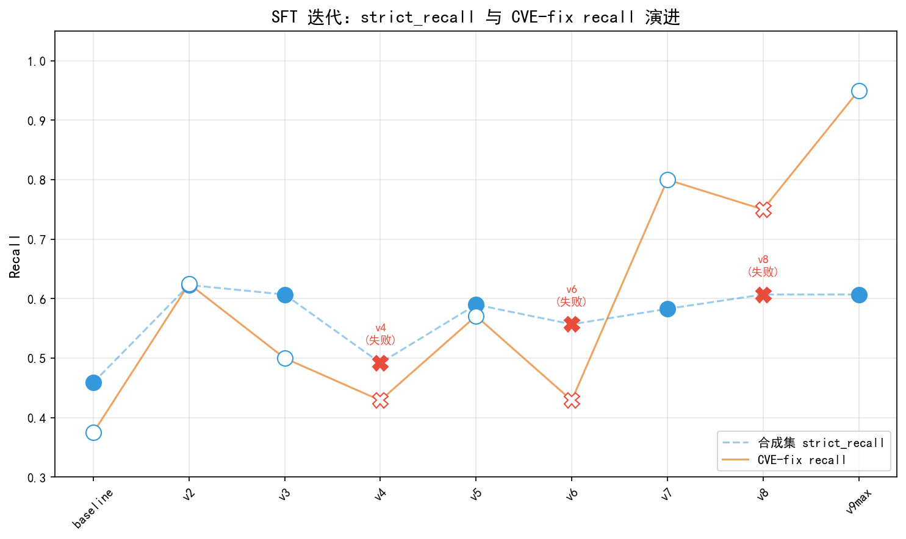
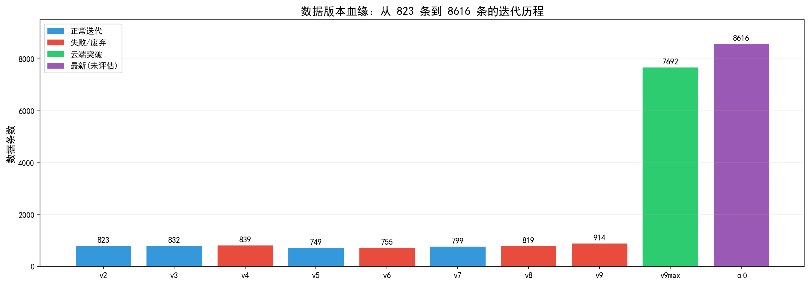
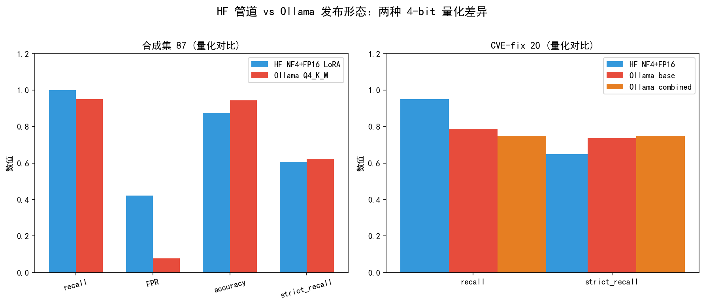
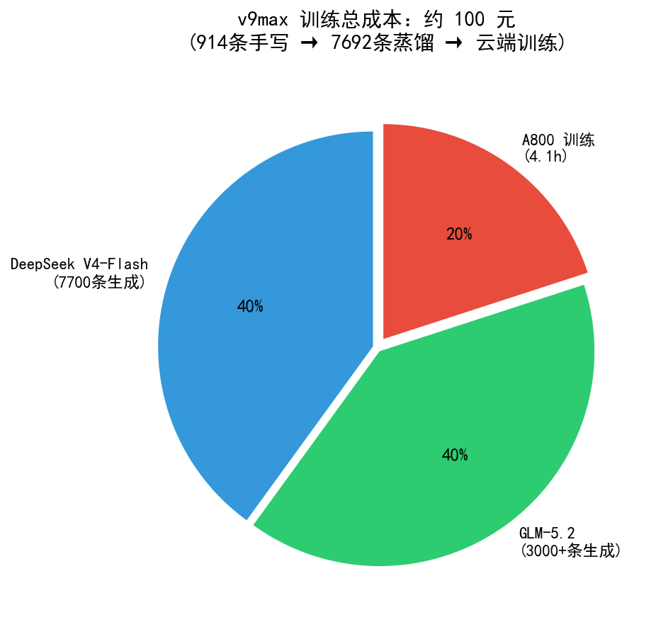
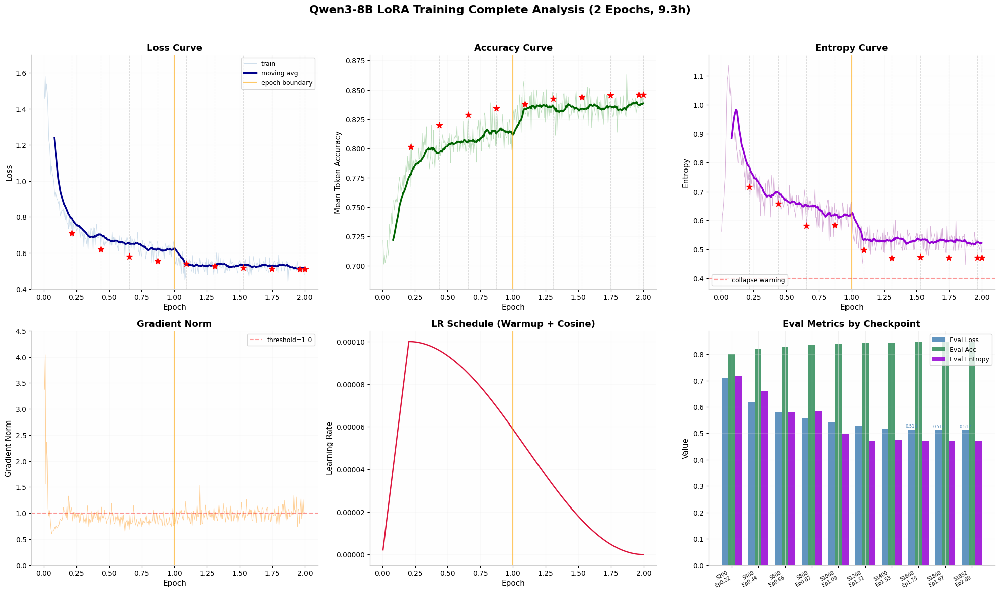
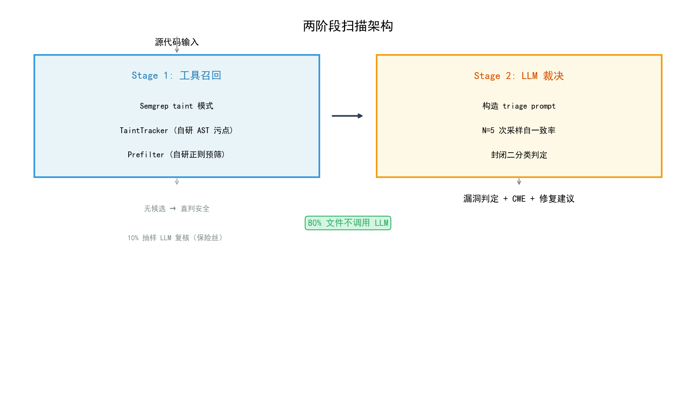

# 论文写作素材库

> 本库按实验、后端、前端、插件、项目级亮点与难点、未来规划、PPT 七个方向，归档论文写作可直接引用的素材。每条素材均标注来源文件，定稿前可按来源追溯核对。
>
> 收录原则：只收录**已确证、可直接引用**的事实；"计划中 / 未执行"的内容单独成章并明确标注状态。

---

## 目录

- [写作口径须知（引用前必读）](#写作口径须知引用前必读)
- [一、实验模块](#一实验模块)
  - [1.1 核心实验数据汇总](#11-核心实验数据汇总)
  - [1.2 策略转变与关键决策](#12-策略转变与关键决策)
  - [1.3 巧妙的实验设计](#13-巧妙的实验设计)
  - [1.4 失败经历与教训](#14-失败经历与教训)
- [二、后端模块](#二后端模块)
  - [2.1 架构设计亮点](#21-架构设计亮点)
  - [2.2 巧妙的工程逻辑](#22-巧妙的工程逻辑)
  - [2.3 自研工具与关键实现细节](#23-自研工具与关键实现细节)
- [三、前端模块](#三前端模块)
  - [3.1 设计系统亮点](#31-设计系统亮点)
  - [3.2 巧妙的交互逻辑](#32-巧妙的交互逻辑)
- [四、插件模块](#四插件模块)
  - [4.1 VS Code 插件](#41-vs-code-插件)
  - [4.2 IntelliJ 插件](#42-intellij-插件)
  - [4.3 插件工程细节](#43-插件工程细节)
- [五、项目级亮点与创新点](#五项目级亮点与创新点)
- [六、项目级难点与应对](#六项目级难点与应对)
- [七、规划与未来目标：Nivis-α1](#七规划与未来目标nivis-α1)
- [八、PPT 专用素材](#八ppt-专用素材)
- [附录：代码审查验证记录](#附录代码审查验证记录)

---

## 写作口径须知（引用前必读）

论文定稿前必须与代码/仓库保持一致的**口径事实**，引用数据时按此核对：

1. **当前已发布最佳模型是 v9max**，α0 是后续训练的未评估版本。v9max 有完整评估数据（合成集 + CVE-fix），α0 无任何评估结果。论文写"当前最佳"时指 v9max；提及 α0 须明确定位为"已训练未评估的后续版本"。
2. **推理 prompt 已统一为 `prompts.V3_PROMPT`**（combined：SYSTEM_PROMPT + CoT 5 步 + 3 组 few-shot，4448 字符），注册表内所有模型的 `prompt_variant` 全部为 `"v3"`。
3. **Prompt 消融结论随基座变化**：Qwen2.5 首轮 CoT 最优 → Qwen3-8B 第二轮 +consistency 最优 → repeat=3 后 combined 最优。论文叙事应以"随基座与统计可靠性迁移"为主线，勿引用单一"CoT 最优"。
4. **数据文件与训练版本名称区分**：`final_train_chatml_v2.jsonl`（8421 条）是数据文件，≠ SFT 训练版本 v2（823 条）；同理 v3 数据文件 8616 条 ≠ 训练版本 v3（832 条）。引用时须写清是数据文件还是训练版本。
5. **指标须区分推理管道**：同一模型在 HF 管道（NF4+FP16 LoRA 增量叠加）与 Ollama 发布形态（Q4_K_M 合并量化）下指标不同（CVE-fix recall 0.95 vs 0.75~0.79）。引用时注明管道。
6. **L1-L4 分层审查只有 L1 有落地产物**，L2-L4 框架就绪但未执行，论文不得写成"已执行"。
7. **负样本 1:3 是蒸馏任务计划值**，清洗后实际约 1:1.2（3493/4199）。引用"负样本配比"时注明是计划还是实际。

---

## 一、实验模块

> 本项目经历了两轮实验周期。第一轮（2026-06~07）在 Qwen2.5-Coder 上完成 exp_01~05 与 exp_06 Phase 1-3；第二轮（2026-07~08）切换到 Qwen3-8B 后全部重跑。以下数据均为最终重跑后的可信结果。

### 1.1 核心实验数据汇总

#### 1.1.1 零样本推理基线（exp_01~05）

**G0 修复后重跑结果（Qwen3-8B，文件名泄漏已修复，2026-08-07~08）**：

| 实验 | 模型 | 核心指标 | 核心结论 |
|------|------|----------|----------|
| exp_01 能力摸底 | qwen3:8b | recall 100% / FPR 50% / accuracy 92.9% | 泄漏修复生效，1 个安全样本被误报 |
| exp_04 难样本(repeat=3) | qwen3:8b | recall 91.8% / FPR 7.7% / accuracy 91.9%（多数表决） | 非独立 held-out，仅趋势参考 |
| exp_05 消融(repeat=3) | qwen3:8b | combined 最优：FPR 7.7% / accuracy 91.9% | 消融结论成立但最优策略随统计可靠性变化 |

> 来源：`experiments/exp_01_basic_scan/results/`；`experiments/exp_05_prompt_ablation/results/`；`experiments/exp_04_hard_samples/results/`

**exp_05 G0 重跑详细数据（repeat=3，多数表决口径，Qwen3-8B）**：

| 变体 | recall | FPR | accuracy | recall 95% CI |
|------|--------|-----|----------|---------------|
| zero_shot | 0.951 | 0.154 | 0.920 | [0.865, 0.983] |
| whitelist_only | 0.984 | 0.269 | 0.908 | [0.913, 0.997] |
| few_shot | 0.984 | 0.231 | 0.920 | [0.913, 0.997] |
| cot | 0.885 | 0.192 | 0.862 | [0.782, 0.943] |
| **combined** | 0.918 | **0.077** | 0.920 | [0.822, 0.965] |

> 关键发现：repeat=1 时 CoT 最优（accuracy 89.7%），但 repeat=3 后 combined 的 FPR 最低（7.7%），CoT 反而退步（accuracy 86.2%）。原始 repeat=1 下 cot 与 few_shot 仅差 1 个样本的差异被噪声覆盖，需 repeat=3 才有统计显著性。

**RAG Top-K 对照实验（exp_03 补充数据）**：

| K | 召回率 | 误报率 | 准确率 |
|---|-------|-------|-------|
| 1 | 95.0% | 33.3% | 86.2% |
| 3 | 96.7% | 25.9% | 89.7% |
| **5** | **100.0%** | 29.6% | **90.8%** |
| 10 | 98.3% | 25.9% | 90.8% |

K=5 召回率最高（100%），但 K=3 是准确率/FPR 综合最优。

> 来源：`规划.md`

#### 1.1.2 SFT 微调完整迭代数据（exp_06）

**Qwen2.5-Coder 时代（已归档，不可直接对比）**：

| 阶段 | 配置 | 核心发现 |
|------|------|----------|
| Phase 1 lr sweep | lr=1e-5/5e-5/1e-4 × rsLoRA/DoRA | 最优 dev_loss=0.8892 (lr=1e-4+rsLoRA) |
| Phase 2 LoRA 增容 | r=32, rsLoRA, e=2 | **失败**：LoRA 增容 ≠ 知识注入，FPR +19.2pp |
| Phase 3 KnItLM CPT | 知识注入 + LoRA merge | **失败**：CPT 知识冲突，第一次"成功"是泄题假象 |

**Qwen3-8B 时代 SFT 迭代（核心实验数据）**：

| 版本 | 数据量 | 合成集 recall | 合成集 FPR | 合成集 strict_recall | CVE-fix recall | 状态 |
|------|--------|---------------|-----------|---------------------|----------------|------|
| baseline | - | 0.967 | 0.269 | 0.459 | 0.375 (8样本) | 锚点 |
| v2 | 823 | 0.967 | 0.231 | 0.623 | 0.625 (8样本) | 首个 SFT |
| v3 | 832 | 0.984 | 0.192 | 0.607 | 0.500 (8样本) | CoT 清单化副作用 |
| v4 | 839 | 0.885 | 0.115 | 0.492 | 0.429 (7样本) | **废弃（训练-测试泄漏）** |
| v5 | 749 | 1.000 | 0.231 | 0.590 | 0.571 (7样本) | 首个可信基线 |
| v6 | 755 | 0.984 | 0.192 | 0.557 | 0.429 (7样本) | **失败（负迁移）** |
| v7 | 799 | 0.983 | 0.231 | 0.583 | 0.800 (20样本) | SFT 最佳 |
| v8 | 819 | 0.967 | 0.308 | 0.607 | 0.750 (20样本) | **失败（FP 激增）** |
| **v9max** | **7692** | **1.000** | **0.423** | **0.607** | **0.950 (20样本)** | **当前已发布最佳** |
| α0 | 8616 | 待评估 | - | - | - | 已训练，无评估 |

> 来源：`experiments/exp_06_finetune/results/EXPERIMENT_LEDGER.md`



> 上图展示了从 baseline 到 v9max 的 strict_recall 与 CVE-fix recall 演进趋势。v4、v6、v8 三个版本因不同原因失败（详见 1.4 节），在图中以红色标记。

**各版本关键变更**：

| 版本 | 数据变更 | 核心发现 |
|------|----------|----------|
| v2→v3 | 36 条 CWE 统一 + 107 条 CoT 重写 + 9 条 LDAP 补充 | CoT 重写导致"清单式"推理，CVE-fix recall 回退 12.5pp |
| v3→v4 | prompt 数据流推理导向 + 19 条不坚定 CoT 修复 | 发现 100 条训练-测试泄漏样本，v4 指标不可信 |
| v4→v5 | 删除 100 条泄漏 + 10 条弱密码学样本 | **首个可信评估基线**：recall 1.000 是清洗后首次可信结果 |
| v5→v6 | 追加 6 个 FP 的正确拒绝 CoT（hard-negative） | **负迁移**：FPR 仅降 3.9pp，CVE-fix recall 跌 14.2pp |
| v5→v7 | 新增 50 条（LDAP 10 / 信任边界 10 / 整数溢出 8 / 反事实 CoT 6 / 对比 CoT 6 / CVE 启发 10） | CVE-fix recall +22.9pp；Bootstrap 检验 v7 vs v5 无显著差异（p>0.05） |
| v7→v8 | 24 条对比 CoT + 防泄漏阈值放宽 | **三大根因失败**：(1) 判别焦虑→FN 增加；(2) 矛盾信号→FP 激增；(3) epochs=3 过拟合 |
| v8→v9 | 55 条新样本 + epochs 3→2 | 修正 v8 三大根因 |
| v9→v9max | 双模型 API 蒸馏，约 10700 条 → 清洗 7692 条 | 本地手写天花板 914 条，转云端放大；A800 bf16 训练 4.1h |



> 上图展示了从 v2 到 α0 的数据量变化。绿色柱（v9max）代表云端蒸馏突破，紫色柱（α0）为最新训练版本但尚未评估。

#### 1.1.3 v9max 完整评估数据

**HF 评估管道（NF4 4bit 基座 + FP16 LoRA 增量叠加）**：

| 测试集 | 样本数 | recall | FPR | accuracy | strict_recall | strict_accuracy |
|--------|--------|--------|-----|----------|---------------|-----------------|
| 合成集 87 | 87 | **1.000** | 0.423 | 0.874 | 0.607 | 0.598 |
| CVE-fix 20 | 20 | **0.950** | - | 0.950 | 0.650 | 0.650 |

**Ollama 发布形态（Q4_K_M 合并量化）**：

| 测试集 | 变体 | recall | FPR | accuracy | strict_recall |
|--------|------|--------|-----|----------|---------------|
| 合成集 87 | base | 0.934 | 0.192 | 0.897 | 0.639 |
| 合成集 87 | anti_fp_cot | 0.918 | 0.115 | 0.908 | 0.623 |
| 合成集 87 | **combined** | **0.951** | **0.077** | **0.943** | 0.623 |
| CVE-fix 20 | base | 0.789 (15/19) | - | 0.789 | 0.737 |
| CVE-fix 20 | combined | 0.750 (15/20) | - | 0.750 | 0.750 |

**量化缺口诊断**：

| 管道 | 数据集 | recall | FPR | accuracy | strict_recall |
|------|--------|--------|-----|----------|---------------|
| HF NF4+FP16 LoRA | 合成集 87 | **1.000** | 0.423 | 0.874 | 0.607 |
| Ollama Q4_K_M combined | 合成集 87 | 0.951 | **0.077** | **0.943** | 0.623 |
| HF NF4+FP16 LoRA | CVE-fix 20 | **0.950** | - | 0.950 | 0.650 |
| Ollama Q4_K_M base | CVE-fix 20 | 0.789 | - | 0.789 | 0.737 |
| Ollama Q4_K_M combined | CVE-fix 20 | 0.750 | - | 0.750 | 0.750 |



> 95%→79% 的缺口是两种 4-bit 量化管道差异（HF/NF4+fp16 LoRA 增量叠加 vs GGUF Q4_K_M 合并后整体量化，LoRA 信号被重量化），**不是"量化 vs 未量化"**。合成集上 Ollama combined 的 FPR 反而更低（7.7% vs 42.3%），因为合并量化"抹平"了部分 LoRA 学到的过度敏感模式。CVE-fix 上 combined 优势不迁移到真实 CVE（75% vs base 79%）。

#### 1.1.4 CVE-fix 测试集演进历程

| 时间 | 版本 | CVE-fix 样本数 | recall | strict_recall | 关键变化 |
|------|------|----------------|--------|---------------|----------|
| 2026-07-23 | baseline | 8 | 0.375 | 0.125 | 合成集虚高 59.2pp 暴露 |
| 2026-07-23 | v2 | 8 | 0.625 | 0.125 | recall +25pp，strict 仍 0.125 |
| 2026-07-25 | v3 | 8 | 0.500 | 0.125 | cve_fix_0003 TP→FN 回退 |
| 2026-07-26 | v5 | 7 | 0.571 | 0.143 | 清洗后首个可信 CVE-fix 评估 |
| 2026-07-27 | v6 | 7 | 0.429 | 0.143 | 负迁移，cve_fix_0003 TP→FN |
| 2026-07-31 | v7 | 20（扩展） | 0.800 | 0.650 | 扩展到 20 样本 |
| 2026-08-01 | v8 | 20 | 0.750 | 0.700 | LDAP 注入 TP→FN（判别焦虑） |
| 2026-08-06 | v9max (HF) | 20 | **0.950** | 0.650 | 仅 1 个 FN（cve_fix_0003） |
| 2026-08-08 | v9max (Ollama) | 20 | 0.750~0.790 | 0.737~0.750 | 量化缺口，3 个 FN |

**CVE-fix 持续 FN 根因**（4 个自 v2 起未完全解决）：

1. **被防御措施迷惑**：cve_fix_0001.java 看到 `LdapEncoder.nameEncode` 就判安全
2. **被无关安全机制分散注意力**：cve_fix_0002.js 看到 `bcryptjs` 就忽略 LDAP filter 拼接
3. **对"演示/框架代码"的误判**：cve_fix_0003.py 没看到 JSON-RPC `calculate(expression)` 是危险 sink
4. **跨文件上下文缺失**：cve_fix_0005.js 只看当前文件，没看到 `server.js` 中的 loopback 信任绕过

#### 1.1.5 DPO 尝试与失败记录

| # | 配置 | 结果 | 根因 |
|---|------|------|------|
| 1 | 8bit + max_len=1024 | OOM 黑屏 | 8B 8bit + DPO 双前向超 15GB VRAM |
| 2 | fp16 + max_len=512 | 立即 OOM | 8B fp16 本身就超 16GB |
| 3 | 4bit + max_len=512 | 跑完但 grad_norm=0 | 4bit NF4 + DPO 双前向梯度回传失效 |

> DPO 在本地 16GB 消费级 GPU 上无法用于 Qwen3-8B。DPO 数据（`dpo_merged.jsonl` 104 条）已保留，若换云端 GPU 可直接复用。

#### 1.1.6 v7 Bootstrap 显著性检验

| 指标 | 差值（v7 - v5） | 95% CI | p 值 | 显著？ |
|------|-----------------|--------|------|--------|
| recall | -0.0166 | [-0.0536, +0.0000] | 0.7362 | ✗ |
| accuracy | -0.0125 | [-0.0575, +0.0230] | 0.5220 | ✗ |
| fpr | -0.0005 | [-0.1111, +0.1111] | 1.0000 | ✗ |

> 配对 block bootstrap N=10000。合成集上 v7 与 v5 无统计显著差异，说明 v7 的改进主要体现在真实 CVE 泛化上而非合成集。

#### 1.1.7 测试集标注修正记录

**CVE-fix 测试集修正（2026-07-25）**：

| 样本 | 问题 | 修正 | 影响 |
|------|------|------|------|
| cve_fix_0001.java | NVD 标 CWE-74，但描述为 LDAP injection | CWE-74 → **CWE-90** | 模型识别出 LDAP 注入但因 CWE 号不匹配被计 strict_FN |
| cve_fix_0008.py | 标 CWE-502 但无 pickle.loads | 从 samples 移除 | 模型正确判断"无反序列化"却被计 FN |

**87 合成集标注修正（2026-07-31，9 个样本）**：补充父类编号、细化 SSTI 编号等。修正后 v7 strict_accuracy 从 0.640→0.728（合成集）、0.650→0.700（CVE-fix），无需重跑模型仅重算 strict_metrics。

#### 1.1.8 v9max 训练配置详情

| 字段 | 值 |
|------|------|
| 训练数据 | 双模型 API 蒸馏（DeepSeek V4-Flash / GLM-5.2），清洗后 7692 条（漏洞 3493 / 安全 4199） |
| 训练配置 | Qwen3-8B bf16 全精度 LoRA（r=8, alpha=16, dropout=0.1, rsLoRA），A800 |
| 数据划分 | train 6539 / dev 1153 |
| 训练参数 | 2 epoch, lr=1e-4, max_seq 6144, 1636 步 ≈ 4.1h, train_loss ≈ 0.529 |
| 发布形态 | base+LoRA 合并后 Q4_K_M 量化，Ollama 模型 `garrywhite109909/graduation-vuln-scanner:v9max` |

#### 1.1.9 经济性数据

| 项目 | 成本 | 说明 |
|------|------|------|
| DeepSeek V4-Flash API | 40 元 | 7700 条生成 |
| GLM-5.2 API | 40 元 | 3000+ 条生成 |
| autodl A800 训练 | 20 元 | 4.1h × 5 元/h |
| **总计** | **约 100 元** | 从 914 条手写扩展到 7692 条蒸馏数据 |



#### 1.1.10 G0 方法学修复清单（2026-08-08）

| # | 修复项 | 影响范围 | 是否需重跑 |
|---|--------|----------|------------|
| 1 | `build_user_prompt` 不再注入 filename | 所有 LLM 实验 | 必须重跑 |
| 2 | CVE-fix 测试集标注修正 | exp_06 | 已处理 |
| 3 | exp_04 manifest 加 `held_out_status` | exp_04 | 不影响推理 |
| 4 | CVE-fix 加 `limitations` 字段 | exp_06 | 仅 recall 参考 |
| 5 | `--repeat` 默认值 1→3 | exp_04/05 | 重跑用 repeat=3 |
| 6 | 新增严格口径指标 | exp_06 | 自动输出 |
| 7 | 多数表决平票语义统一为 True | exp_04/05 | 重跑已应用 |
| 8 | resume 逻辑修复 | exp_04/05 | 重跑已应用 |
| 9 | evaluate.py 跨文件注释去标签 | exp_06 | 重跑已应用 |

**重跑后检查**：exp_01 准确率从 100% 降至 92.9%（泄漏修复生效）；exp_05 repeat=3 下各变体有 95% 置信区间；所有结果 JSON 含严格口径指标；CVE-fix 仅引用 recall；exp_04 结果旁注明"非独立 held-out"局限性。

#### 1.1.11 exp_05 第二轮消融（Qwen3-8B，8+2 变体，2026-08-02）

以 base（482 字符）为起点，逐个叠加 6 个维度，另有 3 个组合变体。87 样本 × repeat=1。

| 变体 | recall | FPR | accuracy | 说明 |
|------|--------|-----|----------|------|
| base | 0.934 | 0.192 | 0.897 | 纯基线 |
| +scope | 1.000 | 0.308 | 0.908 | 召回最高但 FPR 高 |
| +whitelist | 0.885 | 0.077 | 0.897 | FPR 最低 |
| +hardcoded | 0.750 | 0.038 | 0.805 | 召回暴跌 |
| +cot | 0.885 | 0.192 | 0.862 | 不如 base |
| +lineno | 0.967 | 0.385 | 0.862 | FPR 最高 |
| **+consistency** | **0.967** | **0.115** | **0.943** | **loose 综合最优** |
| +all | 0.951 | 0.231 | 0.897 | 六维全加反而回退 |

> `+consistency`（结论一致性校验）在 Qwen3-8B 上是唯一显著优于 base 的维度（accuracy +4.6pp），这与首轮"CoT 最优"完全不同——**最优 prompt 策略随基座变化**。

#### 1.1.12 Nivis-α0：已训练、未评估（2026-08-09~10）

| 字段 | 值 |
|------|------|
| 模型名 | `garrywhite109909/nivis-alpha0`（Ollama 本地已安装） |
| 基座 | Qwen3-8B，LoRA r=8 / alpha=16 / dropout=0.1 / rsLoRA |
| 训练数据 | `final_train_chatml_v3.jsonl`，8616 条（train 7324 / dev 1292） |
| 训练参数 | bf16、2 epoch、lr=1e-4、max_seq 6144、1832 步、约 9.3h（A800） |
| 训练曲线 | train_loss 1.459→0.482；eval_loss 0.709→0.512；eval_acc 84.6% |
| 推理 prompt | V3_PROMPT（combined，4448 字符） |
| 评估 | **无**（合成集 / CVE-fix 均无结果文件） |



> α0 是"数据继续清洗 + prompt 统一 + 二次蒸馏"后的训练版本，训练健康度本身可作为"训练过程监控"素材。但 **α0 无任何评估数据**，论文若引用须明确定位为"已训练未评估的后续版本"，当前已发布最佳仍为 v9max。

### 1.2 策略转变与关键决策

#### 决策 1：从"LLM 做所有事"到"工具召回 + LLM 裁决"

原始管道是 Prefilter → Slicer → LLM 全量扫描，LLM 被迫在每个文件上"大海捞针"。80-90% 文件无任何可疑特征，对它们调用 LLM 是纯浪费。反转后：静态工具做候选召回，LLM 只对有候选的少数文件做封闭二分类裁决。**判别比生成可靠**——发现漏洞要求在指数级空间搜索，裁决只需验证一条 source→sink 证据链。

> 来源：`docs/方法论_工具召回与LLM裁决.md`

#### 决策 2：从 Qwen2.5-Coder-7B 到 Qwen3-8B 的基座切换

直接原因：parse_fail 蒙蔽（18/87 样本因输出截断被排除，FPR 虚低 13pp）；CVE-fix 测试集标签错误。深层原因：Phase 1-3 在 Qwen2.5 上的微调已到天花板（LoRA 增容失败、CPT 知识冲突）。切换后 parse_fail 归零，真实 FPR 27% / strict_recall 46% 暴露——旧 baseline 的"低 FPR"是假象。

#### 决策 3：从 CPT 知识注入到 Prompt Distillation

触发点：用户提出"知识注入是不是需要模型原本没有相关知识，否则自带的和我注入的会互相矛盾"。根因：CPT 在基座已具备相关知识时引发知识冲突与负迁移。转向推理分布对齐（PD），后因 Qwen3-8B 性能优势主动放弃 PD 路线。

#### 决策 4："本地探索 → 云端放大"双轨路线

本地 16GB GPU 可做 QLoRA SFT 但无法做 DPO（8bit OOM、4bit 梯度失效），手写数据量天花板 914 条。策略：本地低成本验证数据/方法论 → 云端 A800 bf16 全精度释放能力。闭环：v2~v9 本地迭代验证数据质量 → 双模型 API 蒸馏 7692 条 → 云端 A800 4.1h 训练 v9max。

#### 决策 5：从手写 CoT 到双模型 API 蒸馏

本地手写数据量 914 条已达极限。DeepSeek V4-Flash 7700 条（C/C++ 内存/Web 漏洞）、GLM-5.2 3000+ 条（CWE+CVSS 严格格式/负样本），合计约 10700 条原始生成。三条铁律：CoT ≤5 步 ≤590 token、三段式统一输出、负样本 1:3 配比。清洗后约 10700 → 7692 条。

#### 决策 6：推理 prompt 统一为 V3_PROMPT

v9max 训练/评估时用 BASE_PROMPT，G0 对照又证明 combined 变体在合成集 FPR 最优；α0 改用 combined 家族训练后，继续"按模型绑定 prompt"会形成三套不一致。所有推理入口统一 `prompts.V3_PROMPT`，注册表三个模型全部 `prompt_variant="v3"`。prompt 统一首先发生在 α0 训练数据侧（`_merge_low_cwe.py` 合并低频 CWE 时已替换全量 system prompt），model_registry 修改只是注册表层面的最终确认。

### 1.3 巧妙的实验设计

#### 设计 1：AST 代码切片解决长文件注意力衰减

qwen2.5-coder:7b 对 3 个长文件样本二值判定全对但理由错误——把文件开头的 `DB_PATH` 误判为硬编码凭证，漏掉文件末尾隐藏的 SQL 注入。tree-sitter AST 切片方案：文件≥150 行按顶层函数/类方法切分，每切片含文件级上下文头 + 当前函数代码，chunk 间 OR 合并（保守策略宁误报不漏报）。longfile_01 理由从错误的 CWE-798 修正为正确的 CWE-89 SQL 注入。

#### 设计 2：双口径评估指标（loose + strict）

loose 口径只看 `has_vulnerability` 布尔值；strict 口径同时校验 CWE 编号完全匹配。strict_recall 暴露了 loose recall 虚高的问题，CWE 归因准确率才是真实瓶颈。

#### 设计 3：Jaccard 行级重叠审计

对每对训练-测试文件计算 3 行滑动窗口的 Jaccard 相似度。>30% 视为高重叠（直接删除），>15% 视为中重叠（人工复核）。v4 因泄漏被废弃后建立的标准流程，后续所有数据版本均须通过。

#### 设计 4：多模型顺序加载/卸载策略

逐个模型加载 → 扫描 → 立即卸载（`keep_alive=0`）→ 加载下一个，任一时刻显存中只驻留一个模型。`scan_files` 让每个模型一次性处理全部文件，模型加载次数 = 模型数。`finally` 块保证即使中途异常也能卸载。

#### 设计 5：蒸馏数据 L1-L4 分层审查框架

- **L1 规则校验**（全量，免费，自动）：JSON schema / CWE 合法性 / CoT 步数 / 一致性
- **L2 交叉复审**（全量，API）：DeepSeek 样本 → GLM 复审，标记分歧
- **L3 闭源模型仲裁**（分歧 + 抽样）：Claude Opus 4.1 主审 + GPT-5 副审
- **L4 金标准集校准**（一次性）：50-100 条金标准评估生成模型准确率

开源生成模型可能有共同盲区和预训练语料重叠，不能做最终裁决；闭源模型能力代差能识别开源模型认知错误。**L1 完整实现并有运行证据；L2-L4 框架就绪但未执行**。

#### 设计 6：自一致率置信度（N 次采样）

对同一 finding 以 temperature > 0 采样 N=5 次，置信度 = 判真票数 / N。≥0.8 自动判定，0.5-0.8 标记"需人工复核"，<0.5 不自动结论。自一致率是多数表决的软化，与已有多数表决机制同构。

### 1.4 失败经历与教训

> 本节记录具体失败事件及从中提取的教训。持续性的方法论挑战见第六章。

#### 失败 1：样本答案泄露（两次发现）

第一次（06-28）：14 个样本源码含 `# 期望/漏洞/安全` 注释直接泄露答案，100% 准确率无法证明模型真实能力。第二次（07-05）：全面审查发现 47 个文件泄露答案注释 + 1 个 ground truth 错误 + RAG 示例代码去重。修复后：v3 准确率从 v2 的 89.7% 降到 78.2%——**v2 的高指标是注释泄露造成的假象**。

#### 失败 2：v4 训练-测试泄漏

63 个训练样本与 20+ 测试文件存在 30% 以上行级 Jaccard 重叠。v4 的漂亮数字是泄漏造成的假象，已被废弃。v5 引入 Jaccard 泄漏审计，清洗 100 条泄漏/近泄漏样本。**数据可信度比指标绝对值更重要**。

#### 失败 3：v6 hard-negative 负迁移

为降 FPR 追加 6 个 FP 的正确拒绝 CoT 作为正样本。FPR 仅降 3.9pp，但 CVE-fix recall 从 0.571 跌到 0.429（降 14.2pp）。模型对安全代码过度敏感，在真实 CVE 上错判。**简单 hard-negative SFT 得不偿失**。

#### 失败 4：v8 对比 CoT 判别焦虑

新增 24 条"CWE-89 vs CWE-90"的反事实对比 CoT 样本。FP 从 6 增至 8，LDAP 注入从 TP 退步为 FN。对比 CoT 让模型在 CWE 边界上纠结到误判安全。**对比 CoT 引发判别焦虑，不适合小模型**。

#### 失败 5：DPO 本地三次失败

8bit + max_len=1024 → OOM 黑屏；fp16 + max_len=512 → 立即 OOM；4bit + max_len=512 → 跑完但 grad_norm=0（梯度无法回传到 LoRA 层）。DPO 需要 policy + reference 双前向，显存需求接近 SFT 两倍。**16GB 消费级 GPU 无法训练 8B DPO**。

#### 失败 6：LoRA 增容 ≠ 知识注入

Phase 2 将 LoRA rank 从 8 提升到 32 + rsLoRA + 2 epoch。strict_recall 仅 +1.6pp，FPR 暴涨 +19.2pp，CWE 错标完全没动。**高基座上增大 LoRA rank 未带来知识注入，反而让模型多学了"风格"导致 FPR 暴涨**。

#### 失败 7：CPT 知识冲突

KnItLM CPT 在 Base model 上注入 CVE/CWE/OWASP 知识，LoRA 权重 merge 到 Instruct。第一次"成功"（strict_recall +23pp）是泄题假象；第二次"爆炸"（宽松 accuracy 跌至 80%）。**基座已具备相关知识时注入会引发知识冲突**。

#### 失败 8：合成集虚高 59.2pp

Qwen3-8B baseline 在合成集 recall 0.967，在 CVE-fix 真实集仅 0.375。真实 CVE 漏洞模式更隐蔽（防御措施迷惑、危险合理化、信任边界绕过、跨文件数据流）。**合成集会系统性高估模型能力，须用真实 CVE-fix 数据集验证泛化**。

#### 失败 9：v7 CVE-fix recall 被简单样本拉高

v7 在 20 扩展 CVE-fix 上 recall 0.800，看似比 v5（7 样本 0.571）提升 +22.9pp。复盘：原本 7 个真实 CVE 上 v7 recall=0.429（**退步**），新增 13 个手工扩展样本上=1.000（全部命中），整体 0.800 被简单样本拉高。**扩展测试集时须区分真实 CVE 与手工样本，分别统计**。

#### 失败 10：fix_usable=0 瓶颈误判

旧结论："fix_usable=0 瓶颈在 FixVerifier 危险模式覆盖面"→ 扩 12 条补充模式后自检通过。重算：14/15 样本 `model_fix_suggestion` 为空——模型 verdict JSON 未输出 fix_suggestion 字段，FixVerifier 根本没有输入可验。**瓶颈定位须沿管道上游追溯，不能停在下游组件**。

## 二、后端模块

### 2.1 架构设计亮点

#### 亮点 1：优先级调度器

基于 `heapq` 优先级队列，交互式扫描（HIGH）优先于批量扫描（LOW）。`ScanTask` dataclass 按 `(priority, seq)` 排序，优先级相同时 FIFO。单工作线程与 Ollama `OLLAMA_NUM_PARALLEL=1` 对齐，Python 层显式排队。每 `client_id` 最多排 8 个任务，防止单一批量扫描霸占队列。工作线程通过 `loop.call_soon_threadsafe` 把结果回填到 `asyncio.Future`。

> 来源：`app/backend/services/scheduler.py`

#### 亮点 2：多后端抽象与精度权衡

四种后端：ollama / transformers / llamacpp / vllm。工厂方法 `_build_default_client` 按后端类型构建对应客户端。`_build_backend_info()` 为前端提供检测报告式信息（基座量化位宽、LoRA 是否被量化、运行设备等），让用户直观理解"当前为什么是 75% 而不是 95%"。

> 来源：`app/backend/services/scanner.py`

#### 亮点 3：训练/推理一致性保证

模型注册表每个模型绑定 `prompt_variant`，推理时自动选择对应的 system prompt。`:latest` 标签归一化避免误判"未安装"重复拉取。`deprecated` 字段标记过时模型，UI 标记"已过时"但仍可使用。

> 来源：`app/backend/services/model_registry.py`

#### 亮点 4：SSRF 多层防护

- 协议白名单：仅允许 http/https
- IP 分类：拦截内网/回环/链路本地/保留地址
- DNS rebinding 缓解：双重解析一致性校验
- 手动重定向控制：每一跳重新校验，最多 5 跳
- 响应体大小限制：流式读取，超过 2MB 截断

> 来源：`app/backend/services/fetcher.py`

#### 亮点 5：分层健康检查

- `/api/health/live`：轻量探针，即时返回（启动器用，避免超时）
- `/api/health`：深度检查，调 Ollama/外部工具（前端用）
- `health()` 端点特意用普通 `def` 而非 `async def`，避免同步阻塞卡死事件循环

> 来源：`app/backend/main.py`

#### 亮点 6：NDJSON 流式通信

批量扫描每行一个文件结果，前端逐行解析显示进度。模型下载用 `queue.Queue` + daemon 线程 + StreamingResponse 实现实时进度推送。比 WebSocket 简单且兼容性更好。

> 来源：`app/backend/main.py`

#### 亮点 7：两阶段扫描架构

**Stage 1**：Semgrep taint + TaintTracker + Prefilter 并行召回候选漏洞。
**Stage 2**：对每个候选构造 triage prompt，N=5 次采样自一致率裁决。

关键反转：LLM 任务从"在全文中发现漏洞"（开放生成）变为"对具体 finding 判定真伪"（封闭判别）。只取包含 source/sink 行的 chunk 作为裁决上下文，聚焦 LLM 注意力。



> 上图展示了 Stage 1（工具召回）到 Stage 2（LLM 裁决）的流程，以及 10% 抽样复核的"保险丝"机制。约 80% 文件在 Stage 1 被 Prefilter 短路，不调用 LLM。

#### 亮点 8：工具层漏报的"抽样复核保险丝"

无候选直判安全的文件按 10% 比例随机抽样做一次全量 LLM 复核。复核命中漏洞 → 文件级判 `None`（需人工复核）而非直接采信 LLM。模块级计数器维护 `no_candidate_total / recheck_sampled / recheck_vuln_found`，可在线估计工具层漏报率。

> 来源：`graduation_project/two_stage_scanner.py`

#### 亮点 9：CWE 标号自动纠正

模型对漏洞"语义分类对、编号记错"（如 SQL 注入写成 CWE-29）是纯记忆错误，`cwe_normalizer.py` 在输出后做确定性查表纠正，**零 token 开销**。幂等且对表外长尾原样放行。SSTI 统一归一到 CWE-1336（与严格评估标注一致）。

> 来源：`graduation_project/cwe_normalizer.py`

#### 亮点 10：SARIF 2.1.0 标准化导出

两阶段结果按置信度映射 level（≥0.8 error / 0.5~0.8 warning / <0.5 note）。每条 confirmed finding 携带 confidence/votes/source/sink/传播链/修复建议。结果带 `partialFingerprints` 稳定哈希，GitHub Code Scanning 可跨扫描去重。与 GitHub Code Scanning、VSCode Problems、JetBrains Qodana 原生互通。

> 来源：`graduation_project/sarif_report.py`

### 2.2 巧妙的工程逻辑

#### 逻辑 1：约束解码兜底

CoT+JSON 解析失败时，用 `format=json` 约束解码重试，数学上保证输出可解析。这是 parse_fail 从 18/87 降到 0/87 的关键机制之一。

#### 逻辑 2：多 chunk 合并策略

任一 chunk 有漏洞 → 整文件判漏洞（保守策略）。取风险最高的 chunk 结果。若有 error 且无漏洞 → 整文件判 error。

#### 逻辑 3：延迟初始化

Chroma 和 TaintTracker 在首次使用时才初始化，初始化失败时优雅降级（回退纯 LLM）。

#### 逻辑 4：模型切换锁

`switch_model` 与 `scan_code` 通过 `_model_lock` (RLock) 互斥，避免多 chunk 扫描中途切模型导致结果撕裂。

#### 逻辑 5：显存分档自适应

按 GPU 显存分档推荐 `num_ctx`：≥15.5G → 16384 / 11.5-15.5G → 12288 / 7.5-11.5G → 9216 / 6-7.5G → 6144 / <6G → 降级 CPU。

#### 逻辑 6：Ollama 桌面版抢占处理

Windows 上 Ollama 桌面版会在 serve 被杀后立即重启抢占 11434。启动器先结束 app 再结束 serve，并轮询确认端口由自己启动的进程监听。

#### 逻辑 7：Python 环境自动切换

检测当前 Python 的 torch 与硬件是否匹配（CUDA vs ROCm），不匹配时用匹配的解释器重新执行启动器。`VULN_SCANNER_REEXEC=1` 守卫防止死循环。

#### 逻辑 8：Qwen3 chat_template 修改 + thinking 禁用

原版 Qwen3 模板不含 `` 标签，导致 `assistant_only_loss=True` 时 loss mask 全部错误。训练脚本注入修改后的模板，同时 patch `apply_chat_template` 禁用 thinking 模式。

> 来源：`experiments/exp_06_finetune/cloud_train/train_qlora_cloud.py`

#### 逻辑 9：模型文件"不落 C 盘"

启动即把 `OLLAMA_MODELS` / `HF_HOME` 锁到项目 `models/` 目录。智能识别"只有过期 partial/重复文件"的源目录，直接清理不迁移。消费级用户视角：模型管理（下载/迁移/删除）是"本地部署工程化"的实打实素材。

#### 逻辑 10：多 chunk 批量解码

长文件切片后，若客户端支持 `generate_batch`，一次 forward 走完整 batch，摊薄权重读取、真正吃满 GPU 带宽。Ollama/vLLM 不支持则回退顺序执行。

#### 逻辑 11：裁决采样期的模型驻留策略

`keep_alive=0`（用完即卸）在 N 次采样下会反复重载模型，延迟爆炸。`_effective_keep_alive` 把采样突发期改为 300s 驻留，空闲自动释放。

#### 逻辑 12：模型管理能力门控（501 而非 500）

进程内后端没有运行时拉取/删除能力，`/api/models/*` 返回 501 并附能力清单。501 的语义是"我知道这个功能是什么，但当前后端不支持"，让前端可以优雅降级（如隐藏"拉取模型"按钮）。

### 2.3 自研工具与关键实现细节

> 以下工具均为**自研实现**（非第三方库）。

#### 自研工具 1：TaintTracker

基于 tree-sitter 的轻量污点分析（v2，线性数据流）：
- 按语句顺序扫描：source 赋值给变量 v → v 入污染集；赋值右值含污染变量 → 左值入集
- 只有 sink 调用的参数里出现污染变量才报路径，不再做 source×sink 笛卡尔积
- 消毒识别：int()/escape()/quote() 等包裹、SQL 参数化 → 标记 sanitized
- 单文件过程间摘要（两遍法）：第一遍生成摘要，第二遍在调用点拼接
- 支持语言：python / javascript / typescript / java / php

> 来源：`graduation_project/taint_tracker.py`

#### 自研工具 2：Prefilter

正则预过滤层，在调用 LLM 之前对代码做传统规则预筛：
- 命中安全模式且未命中漏洞特征 → 判安全；仅命中漏洞特征 → 判漏洞；两者都命中或都没命中 → 交 LLM 复核
- 硬编码凭证标记：`has_secret_marker` 命中时不直接判漏洞，而是抑制安全判定，强制 LLM 复核
- **短路能力**：约 80% 文件无需调用 LLM
- 拼接检测用线性扫描定位配对括号，正确处理嵌套调用

> 来源：`graduation_project/prefilter.py`

#### 自研工具 3：CodeSlicer

AST 代码切片：文件 < 150 行不切片；≥150 行按顶层函数/类方法切分，每个切片含上下文头 + 类骨架 + 当前函数完整代码。

#### 自研工具 4：CWE Normalizer

纯 Python 查表 + 关键词匹配，**不进模型上下文、不增加任何 token 开销**。SSTI 统一映射为 CWE-1336，与严格评估标注一致。

#### 自研工具 5：FixVerifier

验证模型输出的修复建议是否语法正确、是否真正移除危险模式。新口径（2026-08-08）：`fix_suggestion` 改为"行号锚定的单行局部建议"，FixVerifier 主职改为抓幻觉行号。Java 片段自动包壳编译，JavaScript 用 `node --check` 校验。

#### 自研工具 6：SARIF Report Generator

SARIF 2.1.0 标准化导出，与 GitHub Code Scanning、VSCode Problems、JetBrains Qodana 原生互通。

#### 实现细节 1：手写括号深度匹配 JSON 解析

`_extract_json_objects` 是 LLM 输出解析的"最后一道防线"。非贪婪正则在遇到 `"reason": "使用了 {username} 导致 SSTI"` 时会提前截断，而手写状态机跟踪字符串内/外的花括号深度，收集所有平衡闭合的 `{...}` 候选逐个 `json.loads`。

#### 实现细节 2：约束解码兜底

当 CoT+JSON 解析失败时，自动用 Ollama 的 `format=json` 约束解码重试，数学上保证输出可解析。parse_fail 从 18/87 降到 0/87 的关键机制之一。

#### 实现细节 3：possibly_stuck 监控

工作线程无法安全强杀 Ollama 推理，通过 `status()` 暴露 `possibly_stuck` 标记，执行超时的任务会被标记为疑似卡死，供前端监控告警。

#### 实现细节 4：取消时直接移除堆元素

取消时直接从堆里移除任务并回填 Future，不再让已取消任务继续占用队列名额与客户端配额。

#### 实现细节 5：Self-Verification 后处理

首轮生成后追加一轮校验，让模型自己检查 CoT 和 JSON 结论是否一致。典型_19 的"推理对结论错"漂移就是靠这个机制发现的。

#### 实现细节 6：strict_recall_with_parse_fail

把 parse_fail 的样本也算作"未召回"，让评估更严格。如果把 parse_fail 从分母里去掉，strict_recall 会被人为抬高。

#### 实现细节 7：跨文件样本评估注入

evaluate.py 自动识别 `_sink.py` 后缀，把对应的 `_input.py` 内容注入到 prompt 中，让模型看到完整的数据流。评估管道公平性——不能只在两阶段架构中支持跨文件，评估时也要给模型同样的上下文。

#### 实现细节 8：多种子聚合

`seed_list = [42 + i * 1000 for i in range(args.seeds)]`，间隔 1000 避免种子过于接近导致随机序列重叠。

---

## 三、前端模块

### 3.1 设计系统亮点

#### 亮点 1：双层令牌体系

`design-tokens.css` 定义全站 CSS 变量（颜色/圆角/间距/阴影/字体），4 个页面通过 `@theme inline` 映射到 Tailwind 语义 token。`lively.css` 统一管理动效曲线、玻璃卡片、导航栏、健康指示灯。深浅双色系完整覆盖，`prefers-reduced-motion` 支持完善。

#### 亮点 2：FOUC（闪烁）防护

每个 HTML 的 `<head>` 内联同步脚本，在 CSS 加载前就读取 `localStorage` 并设置 `document.documentElement.classList`，避免主题闪烁。

#### 亮点 3：设置抽屉自动注入

`nivis-common.js` 中 `NivisSettings.inject()` 自动将完整设置抽屉 HTML 注入到每个页面。各页面只需保留 `<button id="settings-open">` 即可。抽屉内集成模型拉取/删除/切换的流式 NDJSON 进度解析。

#### 亮点 4：无依赖手写 SVG 图表

全部图表手写 SVG，无第三方图表库：折线趋势图（`<polyline>` + 渐变填充 + 贝塞尔平滑）、环形分布图（`<circle>` + `stroke-dasharray`）、柱状图（`<rect>` + 底部缩放原点）、评分圆环（SVG `<path>` arc + rAF 动画）。

#### 亮点 5：设计哲学

代码注释明确写着："专业的安全工具应该是隐形的，数据 > 装饰。"——不是堆砌动画，而是让安全工具"不打扰用户"。

### 3.2 巧妙的交互逻辑

#### 逻辑 1：安全评分动画规避 Chrome 渲染 Bug

Chrome 在圆头线帽 + `stroke-dasharray`/`stroke-dashoffset` 动画下，偶发渲染位移。`index.html` 用显式 `arcPath()` 计算 SVG arc 路径——每一帧都用三角函数算出新路径的 `d` 属性，从根上规避该 Bug。

#### 逻辑 2：延迟退出动画

`lively.css` 定义 `--lv-out-delay: 120ms`。卡片 hover 动画在移出时延迟 120ms 才回弹，移入即时响应，形成"跟随鼠标流动"的丝滑感。

#### 逻辑 3：主题切换（View Transition API）

防重入锁 `_inTransition`：过渡进行中忽略新点击。View Transition API 支持浏览器原生交叉淡化；不支持的浏览器直接切换。过渡期间禁用所有元素动画，避免全局交叉淡化与局部动画叠加产生视觉混乱。跨标签页同步：监听 `storage` 事件。

#### 逻辑 4：Donut 图联动高亮

鼠标进入扇区或图例项时，对应项添加 `.hl` 类，中心数字动态切换为该分类的百分比和数量，其余扇区降低透明度。

#### 逻辑 5：趋势图精确坐标转换

使用 `createSVGPoint` + `getScreenCTM().inverse()` 做精确坐标转换，Chrome/Firefox/Safari 兼容。吸附逻辑：距离数据点小于阈值时吸附并显示 Tooltip。

#### 逻辑 6：扫描轮次标记

每次点击"开始分析"生成 `currentRound`，结果卡打上 `_roundId` 标记，支持"只看本轮"/"显示全部"切换。轮次 ID 持久化到 `localStorage`，刷新后可恢复。

---

## 四、插件模块

### 4.1 VS Code 插件

- **纯 HTTP 通信**：仅依赖 Node.js 内置 `http` 模块，无需 `npm install`
- **诊断集合**：基于模型返回的 source/sink 行号在编辑器中标记红色波浪线
- **Webview 面板**：展示详细漏洞分析结果（漏洞类型、CWE、风险等级、修复建议）
- **保存后自动扫描**：刻意用 `onDidSave` 而非 `onWillSave+waitUntil`——后者会让 VSCode 等扫描完成才落盘（最长 300s），卡死保存
- **多根工作区支持**：批量扫描遍历全部 workspace roots
- **请求头语义**：`X-Client-Type: vscode` + `X-Scan-Scope: single/batch` 让后端调度器把交互式扫描排 HIGH、批量排 LOW

> 来源：`app/vscode-extension/extension.js`

### 4.2 IntelliJ 插件

- **精简定位**：README 明确说明"毕业设计演示用插件"
- **核心逻辑**：获取选中文本 → `ReadAction.compute()` 线程安全读取 → 后台线程 HTTP POST → 气球通知展示
- **2026-08-09 增强**：Shift+点击动作弹出后端地址配置框；手写 JSON 转义/提取器（逐字符处理 `" \\ \n \uXXXX`，无第三方 JSON 库）；完整错误语义（422 detail、连接失败、超时 10s/5min）

> 来源：`app/intellij-extension/src/main/java/com/graduation/vulnscanner/VulnScannerAction.java`

### 4.3 插件工程细节

#### VS Code 诊断标记的 source/sink 行号定位

模型返回的 `source_line` 和 `sink_line` 是相对于输入代码的，但编辑器中可能有折叠、注释、换行等差异。插件需要把模型返回的行号映射到编辑器中的实际位置，然后创建 `Diagnostic` 对象。长文件切片后的结果还需考虑 chunk 偏移。

#### IntelliJ 插件的手写 JSON 转义

IntelliJ 插件不能依赖第三方库（如 Gson/Jackson），Java 标准库没有内置 JSON 字符串转义工具。`escapeJson` 方法逐字符处理控制字符和特殊符号。这是"零依赖"约束下的工程妥协。

---

## 五、项目级亮点与创新点

### 亮点 1：完整的方法论自觉过程

从"100% 准确率"到"方法论自觉"的完整闭环：
1. 发现问题：样本答案泄露（100% 是假象）
2. 诚实修正：删除泄露注释，重跑实验
3. 反思架构：LLM 不该做"发现"，该做"裁决"
4. 提出新方法：工具召回 + LLM 裁决的两阶段架构
5. 设计实验验证：5 个零样本实验 + 9 版 SFT 迭代 + 云端突破

### 亮点 2："本地探索 → 云端放大"双轨策略

- 本地 16GB GPU：QLoRA SFT 可行（v2~v9 迭代），DPO 不可行（硬件边界）
- 云端 A800：bf16 全精度训练，7692 条数据，4.1h 完成
- 总成本约 100 元，对消费级硬件用户具有直接参考价值

### 亮点 3：数据可信度保障体系

三次泄漏发现（样本注释泄露 → RAG 代码泄露 → 训练-测试 Jaccard 泄漏）+ Jaccard 行级重叠审计 + 合成集 vs CVE-fix 双测试集验证 + Bootstrap 显著性检验 + 严格口径指标（parse_fail 计入漏报）。

### 亮点 4：消费级 GPU 上的完整训练流水线

QLoRA 4-bit NF4 量化 + rsLoRA + AOTRITON attention + TunableOp。8B 模型 SFT 训练显存压缩到 16GB 以内。step time 从 73s 降到 31s（AOTRITON 优化 -50% 以上）。

### 亮点 5：全栈工程实现

- **后端**：FastAPI + 优先级调度器 + 多后端抽象 + NDJSON 流式通信 + SSRF 多层防护
- **前端**：多页面应用 + 双层设计令牌 + 手写 SVG 图表 + 主题切换
- **插件**：VS Code（诊断标记 + Webview + 批量扫描）+ IntelliJ（演示版）
- **启动器**：跨平台引导 + 依赖自动安装 + 模型迁移 + 硬件自适应

### 亮点 6：数据血缘与"冻结集 + 飞轮"协议

`frozen_lock.json` 用 SHA-256 哈希锁定 CVE-fix 测试集，`freeze_testset.py` 强制"冻结集永不入轮"。`flywheel_log.json` 记录了 flywheel_r1/r2 实际运行，`flywheel_ingest.py` 实现"去重→泄漏审计→格式校验→版本 tag"入库管道。**飞轮仅完成协议验证未真正形成数据回流**，论文应如实表述为"协议+管道已就绪、首轮验证性运行"。

### 亮点 7：v9max→α0 的数据继续清洗链

7692（quality_final）→ 8616（final_train_chatml_v3）之间的血缘链：`quality_final_fix` + 6 个补充集，经 `_merge_v3.py` 与 `_merge_low_cwe.py` 两步合并，并对每条样本做二次蒸馏得出最小局部改正代码；`_merge_low_cwe.py` 还把全量 system prompt 替换为 combined。构成"数据版本血缘"叙事：蒸馏 → 规则清洗 → 模型训练 → 评估错题 → 数据修补 → 再训练的完整闭环。

### 创新点 1：工具召回 + LLM 裁决的架构反转

LLM 任务从开放生成变为封闭判别。LLM 调用量从每文件 ≥1 次降为仅 10-20% 有候选的文件。每条判定有工具证据做锚点，幻觉空间被大幅压缩。

### 创新点 2：自一致率置信度替代 LLM 自报 confidence

弃用 LLM 自报 confidence（calibration 差），改用 N 次采样自一致率作为置信度代理。统计依据：自一致率是多数表决的软化。

### 创新点 3：双模型蒸馏 + L1-L4 分层审查

双模型分工蒸馏（DeepSeek V4-Flash / GLM-5.2），发挥各模型优势。L1-L4 四层审查框架，从规则校验到闭源模型仲裁。长链推理压缩为 ≤5 步 ≤590 token 才能蒸馏到 8B 模型。**L1 已落地，L2-L4 框架就绪**。

### 创新点 4：assistant_only_loss + Qwen3 chat_template 修改

解决 Qwen3 模板不含 `` 标签导致 loss mask 错误的问题，同时 patch `apply_chat_template` 禁用 thinking 模式，确保只对 assistant 部分计算 loss。

### 创新点 5：GRPO 奖励函数防 reward hacking 三道闸

1. FP 惩罚 ≥ FN 惩罚（防"全判漏洞"刷 recall）
2. 格式门前置（解析失败近零分）
3. 证据接地校验（sink/source 必须在代码中真实出现）

### 创新点 6：修复建议"行号锚定"契约

`fix_suggestion` 从"完整代码围栏"改为"行号锚定的单行局部建议"，`FixVerifier` 主职改为抓幻觉行号。评估新增 `fix_suggested_rate` / `fix_anchored_rate`，拆分失败原因（"模型未输出" vs "未抽到代码块"）。

### 创新点 7：模型发布形态的"精度可追溯"设计

`_build_backend_info()` 把"基座量化位宽 / LoRA 是否被量化 / 运行设备"做成检测报告式 API，前端可直接展示"当前为什么是 75% 而不是 95%"——把量化缺口从论文脚注变成产品可见信息。

---

## 六、项目级难点与应对

> 本章聚焦持续性的方法论挑战与应对策略。具体失败事件见 1.4 节。

### 难点 1：消费级 GPU 上的 8B 模型训练

16GB 显存约束：4bit 量化后 4.5GB + LoRA/优化器 1GB + 激活值 2-4GB = 峰值 12-14GB。DPO 需双前向，显存需求接近 SFT 两倍，16GB 不可行。应对：QLoRA + rsLoRA + AOTRITON 压缩到 16GB 以内；DPO/GRPO 转至云端 A800。

### 难点 2：数据可信度保障

从答案泄露 → 训练-测试泄漏 → 合成集虚高，每一步"漂亮指标"都需自我审计验证。应对：建立 Jaccard 泄漏审计流程 + 双测试集验证 + Bootstrap 显著性检验。

### 难点 3：CWE 精确归因

strict_recall 从 baseline 0.459 到 v9max 0.607，提升困难。CWE 边界判别是小模型瓶颈（对比 CoT 引发判别焦虑）。模型有"归因偏置"——倾向把不熟悉的 CWE 归为 CWE-89/79/200/798。应对：采用 CWE Normalizer 后处理纠正"分析正确却标错"的样本。

### 难点 4：FPR 抑制

v9max FPR 0.423（恶化 +15.4pp），根因是模型对防御机制理解错误。三类典型误判：subprocess 列表形式误解为字符串拼接、不知道 shlex.quote 作用、过度怀疑白名单+abspath 双重防御。应对：加更多安全样本标签治标，教"为什么安全"的 CoT 才治本（留待 α1 通过 DPO/GRPO 解决）。

### 难点 5：真实 CVE 泛化

合成集 recall 1.000 vs CVE-fix recall 0.375（baseline），差距 59.2pp。真实 CVE 漏洞模式更隐蔽：防御措施迷惑、危险合理化、信任边界绕过、跨文件数据流。过度信任防御是 v9max 在 CVE-fix 上 3-4 个 FN 的共同根因。应对：两阶段"工具召回 + LLM 裁决"架构，让 LLM 聚焦具体 finding 而非全文搜索。

### 难点 6：蒸馏数据质量控制与配比偏离

约 10700 → 7692 条的清洗损失。任务规格计划负样本 1:3，清洗后实际约 1:1.2（3493/4199）。清洗主要删除模板化/重复样本，负样本清洗率高于正样本。应对：如实写"清洗后约 1:1.2"，不虚构 1:3。

### 难点 7：训练/推理一致性（量化缺口）

训练用 HF 管道（NF4 4bit 基座 + FP16 LoRA 增量叠加），发布用 Ollama 形态（base+LoRA 合并后整体 Q4_K_M 量化）。CVE-fix recall 0.95 vs 0.75-0.79 的差距来自 LoRA 信号在合并后整体量化时被损失。应对：前端通过 `backend_info` 直接展示精度差异，让用户理解量化缺口。

### 难点 8：评估管道一致性

schema 声明与训练标签不一致时，模型有足够能力会"修正"成 schema 定义的样子。v9max 格式不匹配根因：schema 定义了 `fix_code` 字段，但 7692 条训练标签里 99% 不用它。应对：三处 schema（schema.py + 两个 client）必须同步。

### 难点 9：跨文件污点分析

跨文件样本需要在实验脚本中特殊处理（把 input 文件作为上下文与 sink 文件一起送入模型）。单文件分析无法知道 base_dir 在调用方是常量。应对：Semgrep taint mode 修复跨 chunk 割裂，对原始整文件跑一次，将完整污点路径注入对应 chunk。

### 难点 10：Qwen3-8B-Instruct vs Base 选型盲点

Instruct 与 Base 在指令遵循、thinking 模式、chat template 上有本质差异。选型时未做对比测试。应对：记录选型决策与原因，后续模型切换须做对比实验。

### 难点 11：模型版本与文档断层（Nivis-α0）

α0 已训练并设为默认，但 README/实验台账/论文大纲全部停留在 v9max；α0 无任何评估数据。系统"默认模型"与论文"当前最佳模型"不一致，是答辩被追问的高风险点。应对：论文明确 v9max 为"当前已发布最佳"，α0 为"已训练未评估的后续版本"；或补 α0 评估后统一口径。

### 难点 12：命名与口径混乱

数据文件 `final_train_chatml_v2/v3.jsonl`（8421/8616 条）与训练版本 v2/v3（823/832 条）重名；prompt 变体三轮消融结论不同。应对：论文引用任何"vN"指标前必须写清是训练版本还是数据文件、哪一轮消融、哪个管道口径。

### 难点 13：测试集扩展的统计陷阱

v7 扩展 CVE-fix 从 7→20 样本时，新增 13 个手工样本全部命中，而原 7 个真实 CVE 上退步至 0.429，整体 0.800 被简单样本拉高。应对：扩展测试集时区分真实 CVE 与手工样本，分别统计。

### 难点 14：方法学修复连锁重跑

文件名泄漏修复改变了所有 LLM 实验的 prompt 构造，导致 exp_01/04/05/06 全部需要重跑。应对：方法学层面的缺陷一旦修正，旧指标不能继续与新材料混用。

### 难点 15：最优 prompt 策略随基座与测试集迁移

Qwen2.5 上 CoT 最优 → Qwen3-8B 第二轮 +consistency 最优 → repeat=3 后 combined 最优。论文若引用单一"CoT 最优"结论会被第二轮数据推翻。combined prompt 在合成集上全面最优，但优势不迁移到真实 CVE。应对：论文叙事以"随基座、统计可靠性与测试分布迁移"为主线。

### 难点 16：结论未落库风险

`BASE_PROMPT strict 55.8% 最优`只存在于代码注释，无结果 JSON 支撑；α0 无任何评估。应对：引用任何指标前先确认"数字有存档、口径有定义、版本有区分"。

---

## 七、规划与未来目标：Nivis-α1

> **定位**：未来目标 / 规划中。方法论与训练脚本已就绪，但**尚未实施**（无任何 DPO/GRPO 训练产物、无 α1 模型、无评估）。
> **论文引用红线**：只能写"设计了 α1 训练方案 / 脚本已就绪"，**不得写成"已实现/已训练/已验证"**。

### 7.1 目标与基线

- 基座：v9max（Qwen3-8B QLoRA SFT，recall 0.95 / strict_recall 0.65）
- 目标：通过**偏好优化（DPO）+ 可验证奖励强化（GRPO）**把 strict_recall 与修复质量推上最终水平
- 关键判断：strict_recall 的 35pp 缺口主要来自"被上下文迷惑"类 FN，这类错误**靠更多 SFT 解决不了**，正是 DPO/GRPO 的适应症

### 7.2 总体路线

```
v9max (SFT 已完)
  ├─(可选) CoT-SFT 增量
  ▼
Stage A: DPO（纠"判断漂移"）→ 过评估门 G1
  ▼
Stage B: GRPO（用规则奖励直接优化 strict 指标）→ 过评估门 G2
Nivis-α1
  ▼
数据飞轮（错题收集 → 教师重生成 → 回流训练 → 版本迭代）
```

顺序不可调换：DPO 在前以最低成本修系统性误判、对稳定性破坏小；GRPO 在后会放大既有倾向，必须先由 DPO 修正判断分布。

### 7.3 已就绪的资产

| 资产 | 状态 | 路径 |
|------|------|------|
| α1 方法论文档（DPO+GRPO+飞轮） | 已写好、评审通过 | `docs/方法论_Nivis-α1训练.md` |
| GRPO 奖励函数（五分量 + 防 reward hacking 三道闸 + 离线自检） | 完整实现，`--selftest` 可跑 | `scripts/grpo_reward.py` |
| DPO 训练脚本（QLoRA-DPO，precompute_ref_logps 省显存） | 完整实现 | `scripts/train_dpo.py` |
| DPO 偏好对生成脚本 | 实现 | `scripts/generate_dpo_pairs*.py` |
| 飞轮入库管道 | 实现 | `scripts/flywheel_ingest.py` |

### 7.4 未就绪 / 阻塞项

- DPO 偏好对数据未生成：`data/dpo_preference_pairs.jsonl` 不存在
- GRPO 训练脚本缺失：只有 reward 函数，无 `train_grpo.py`
- 无任何训练产物：未在云端 GPU 实际跑过
- 依赖飞轮数据回流：`flywheel_pool.jsonl` 当前 0 条

### 7.5 论文应用建议

"训练主线"章节可把 α1 作为**未来工作 / 后续优化方向**收尾，与 v9max 现状形成"当前已实现 → 下一步规划"的递进叙事。方法论设计的"DPO 纠偏 + GRPO 可验证奖励 + 数据飞轮"三件套本身是完整、可自洽的**方法学设计**，即使未训练也可作为设计贡献写入"未来工作"。

---

## 八、PPT 专用素材

### 8.1 十个"一句话亮点"

| # | 金句 | 建议展示页 |
|---|------|-----------|
| 1 | **"从开放生成到封闭判别"**——LLM 任务从"全文中发现漏洞"变为"对具体 finding 判定真伪" | 架构设计页 |
| 2 | **"80% 文件不调用 LLM"**——Prefilter 预筛层短路 + 两阶段架构 | 性能优化页（漏斗图）|
| 3 | **"100 元训练出 95% 召回"**——从 914 条手写到 7692 条蒸馏，云端 4.1h A800 | 经济性/训练页 |
| 4 | **"18/87 解析失败 → 0/87"**——max_tokens 扩容 + 约束解码兜底 | 工程可靠性页 |
| 5 | **"数据可信度比指标绝对值更重要"**——v4 训练-测试泄漏导致 100 条样本废弃 | 方法论自觉页 |
| 6 | **"合成集 96.7% vs 真实 CVE 37.5%"**——59.2pp 虚高差距 | 实验设计页 |
| 7 | **"模型自检：CoT 说有风险，JSON 不得标 false"**——Self-Verification 后处理 | 创新点页 |
| 8 | **"两种 4-bit 量化差距 20pp"**——HF NF4+FP16 LoRA = 95%，Ollama Q4_K_M = 75~79% | 量化分析页 |
| 9 | **"自研 JSON 解析器、自研 SVG 图表、自研污点分析"**——零依赖 + 自研工具链 | 工程实现页 |
| 10 | **"专业的安全工具应该是隐形的"**——数据 > 装饰 | 前端设计页 |

### 8.2 适合画架构图的素材

| 主题 | 建议图型 | 关键数据/标注 |
|------|---------|--------------|
| 两阶段扫描架构 | 泳道图/流程图 | Stage 1 → Stage 2 → 抽样复核 |
| 漏斗图：文件过滤 | 漏斗图 | 100% → Prefilter 短路 80% → 工具候选 20% → LLM 裁决 10-20% |
| 自研工具链 | 工具栈图 | TaintTracker / Prefilter / CodeSlicer / CWE Normalizer / FixVerifier / SARIF |
| 数据版本血缘 | 时间轴 | v2→v3→v4(废弃)→v5→v6(失败)→v7→v8(失败)→v9→v9max→α0 |
| 实验迭代历程 | 折线图 | baseline 0.459 → v9max 0.607 strict_recall，标注失败教训 |
| 量化缺口对比 | 柱状图 | HF 95% vs Ollama 75%（CVE-fix） |
| 经济性饼图 | 饼图 | DeepSeek 40 元 + GLM 40 元 + A800 20 元 = 100 元 |
| 优先级调度器 | 队列示意图 | HIGH（交互式）→ LOW（批量） |

### 8.3 适合放截图/录屏的素材

| 主题 | 建议展示方式 | 来源 |
|------|-------------|------|
| VS Code 诊断波浪线 | 截图：编辑器中红色波浪线 + 后端结果卡片 | `extension.js` |
| 主题切换动画 | 录屏：深色/浅色切换的交叉淡化 | `theme.js` |
| 评分圆环动画 | 慢放录屏：arcPath 丝滑动画 | `index.html` |
| 批量扫描进度流 | 录屏：NDJSON 流式逐行显示进度 | `main.py` |
| 模型管理抽屉 | 截图：拉取/删除/切换模型的流式进度 | `nivis-common.js` |

### 8.4 适合放代码片段的素材

| 代码片段 | 亮点说明 | 文件 |
|---------|---------|------|
| `_extract_json_objects` 状态机 | **自研**手写括号深度匹配，不用正则 | `two_stage_scanner.py` |
| `_maybe_recheck` 抽样复核 | **自研**10% 抽样监控工具漏报率 | `two_stage_scanner.py` |
| `ScanTask` dataclass | **自研**heapq 优先级队列设计 | `scheduler.py` |
| `escapeJson` 手写转义 | **自研**Java 零依赖 JSON 转义 | `VulnScannerAction.java` |
| `arcPath` SVG 动画 | **自研**三角函数逐帧计算规避 Chrome Bug | `index.html` |
| TaintTracker 线性数据流 | **自研**tree-sitter 污点分析 + 消毒识别 | `taint_tracker.py` |
| CWE Normalizer 查表 | **自研**零 token 开销 CWE 纠正 | `cwe_normalizer.py` |

---

## 附录：代码审查验证记录

> 2026-08-10 代码审查结论：整体准确率约 95%。3 处描述偏差（α0 数据血缘、prompt 统一时间线、v9max 废弃标记）已并入正文，此处不再单列。

| 模块 | 素材库描述 | 代码验证 | 结论 |
|------|-----------|---------|------|
| model_registry.py | v9max 为已发布最佳、α0 为未评估后续版本、v3 prompt 统一 | 完全匹配 | 准确 |
| two_stage_scanner.py | 抽样复核、keep_alive 300s、CWE 纠正、去重 | 完全匹配 | 准确 |
| scanner.py | 多后端抽象、批量解码、预筛、切换锁 | 完全匹配 | 准确 |
| scheduler.py | heapq 优先级、单线程、client 配额、Future 回填 | 完全匹配 | 准确 |
| evaluate.py | strict_metrics、fix_metrics、Self-Verification | 完全匹配 | 准确 |
| bootstrap.py | 模型迁移、显存分档、Windows 抢占 | 完全匹配 | 准确 |
| VS Code 插件 | 纯 HTTP、onDidSave、多根工作区 | 完全匹配 | 准确 |
| IntelliJ 插件 | 气球通知、ReadAction、Shift+配置 | 完全匹配 | 准确 |

---

> 本素材库基于项目全量代码与文档整理，所有自研工具均标注来源文件，可追溯。
>
> **自研工具清单**：TaintTracker（污点分析）、Prefilter（正则预筛）、CodeSlicer（AST 切片）、CWE Normalizer（CWE 纠正）、FixVerifier（修复验证）、SARIF Report Generator（SARIF 导出）。
>
> **待办 / 未决事项**统一移至《素材库_待办清单.md》，本文件不再收录未完成项。
>
> 最后更新：2026-08-11（优化版：统一 α0/v9max 口径、合并重复内容、优化表述、新增 5 张数据可视化图表）
