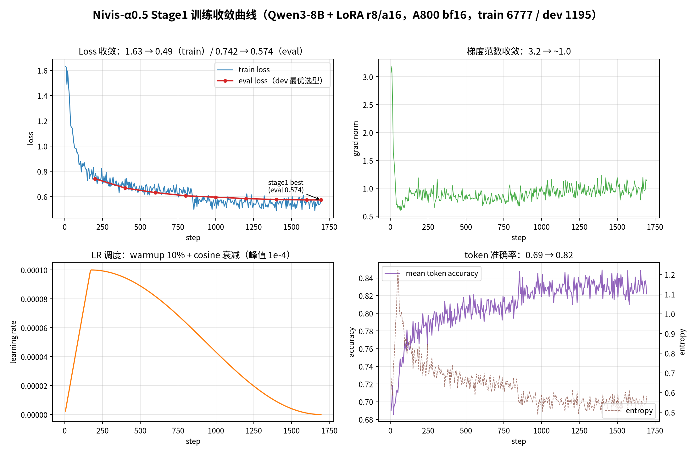
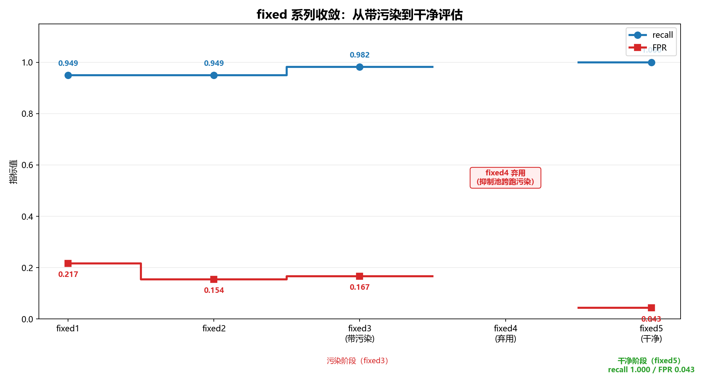
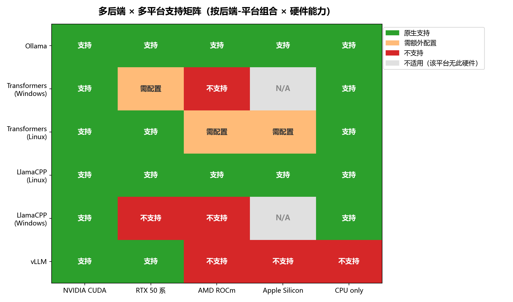
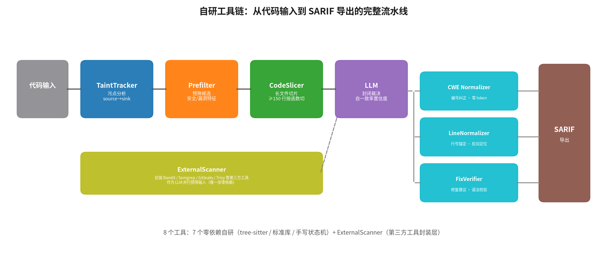
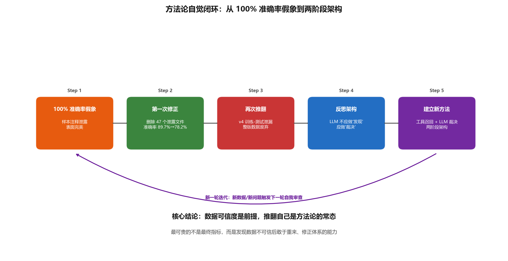
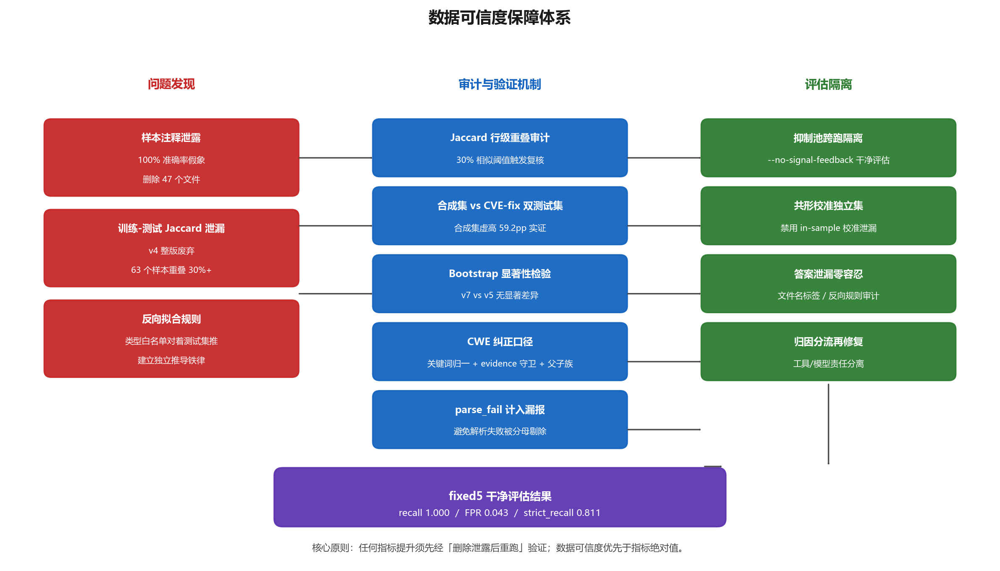
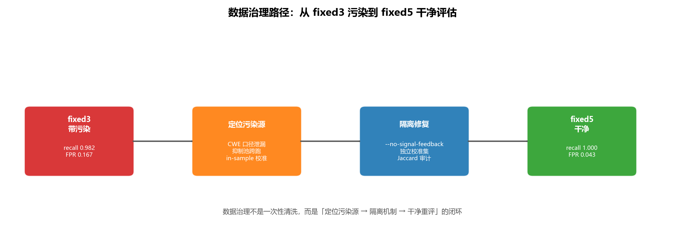
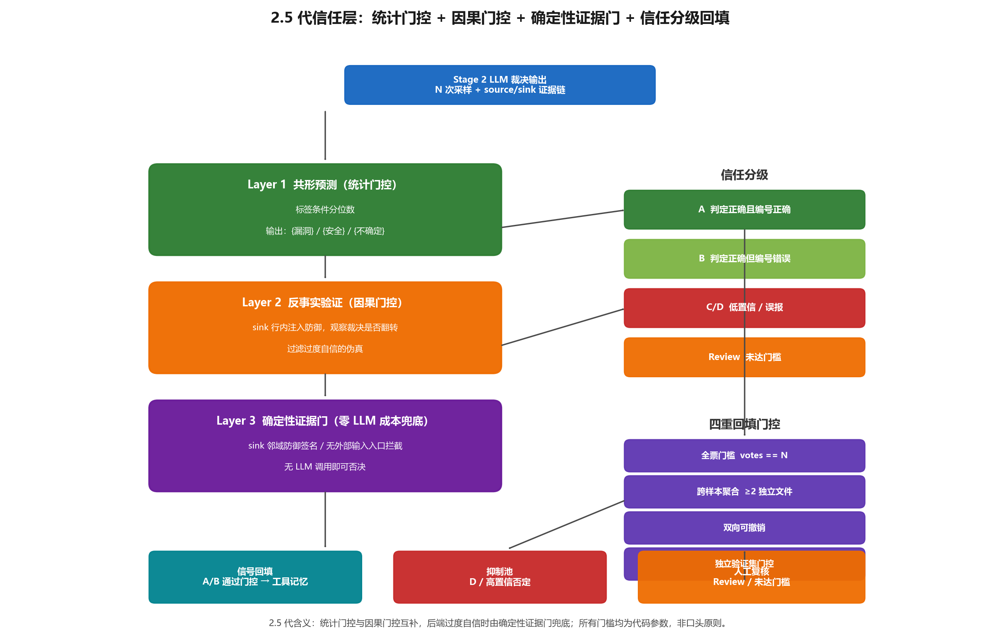
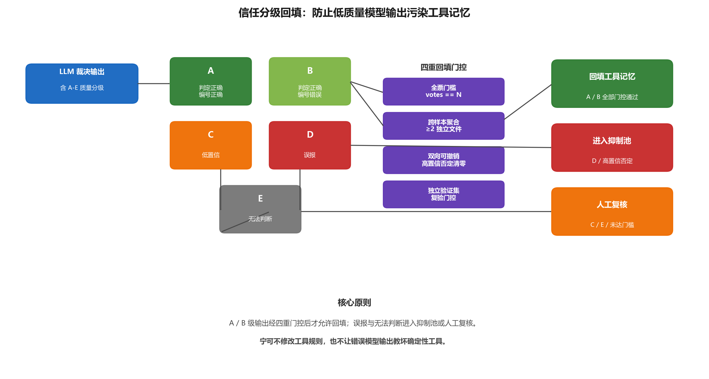

# 论文写作素材库

> 本库按实验、后端、前端、插件、项目级亮点与难点、未来规划、PPT 七个方向，归档论文写作可直接引用的素材。每条素材均标注来源文件，定稿前可按来源追溯核对。
>
> 收录原则：只收录**已确证、可直接引用**的事实；"计划中 / 未执行"的内容单独成章并明确标注状态。


## 目录

- 快速使用指引（给学妹）
- 写作口径须知（引用前必读）
- 一、实验模块
  - 1.1 核心实验数据汇总
  - 1.2 策略转变与关键决策
  - 1.3 巧妙的实验设计
  - 1.4 失败经历与教训
- 二、后端模块
  - 2.1 架构设计亮点
  - 2.2 巧妙的工程逻辑
  - 2.3 自研工具与关键实现细节
- 三、前端模块
  - 3.1 设计系统亮点
  - 3.2 巧妙的交互逻辑
- 四、插件模块
  - 4.1 VS Code 插件
  - 4.2 IntelliJ 插件
  - 4.3 插件工程细节
- 五、项目级亮点与创新点
- 六、项目级难点与应对
- 七、规划与未来目标：Nivis-α1
- 八、PPT 专用素材
- 附录：代码审查验证记录

***

## 写作口径须知（引用前必读）

论文定稿前必须与代码/仓库保持一致的**口径事实**，引用数据时按此核对：

1. **系统级当前最佳 = 两阶段架构 fixed5（2026-08-18）**：α0.5 + 裁决式 prompt `triage_train_aligned`，87 段干净环境（`--no-signal-feedback`）下 **recall 1.000（不含 review）/ FPR 0.043 / acc 0.862**（TP=53 FN=0 TN=22 FP=1，review 11）。模型级"已发布最佳"仍为 v9max（考虑到Q4量化损失精度较多，暂时决定最新模型不发ollama，将transformers作为主要后端）；纯 LLM 形态最佳为 α0.5（combined）。论文写最佳可以直接写α0.5，未来将会是α1、2……。
2. **α0.5 已训练并评估（2026-08-09~16）**：7972 条两阶段训练（stage1 best + stage2 回收 dev 续训，ALPHA05_PROMPT）。纯 LLM 消融（87 段）：combined 最优 recall 0.967 / FPR 0.154 / acc 0.931 / strict_recall 0.770；alpha05_min strict_recall 0.879。与 v9max/α0 一致：**训练 prompt ≠ 推理最优 prompt**。但最新架构不用纯LLM的prompt，而做架构和模型的专属适配prompt。
3. **两阶段指标口径（exp_07 专用）**：recall 为"不含 review"口径（review 既非 TP 也非 FN）；acc 为全量口径 (TP+TN)/87，review 记未决。α0.5fixed5 的 acc 0.862 低于纯 LLM 0.931 主要因 11 个 review 记未决（安全保守性设计），非判错——对比时须注明。α0.5fixed5 strict_recall（CWE 纠正口径，不含 review）= 0.811、strict_acc = 0.847。全部指标公式定义见本文件开头"指标口径速查"。
4. **全部 strict 指标统一为 CWE 纠正口径（2026-08-18 重算落档）**：所有结果 JSON 的 `strict_metrics` 已用当前 `cwe_normalizer`（关键词归一 + evidence 守卫 + 父子族匹配）批量重算写回（`experiments/exp_06_finetune/scripts/recompute_strict_metrics.py --all --write`，122 个文件），旧"未纠正"数字全部作废，论文只引用纠正后数值。纠正工具当日三项修复：CSRF 关键词序（"cross-site request forgery" 原被 XSS 规则误吞）、evidence 兜底守卫（字段已含明确 CWE 编号时不再被 evidence 覆盖，防"把正确改错"）、LDAP 关键词 + CWE-95⊂94 父子映射补全。
5. **评估隔离红线**：两阶段评估必须 `--no-signal-feedback`（signal_registry 抑制池跨跑污染曾致 recall 崩塌 0.25、fixed4 弃用）；未 `--calibrate-from` 时生产端禁用共形校准自动加载（in-sample 校准泄漏）。fixed3（0.982/0.167）带污染仅作演进基线，**本阶段论文主数据用 α0.5fixed5**。
6. **Prompt 消融结论随基座与推理模式迁移**：Qwen2.5 首轮 CoT 最优 → Qwen3-8B 第二轮 +consistency 最优 → repeat=3 后 combined 最优 → α0 微调后 few_shot 反超（合并推理）→ **两阶段裁决须用裁决式变体（triage_*）**（开放式 combined 任务错位 recall 掉到 0.86）。论文叙事以"随基座、统计可靠性与任务形态迁移"为主线。
7. **数据文件与训练版本名称区分**：`final_train_chatml_v2.jsonl`（8421 条）是数据文件，≠ SFT 训练版本 v2（823 条）；同理 v3 数据文件 8616 条 ≠ 训练版本 v3（832 条）。引用时须写清是数据文件还是训练版本。
8. **指标须区分推理管道**：同一模型在 HF 管道（NF4+FP16 LoRA 增量叠加）与 Ollama 发布形态（Q4_K_M 合并量化）下指标不同（CVE-fix recall 0.95 vs 0.75~0.79）。引用时注明管道。
9. **L1-L4 分层审查只有 L1 有落地产物**，L2-L4 框架就绪但未执行，论文不得写成"已执行"。
10. **负样本 1:3 是蒸馏任务计划值**，清洗后实际约 1:1.2（3493/4199）。引用"负样本配比"时注明是计划还是实际。
11. **α0系列 已评估并确认真优于 v9max（FPR 维度，2026-08-12）**：α0 merge+few_shot 下 acc 0.953、fpr 0.038（v9max 同集 FPR：HF 管道 0.423 / Ollama Q4 base 0.192；早期文档误写的 26.9% 系基座 whitelist_only 口径误植，作废）。注意 α0 现已被 α0.5（两阶段训练）接替为训练主线最新版。
12. **多模型投票仅 Ollama 后端开放**：transformers/llamacpp/vLLM 进程内后端每次只能加载一个模型，多个模型名会指向同一模型形成"假投票"，后端以 501 门控关闭该通道。论文描述多模型交叉验证时须注明"Ollama 后端"前提。
13. **纠正口径下合成集 strict 趋势反转（重要叙事修正）**：统一 CWE 纠正口径后，合成集 87 strict_recall：baseline 0.705 → v9max 0.656（未微调基座反高于微调版）。原因：基座语义分析本就强（编号乱被 normalizer 救回），SFT 提升的是格式遵从与存在性判别（recall/FPR），并未注入 CWE 知识（归因偏置仍在）。论文结论改写为"SFT 收益集中在判别与格式，归因准确率需靠后处理纠正与两阶段架构补足"，禁止再引用旧叙事"strict 0.459→0.607 稳步提升"。
14. **87 段合成集为"多漏洞单标注"，strict 偏低有测试集局限成分（引用局限类表述前必读）**：每段测试样本只标注一个 GT CWE，但真实代码常含第二个真实漏洞——模型报的"错 CWE"很多实为命中未被标注的真漏洞。实证：typical_13（样本仅标 CWE-306 认证缺失）实含反射 XSS、typical_14（仅标 CWE-639）实含 XSS，均真实存在。因此 strict_recall 天然偏低部分是测试集局限而非模型缺陷，论文写"归因局限/严格指标偏低"时须注明该口径，避免把测试集局限写成模型能力缺陷。

### 指标口径速查（exp_06 纯 LLM / exp_07 两阶段通用；strict 列均为 2026-08-18 CWE 纠正口径）

| 指标                                | 公式                             | 含义                                                                                                                        |
| --------------------------------- | ------------------------------ | ------------------------------------------------------------------------------------------------------------------------- |
| recall（loose）                     | tp/(tp+fn)                     | 漏洞样本判真比例。两阶段口径下 review（需人工复核）既非 TP 也非 FN，不入分母                                                                             |
| FPR                               | fp/(fp+tn)                     | 安全样本误报比例                                                                                                                  |
| acc（两阶段论文口径）                      | (tp+tn)/87                     | 全量分母，review 记未决仍占分母——fixed5 0.862 低于纯 LLM 0.931 即因 11 个 review 全计未决，非判错（见上第 3 条）。纯 LLM 的 acc=(tp+tn)/valid，parse_fail 剔除 |
| strict_recall                    | strict_tp/(tp+fn)             | 漏洞样本"判真**且** CWE 归因正确"的比例。归因比对前先过 CWE Normalizer（关键词归一 + evidence 守卫 + 父子族匹配），"语义对但编号记错"（如 CWE-77→78 同族）计命中               |
| strict_acc                       | (strict_tp+tn)/valid          | 全样本严格正确率：漏洞样本须"判真且 CWE 对"，安全样本须判安全。valid=tp+fn+tn+fp（两阶段剔除 decision 含 review 的样本；纯 LLM 剔除 parse_fail）                    |
| strict_recall_with_parse_fail | strict_tp/(tp+fn+parse_fail) | 把 parse_fail 计为未召回的最严口径（脚本自动输出，主口径仍用 strict_recall）                                                                     |
| parse_fail                       | 计数                             | 模型输出不可解析的样本数                                                                                                              |

***

## 一、实验模块

> 本项目经历了两轮实验周期。第一轮（2026-06~07）在 Qwen2.5-Coder 上完成 exp_01~05 与 exp_06 Phase 1-3；第二轮（2026-07~08）切换到 Qwen3-8B 后全部重跑。以下数据均为最终重跑后的可信结果。

### 1.1 核心实验数据汇总

#### 1.1.1 零样本推理基线（exp_01~05）

**G0 修复后重跑结果（Qwen3-8B，文件名泄漏已修复，2026-08-07~08）**：

| 实验                    | 模型       | 核心指标                                           | 核心结论                |
| --------------------- | -------- | ---------------------------------------------- | ------------------- |
| exp_01 能力摸底          | qwen3:8b | recall 100% / FPR 50% / accuracy 92.9%         | 泄漏修复生效，1 个安全样本被误报   |
| exp_04 难样本(repeat=3) | qwen3:8b | recall 91.8% / FPR 7.7% / accuracy 91.9%（多数表决） | 非独立 held-out，仅趋势参考  |
| exp_05 消融(repeat=3)  | qwen3:8b | combined 最优：FPR 7.7% / accuracy 91.9%          | 消融结论成立但最优策略随统计可靠性变化 |

> 来源：`experiments/exp_01_basic_scan/results/`；`experiments/exp_05_prompt_ablation/results/`；`experiments/exp_04_hard_samples/results/`

**exp_05 G0 重跑详细数据（repeat=3，多数表决口径，Qwen3-8B）**：

| 变体              | recall | FPR       | accuracy | recall 95% CI   |
| --------------- | ------ | --------- | -------- | --------------- |
| zero_shot      | 0.951  | 0.154     | 0.920    | \[0.865, 0.983] |
| whitelist_only | 0.984  | 0.269     | 0.908    | \[0.913, 0.997] |
| few_shot       | 0.984  | 0.231     | 0.920    | \[0.913, 0.997] |
| cot             | 0.885  | 0.192     | 0.862    | \[0.782, 0.943] |
| **combined**    | 0.918  | **0.077** | 0.920    | \[0.822, 0.965] |

> 关键发现：repeat=1 时 CoT 最优（accuracy 89.7%），但 repeat=3 后 combined 的 FPR 最低（7.7%），CoT 反而退步（accuracy 86.2%）。原始 repeat=1 下 cot 与 few_shot 仅差 1 个样本的差异被噪声覆盖，需 repeat=3 才有统计显著性。

**RAG Top-K 对照实验（exp_03 补充数据）**：

| K     | 召回率        | 误报率   | 准确率       |
| ----- | ---------- | ----- | --------- |
| 1     | 95.0%      | 33.3% | 86.2%     |
| 3     | 96.7%      | 25.9% | 89.7%     |
| **5** | **100.0%** | 29.6% | **90.8%** |
| 10    | 98.3%      | 25.9% | 90.8%     |

K=5 召回率最高（100%），但 K=3 是准确率/FPR 综合最优。

> 来源：`规划.md`

#### 1.1.2 SFT 微调完整迭代数据（exp_06）

**Qwen2.5-Coder 时代（已归档，不可直接对比）**：

| 阶段                 | 配置                              | 核心发现                                 |
| ------------------ | ------------------------------- | ------------------------------------ |
| Phase 1 lr sweep   | lr=1e-5/5e-5/1e-4 × rsLoRA/DoRA | 最优 dev_loss=0.8892 (lr=1e-4+rsLoRA) |
| Phase 2 LoRA 增容    | r=32, rsLoRA, e=2               | **失败**：LoRA 增容 ≠ 知识注入，FPR +19.2pp    |
| Phase 3 KnItLM CPT | 知识注入 + LoRA merge               | **失败**：CPT 知识冲突，第一次"成功"是泄题假象         |

**Qwen3-8B 时代 SFT 迭代（核心实验数据）**：

| 版本        | 数据量      | 合成集 recall            | 合成集 FPR      | 合成集 strict_recall | CVE-fix recall                                  | 状态                                               |
| --------- | -------- | --------------------- | ------------ | ------------------ | ----------------------------------------------- | ------------------------------------------------ |
| baseline  | -        | 0.967                 | 0.269        | 0.705              | 0.375 (8样本)                                     | 锚点                                               |
| v2        | 823      | 0.967                 | 0.231        | 0.738              | 0.625 (8样本)                                     | 首个 SFT                                           |
| v3        | 832      | 0.984                 | 0.192        | 0.738              | 0.500 (8样本)                                     | CoT 清单化副作用                                       |
| v4        | 839      | 0.885                 | 0.115        | 0.656              | 0.429 (7样本)                                     | **废弃（训练-测试泄漏）**                                  |
| v5        | 749      | 1.000                 | 0.231        | 0.754              | 0.571 (7样本)                                     | 首个可信基线                                           |
| v6        | 755      | 0.984                 | 0.192        | 0.689              | 0.429 (7样本)                                     | **失败（负迁移）**                                      |
| v7        | 799      | 0.983                 | 0.231        | 0.667              | 0.800 (20样本)                                    | SFT 最佳                                           |
| v8        | 819      | 0.967                 | 0.308        | 0.770              | 0.750 (20样本)                                    | **失败（FP 激增）**                                    |
| **v9max** | **7692** | **1.000**             | **0.423**    | **0.656**          | **0.950 (20样本)**                                | **已发布最佳（模型级）**                                   |
| α0        | 8616     | 0.918~0.950          | 0.038~0.077 | 0.574~0.789       | 0.800（Ollama combined，2026-08-18 补跑；base 0.900） | 已评估（2026-08-12，口径见 1.1.12；CVE-fix 2026-08-18 补跑） |
| α0.5      | 7972     | 0.967（combined 纯 LLM） | 0.154        | 0.770              | 纯 LLM no-merge 0.850（17/20，strict 0.800，2026-08-20 补跑）；两阶段 stage2 0.556（见 1.1.14⑤） | 已评估（2026-08-16）；两阶段形态见 1.1.14 |

> 来源：`experiments/exp_06_finetune/results/EXPERIMENT_LEDGER.md`；strict_recall 列全部为 **2026-08-18 CWE 纠正口径统一重算值**（见"口径事实"第 4 条），与旧版素材库的"未纠正"数字不可混用。


> 上图为 2026-08-18 纠正口径重绘版（`figures/gen_sft_strict_evolution.py` 可复现）。v4、v6、v8 三个版本因不同原因失败（详见 1.4 节），图中以红色标记。核心叙事：合成集 strict_recall 全程持平（0.705→0.656，归因编号未被 SFT 注入），CVE-fix recall 从 0.375 升至 0.950（判别与格式收益）——两条曲线的背离即"SFT 收益集中在判别与格式，归因需靠后处理纠正与两阶段架构补足"结论的可视化。

**各版本关键变更**：

| 版本       | 数据变更                                                                   | 核心发现                                                       |
| -------- | ---------------------------------------------------------------------- | ---------------------------------------------------------- |
| v2→v3    | 36 条 CWE 统一 + 107 条 CoT 重写 + 9 条 LDAP 补充                               | CoT 重写导致"清单式"推理，CVE-fix recall 回退 12.5pp                   |
| v3→v4    | prompt 数据流推理导向 + 19 条不坚定 CoT 修复                                        | 发现 100 条训练-测试泄漏样本，v4 指标不可信                                 |
| v4→v5    | 删除 100 条泄漏 + 10 条弱密码学样本                                                | **首个可信评估基线**：recall 1.000 是清洗后首次可信结果                       |
| v5→v6    | 追加 6 个 FP 的正确拒绝 CoT（hard-negative）                                     | **负迁移**：FPR 仅降 3.9pp，CVE-fix recall 跌 14.2pp               |
| v5→v7    | 新增 50 条（LDAP 10 / 信任边界 10 / 整数溢出 8 / 反事实 CoT 6 / 对比 CoT 6 / CVE 启发 10） | CVE-fix recall +22.9pp；Bootstrap 检验 v7 vs v5 无显著差异（p>0.05） |
| v7→v8    | 24 条对比 CoT + 防泄漏阈值放宽                                                   | **三大根因失败**：(1) 判别焦虑→FN 增加；(2) 矛盾信号→FP 激增；(3) epochs=3 过拟合  |
| v8→v9    | 55 条新样本 + epochs 3→2                                                   | 修正 v8 三大根因                                                 |
| v9→v9max | 双模型 API 蒸馏，约 10700 条 → 清洗 7692 条                                       | 本地手写天花板 914 条，转云端放大；A800 bf16 训练 4.1h                      |


> 上图展示了从 v2 到 α0.5 的数据量变化（`figures/gen_data_lineage.py` 可复现）。绿色柱（v9max）代表云端蒸馏突破，紫色柱为 α0 系列——**α0.5（7972 条）为当前训练主线**；v4/v6/v8 红色标记（泄漏/负迁移/FP 激增，详见 1.4 节）。

#### 1.1.3 v9max 完整评估数据

**HF 评估管道（NF4 4bit 基座 + FP16 LoRA 增量叠加）**：

| 测试集        | 样本数 | recall    | FPR   | accuracy | strict_recall          | strict_accuracy |
| ---------- | --- | --------- | ----- | -------- | ----------------------- | ---------------- |
| 合成集 87     | 87  | **1.000** | 0.423 | 0.874    | 0.656                   | 0.632            |
| CVE-fix 20 | 20  | **0.950** | -     | 0.950    | 0.750（两次运行 0.750/0.700） | 0.750            |

**Ollama 发布形态（Q4_K_M 合并量化）**：

| 测试集        | 变体            | recall        | FPR       | accuracy  | strict_recall |
| ---------- | ------------- | ------------- | --------- | --------- | -------------- |
| 合成集 87     | base          | 0.934         | 0.192     | 0.897     | 0.656          |
| 合成集 87     | anti_fp_cot | 0.918         | 0.115     | 0.908     | 0.623          |
| 合成集 87     | **combined**  | **0.951**     | **0.077** | **0.943** | 0.656          |
| CVE-fix 20 | base          | 0.789 (15/19) | -         | 0.789     | 0.737          |
| CVE-fix 20 | combined      | 0.750 (15/20) | -         | 0.750     | 0.750          |

**量化缺口诊断**：

| 管道                       | 数据集        | recall    | FPR       | accuracy  | strict_recall |
| ------------------------ | ---------- | --------- | --------- | --------- | -------------- |
| HF NF4+FP16 LoRA         | 合成集 87     | **1.000** | 0.423     | 0.874     | 0.656          |
| Ollama Q4_K_M combined | 合成集 87     | 0.951     | **0.077** | **0.943** | 0.656          |
| HF NF4+FP16 LoRA         | CVE-fix 20 | **0.950** | -         | 0.950     | 0.750          |
| Ollama Q4_K_M base     | CVE-fix 20 | 0.789     | -         | 0.789     | 0.737          |
| Ollama Q4_K_M combined | CVE-fix 20 | 0.750     | -         | 0.750     | 0.750          |

> strict 列均为 2026-08-18 CWE 纠正口径统一重算值。有趣变化：纠正口径下合成集 strict_recall 在 HF/Ollama 两个管道间不再有差异（均 0.656）——量化噪声影响的主要是存在性判别（recall 1.000→0.951），语义归因经 normalizer 归一后被拉平。


> 95%→79% 的缺口是两种 4-bit 量化管道差异（HF/NF4+fp16 LoRA 增量叠加 vs GGUF Q4_K_M 合并后整体量化，LoRA 信号被重量化），**不是"量化 vs 未量化"**。合成集上 Ollama combined 的 FPR 反而更低（7.7% vs 42.3%），因为合并量化"抹平"了部分 LoRA 学到的过度敏感模式。CVE-fix 上 combined 优势不迁移到真实 CVE（75% vs base 79%）。

#### 1.1.4 CVE-fix 测试集演进历程

| 时间         | 版本             | CVE-fix 样本数 | recall       | strict_recall      | 关键变化                                |
| ---------- | -------------- | ----------- | ------------ | ------------------- | ----------------------------------- |
| 2026-07-23 | baseline       | 8           | 0.375        | 0.250               | 合成集虚高 59.2pp 暴露                     |
| 2026-07-23 | v2             | 8           | 0.625        | 0.375               | recall +25pp，strict_recall 仍 0.375 |
| 2026-07-25 | v3             | 8           | 0.500        | 0.250               | cve_fix_0003 TP→FN 回退             |
| 2026-07-26 | v5             | 7           | 0.571        | 0.286               | 清洗后首个可信 CVE-fix 评估                  |
| 2026-07-27 | v6             | 7           | 0.429        | 0.286               | 负迁移，cve_fix_0003 TP→FN            |
| 2026-07-31 | v7             | 20（扩展）      | 0.800        | 0.750               | 扩展到 20 样本                           |
| 2026-08-01 | v8             | 20          | 0.750        | 0.700               | LDAP 注入 TP→FN（判别焦虑）                 |
| 2026-08-06 | v9max (HF)     | 20          | **0.950**    | 0.750（0.700~0.750） | 仅 1 个 FN（cve_fix_0003）            |
| 2026-08-08 | v9max (Ollama) | 20          | 0.750~0.790 | 0.737~0.750        | 量化缺口，3 个 FN                         |

> strict_recall 列为 2026-08-18 CWE 纠正口径重算值（旧未纠正值 0.125~0.650 已作废）。纠正口径下 CVE-fix 演进趋势不变：v7 扩集后 strict 从 ~0.29 跃至 0.75，v9max 维持 0.74~0.75。

**CVE-fix 持续 FN 根因**（4 个自 v2 起未完全解决）：

1. **被防御措施迷惑**：cve_fix_0001.java 看到 `LdapEncoder.nameEncode` 就判安全
2. **被无关安全机制分散注意力**：cve_fix_0002.js 看到 `bcryptjs` 就忽略 LDAP filter 拼接
3. **对"演示/框架代码"的误判**：cve_fix_0003.py 没看到 JSON-RPC `calculate(expression)` 是危险 sink
4. **跨文件上下文缺失**：cve_fix_0005.js 只看当前文件，没看到 `server.js` 中的 loopback 信任绕过

#### 1.1.5 DPO 尝试与失败记录

| # | 配置                   | 结果               | 根因                           |
| - | -------------------- | ---------------- | ---------------------------- |
| 1 | 8bit + max_len=1024 | OOM 黑屏           | 8B 8bit + DPO 双前向超 15GB VRAM |
| 2 | fp16 + max_len=512  | 立即 OOM           | 8B fp16 本身就超 16GB            |
| 3 | 4bit + max_len=512  | 跑完但 grad_norm=0 | 4bit NF4 + DPO 双前向梯度回传失效     |

> DPO 在本地 16GB 消费级 GPU 上无法用于 Qwen3-8B。DPO 数据（`dpo_merged.jsonl` 104 条）已保留，若换云端 GPU 可直接复用。

#### 1.1.6 v7 Bootstrap 显著性检验

| 指标       | 差值（v7 - v5） | 95% CI              | p 值    | 显著？ |
| -------- | ----------- | ------------------- | ------ | --- |
| recall   | -0.0166     | \[-0.0536, +0.0000] | 0.7362 | ✗   |
| accuracy | -0.0125     | \[-0.0575, +0.0230] | 0.5220 | ✗   |
| fpr      | -0.0005     | \[-0.1111, +0.1111] | 1.0000 | ✗   |

> 配对 block bootstrap N=10000。合成集上 v7 与 v5 无统计显著差异，说明 v7 的改进主要体现在真实 CVE 泛化上而非合成集。

#### 1.1.7 测试集标注修正记录

**CVE-fix 测试集修正（2026-07-25）**：

| 样本                  | 问题                               | 修正                  | 影响                                    |
| ------------------- | -------------------------------- | ------------------- | ------------------------------------- |
| cve_fix_0001.java | NVD 标 CWE-74，但描述为 LDAP injection | CWE-74 → **CWE-90** | 模型识别出 LDAP 注入但因 CWE 号不匹配被计 strict_FN |
| cve_fix_0008.py   | 标 CWE-502 但无 pickle.loads        | 从 samples 移除        | 模型正确判断"无反序列化"却被计 FN                   |

**87 合成集标注修正（2026-07-31，9 个样本）**：补充父类编号、细化 SSTI 编号等。修正后 v7 strict_accuracy 从 0.640→0.728（合成集）、0.650→0.700（CVE-fix），无需重跑模型仅重算 strict_metrics。

#### 1.1.8 v9max 训练配置详情

| 字段   | 值                                                                                    |
| ---- | ------------------------------------------------------------------------------------ |
| 训练数据 | 双模型 API 蒸馏（DeepSeek V4-Flash / GLM-5.2），清洗后 7692 条（漏洞 3493 / 安全 4199）                |
| 训练配置 | Qwen3-8B bf16 全精度 LoRA（r=8, alpha=16, dropout=0.1, rsLoRA），A800                      |
| 数据划分 | train 6539 / dev 1153                                                                |
| 训练参数 | 2 epoch, lr=1e-4, max_seq 6144, 1636 步 ≈ 4.1h, train_loss ≈ 0.529                  |
| 发布形态 | base+LoRA 合并后 Q4_K_M 量化，Ollama 模型 `garrywhite109909/graduation-vuln-scanner:v9max` |

#### 1.1.9 经济性数据

| 项目                    | 成本          | 说明                      |
| --------------------- | ----------- | ----------------------- |
| DeepSeek V4-Flash API | 40 元        | 7700 条生成                |
| GLM-5.2 API           | 40 元        | 3000+ 条生成               |
| autodl A800 训练        | 20 元        | 4.1h × 5 元/h            |
| **总计**                | **约 100 元** | 从 914 条手写扩展到 7692 条蒸馏数据 |


#### 1.1.10 G0 方法学修复清单（2026-08-08）

| # | 修复项                                  | 影响范围       | 是否需重跑        |
| - | ------------------------------------ | ---------- | ------------ |
| 1 | `build_user_prompt` 不再注入 filename    | 所有 LLM 实验  | 必须重跑         |
| 2 | CVE-fix 测试集标注修正                      | exp_06    | 已处理          |
| 3 | exp_04 manifest 加 `held_out_status` | exp_04    | 不影响推理        |
| 4 | CVE-fix 加 `limitations` 字段           | exp_06    | 仅 recall 参考  |
| 5 | `--repeat` 默认值 1→3                   | exp_04/05 | 重跑用 repeat=3 |
| 6 | 新增严格口径指标                             | exp_06    | 自动输出         |
| 7 | 多数表决平票语义统一为 True                     | exp_04/05 | 重跑已应用        |
| 8 | resume 逻辑修复                          | exp_04/05 | 重跑已应用        |
| 9 | evaluate.py 跨文件注释去标签                 | exp_06    | 重跑已应用        |

**重跑后检查**：exp_01 准确率从 100% 降至 92.9%（泄漏修复生效）；exp_05 repeat=3 下各变体有 95% 置信区间；所有结果 JSON 含严格口径指标；CVE-fix 仅引用 recall；exp_04 结果旁注明"非独立 held-out"局限性。

#### 1.1.11 exp_05 第二轮消融（Qwen3-8B，8+2 变体，2026-08-02）

以 base（482 字符）为起点，逐个叠加 6 个维度，另有 2 个组合变体。87 样本 × repeat=1。

| 变体               | recall    | FPR       | accuracy  | 说明             |
| ---------------- | --------- | --------- | --------- | -------------- |
| base             | 0.934     | 0.192     | 0.897     | 纯基线            |
| +scope           | 1.000     | 0.308     | 0.908     | 召回最高但 FPR 高    |
| +whitelist       | 0.885     | 0.077     | 0.897     | FPR 最低         |
| +hardcoded       | 0.750     | 0.038     | 0.814     | 召回暴跌           |
| +cot             | 0.885     | 0.192     | 0.862     | 不如 base        |
| +lineno          | 0.967     | 0.385     | 0.862     | FPR 最高         |
| **+consistency** | **0.967** | **0.115** | **0.943** | **loose 综合最优** |
| +all             | 0.951     | 0.231     | 0.897     | 六维全加反而回退       |

> `+consistency`（结论一致性校验）在 Qwen3-8B 上是唯一显著优于 base 的维度（accuracy +4.6pp），这与首轮"CoT 最优"完全不同——**最优 prompt 策略随基座变化**。组合变体均无增益：`+consistency+scope` 0.984/0.308/0.897、`+consistency+scope+cot` 0.885/0.154/0.874，均回退到 base 水平，进一步印证 `+consistency` 单独最优。

#### 1.1.12 Nivis-α0：已训练、已评估（2026-08-09~12）

| 字段        | 值                                                              |
| --------- | -------------------------------------------------------------- |
| 模型名       | `garrywhite109909/nivis-alpha0`（Ollama 本地已安装）                  |
| 基座        | Qwen3-8B，LoRA r=8 / alpha=16 / dropout=0.1 / rsLoRA            |
| 训练数据      | `final_train_chatml_v3.jsonl`，8616 条（train 7324 / dev 1292）    |
| 训练参数      | bf16、2 epoch、lr=1e-4、max_seq 6144、1832 步、约 9.3h（A800）         |
| 训练曲线      | train_loss 1.459→0.482；eval_loss 0.709→0.512；eval_acc 84.6% |
| 推理 prompt | V3_PROMPT（combined，4448 字符）                                   |
| 评估        | ✅ 已完成（87 合成集 + 全历史 prompt 消融，2026-08-12）                       |


**α0 评估结果（87 段合成集，2026-08-12）**：

| 推理模式                  | prompt        | recall | acc      | fpr     | strict_recall | strict_acc | parse_fail |
| --------------------- | ------------- | ------ | -------- | ------- | -------------- | ----------- | ----------- |
| no-merge（FP16 叠加）     | combined      | 0.918  | 0.976\*  | 0.0385  | **0.789**     | 0.842       | 5/87        |
| **merge（adapter 合并）** | **few_shot** | 0.950  | **0.953** | **0.038** | 0.617          | 0.721       | 1/87        |
| merge                 | combined      | 0.934  | 0.931    | 0.077   | 0.574          | 0.678       | 0/87        |

> \*no-merge 的 accuracy 0.976 分母为 82 有效样本（5 个 parse_fail 剔除），与 merge 的 86 有效样本口径不同，不可直接比较。strict 列为 2026-08-18 CWE 纠正口径重算值；no-merge combined 的 strict_recall（0.789）显著高于 merge 两变体，与"no-merge 保真 LoRA 细粒度判别、合并量化抹平归因信号"的解释一致。
>
> **全历史 prompt 消融结论（11 变体，merge 模式）**：
>
> - **few_shot 最优**（acc 0.953、fpr 0.038、strict_recall 0.617），反超训练用的 combined（acc 0.931、fpr 0.077、strict_recall 0.574）。训练把 few-shot 在基座上的"激进判 True"偏见洗掉，few-shot 反而稳定输出格式。
> - **长 prompt 复读退化不存在**：few_shot/combined 无退化，short（767字）fpr 反而飙到 0.346。
> - **显式规则未完全内化**：no_rules 掉到 acc 0.862，白名单/硬编码规则仍有价值。
> - **A/B 类问题（格式跑偏/复读）根因 = no-merge 数值精度**，非 prompt 本身：combined 在 no-merge 下 5/5 全 parse_fail，merge 下 parse_fail=0。
> - 完整数据：`experiments/exp_06_finetune/results/alpha0_all_variant_regressed.json`（聚合表，strict 列仍为旧未纠正值）+ 下方"α0 评估记录"区块（11 变体全表 strict 已按纠正口径更新，引用以本表为准）
>
> α0 相比 v9max 的核心改进是**误报率大幅下降**（合成集 87 FPR：v9max HF 管道 0.423 / Ollama Q4 base 0.192 → α0 merge+few_shot 0.038），符合"数据清洗 + 二次蒸馏"的目标。论文引用须注明评估口径（merge/no-merge）与推理管道。

**α0 CVE-fix 真实集补跑（2026-08-18/19，A1 闭环）**：

> 原 1.1.12 缺 CVE-fix 数据（"待补"）。本机 α0 仅存 Ollama 发布形态（Q4 GGUF 合并量化，本地已装 `garrywhite109909/nivis-alpha0`），HF 管道（NF4+FP16 LoRA）adapter 为云端训练产物已删，故补跑走 Ollama 后端（与 v9max Ollama 形态同口径可对比）。

| 变体       | recall           | strict_recall（纠正口径） | strict_acc | FN                  | parse_fail |
| -------- | ---------------- | -------------------- | ----------- | ------------------- | ----------- |
| base     | **0.900**（18/20） | 0.600                | 0.600       | 0005/0006           | 0           |
| combined | 0.800（16/20）     | **0.750**            | 0.750       | 0001/0003/0005/0006 | 0           |

- **对比 v9max Ollama 发布形态 CVE-fix（recall 0.75~0.79 / strict 0.737~0.75）**：α0 不再有量化缺口劣势——combined 的 strict_recall（0.75）与 v9max 最优档持平，base 的 recall（0.9）超过 v9max 全部 Ollama 档；与 HF 管道 v9max（recall 0.95 / strict 0.75）比，recall 有 0.15 差距（Ollama 量化 + 不同基座）。
- 与合成集一致：α0 的弱项是 CWE 编号记忆（strict < recall），combined 的 strict 归因明显优于 base（0.75 vs 0.6，cwe_mismatch 1 vs 6）。
- 结果文件：`experiments/exp_06_finetune/results/exp_06_eval.ollama_garrywhite109909/nivis-alpha0.combined.20260818_225955.json`（combined）、`…/nivis-alpha0.20260818_230612.json`（base）；strict 已写回纠正口径。

**α0 评估记录（完整明细，2026-08-12 落档；strict 为 2026-08-18 纠正口径）**：

- **配置**：transformers 后端 + no-merge（PeftModel 运行时叠加 LoRA，保留 adapter FP16 最大精度）+ 4bit NF4 基座 + 训练 prompt（combined/V3_PROMPT）+ 贪心解码。结果文件：`experiments/exp_06_finetune/results/alpha0_87_full.json`。
- **失败样本明细**：parse_fail（5）= `hard_cve_02_python_log_injection.py`（CWE-117）、`typical_17_md5_password.py`（CWE-327）、`typical_33_php_type_juggling.php`（CWE-843，271s 长耗时=输出打满 max_new_tokens）、`typical_35_java_deser.java`（CWE-502，271s）、`noise_03_harden_string_concat.py`（安全样本）；FN（1）= `hard_longfile_01_hidden_sql.py`（CWE-89，181 行长文件隐藏 SQL 注入漏报）；FP（1）= `noise_06_shell_true_hardcoded.py`（shell=True 但命令为硬编码常量，被误判）。
- **关键观察**：① CWE 编号记忆是主要短板——strict_recall 0.789 明显低于 recall 0.918，12 个 cwe_mismatch 中大量"判对类型但编号记错"（CWE-78→77、CWE-306→XSS、CWE-639→XSS），体现 CWE Normalizer 查表工具价值；② 271s 长耗时样本 = parse_fail（typical_33/35 输出超长打满 2048 token，no-merge 边界问题）；③ no-merge 下 batch 提速失效（batch=4 时 LoRA 运行时叠加反而更慢，逐档 OOM、每批 7 分钟，改回单条串行，记入 batch_probe）。

**merge 消融 11 变体全表（按 accuracy 排序，strict 为纠正口径）**：

| 变体              | 字数   | recall | acc      | fpr     | strict_recall | strict_acc | parse_fail | avg_s |
| --------------- | ---- | ------ | -------- | ------- | -------------- | ----------- | ----------- | ------ |
| **few_shot**   | 4259 | 0.950  | **0.953** | **0.038** | 0.617          | **0.721**   | 1           | 47.1   |
| **combined**    | 4448 | 0.934  | 0.931    | 0.077   | 0.574          | 0.678       | 0           | 43.6   |
| whitelist_only | 2019 | 0.967  | 0.908    | 0.231   | 0.656          | 0.690       | 0           | 37.9   |
| strict_schema  | 5343 | 0.951  | 0.908    | 0.192   | 0.607          | 0.667       | 0           | 46.1   |
| anti_fp_cot   | 1030 | 0.933  | 0.907    | 0.154   | 0.517          | 0.616       | 1           | 30.7   |
| lite            | 1108 | 0.967  | 0.885    | 0.308   | 0.623          | 0.644       | 0           | 34.0   |
| zero_shot      | 1981 | 0.934  | 0.885    | 0.231   | 0.557          | 0.621       | 0           | 43.6   |
| cot             | 3348 | 0.918  | 0.885    | 0.192   | 0.574          | 0.644       | 0           | 40.5   |
| no_rules       | 3211 | 0.918  | 0.862    | 0.269   | 0.623          | 0.655       | 0           | 36.5   |
| short           | 767  | 0.950  | 0.860    | 0.346   | 0.500          | 0.546       | 1           | 17.8   |
| base            | 482  | 0.934  | 0.851    | 0.346   | 0.590          | 0.609       | 0           | 26.4   |

> avg_s = 平均每样本推理耗时（秒），即结果 JSON `metrics.elapsed_stats.avg`（87 段均值）。与 prompt 字数正相关：short（767 字）17.8s 最快，few_shot（4259 字）47.1s / strict_schema（5343 字）46.1s 最慢。论文若比较推理成本可用此列，但注意它混入 no-merge 的 batch 失效影响（见关键观察③）。

**no-merge 针对性验证（5 个问题样本，验证新变体是否解决 A/B 类问题）**：

| 变体             | hard_cve_02 | noise_03    | typical_17  | typical_33(PHP)   | typical_35(Java)  | parse_fail |
| -------------- | ------------- | ------------ | ------------ | ------------------ | ------------------ | ----------- |
| combined（训练用）  | ✗parse_fail  | ✗parse_fail | ✗parse_fail | ✗parse_fail(275s) | ✗parse_fail(276s) | **5/5**     |
| strict_schema | ✗parse_fail  | ✅TN          | ✅TP          | ✅TP(79s)           | ✗parse_fail(292s) | 2/5         |
| short          | ✅TP           | ✗FP          | ✅TP          | ✅TP(40s)           | ✅TP(32s)           | **0/5**     |
| few_shot      | ✅TP           | ✗FP          | ✅TP          | ✅TP(45s)           | ✅TP(86s)           | **0/5**     |

> no-merge 验证结论：A/B 类问题（格式跑偏/复读）根因 = **no-merge 数值精度**（FP16 adapter 叠加 4bit 基座的低精度漂移），非 prompt 本身——combined 在 no-merge 下 5/5 全 parse_fail，merge 下 parse_fail=0；short/few_shot 在 no-merge 下也能救格式（parse_fail=0）但代价是 noise_03 误报（FP）。生产建议：merge 模式 + few_shot（acc 0.953、fpr 0.038、parse_fail 0）；no-merge 仅在有"最大精度"研究需求时使用。

#### 1.1.13 Nivis-α0.5 模型评估（exp_06，2026-08-09~16）

**α0.5（两阶段训练，2026-08-09~16）**：7972 条（`final_train_chatml_alpha05.jsonl`），stage1 best + stage2 回收 dev 全量续训（train 6777 / dev 1195）。纯 LLM prompt 消融（87 段，transformers nomerge）：



> 上图为 stage1 训练曲线（`figures/gen_alpha05_stage1_train_curve.py` 可复现，数据源云端日志 `train_log_cloud_r8_e2_lr0.0001_s42_rslora.json`）：train loss 1.63→0.49、eval loss 0.742→0.574（dev 最优选型点，stage1 best）、梯度范数 3.2→~1.0、LR warmup 10% + cosine 衰减（峰值 1e-4）。stage2 为回收 dev 全量续训的另一运行，不在本图内。

| 变体            | recall | FPR   | acc       | strict_recall | strict_acc | parse_fail |
| ------------- | ------ | ----- | --------- | -------------- | ----------- | ----------- |
| alpha05_min  | 1.000  | 0.480 | 0.855     | **0.879**      | 0.771       | 4/87        |
| alpha05_lite | 1.000  | 0.462 | 0.862     | 0.820          | 0.736       | 0/87        |
| alpha05（训练原样） | 0.984  | 0.269 | 0.908     | 0.803          | 0.782       | 0/87        |
| **combined**  | 0.967  | 0.154 | **0.931** | 0.770          | **0.793**   | 0/87        |

> 口径说明（2026-08-18 统一）：strict_recall 为 CWE 纠正口径（normalize + evidence 守卫 + 父子族匹配），主口径分母 = tp+fn（不含 parse_fail）；alpha05_min 计入 parse_fail 后 strict_recall = 0.836。alpha05_min 的 recall 1.000 / acc 0.855 为 valid 口径（83 有效样本，4 个 parse_fail 剔除）；计入 parse_fail 后 recall 0.951 / acc 0.816。alpha05_min 剩余 strict 缺口（7 个 mismatch）已逐样本人工审查：4 个为模型真实归因错误（认证/IDOR/CSRF/类型杂耍被降级为表层注入或泛化授权类——"语义类漏洞归因偏置"的扩展证据），1 个为标签不完整（typical_28 代码同时含 SQL 注入与信息泄露，GT 仅标 CWE-209，建议补标 CWE-89），2 个次漏洞命中（hard_bypass_06 时序比较标成硬编码、typical_13 反射 XSS 技术成立但主漏洞认证缺失未识别）。

> 来源：`experiments/exp_06_finetune/results/exp_06_eval.finetuned_custom.*.json`

**α0.5 CVE-fix 纯 LLM 评估（2026-08-20 补跑，A1 同配置对齐 v9max）**：

> 配置与 v9max HF 评估对齐：`evaluate.py --mode finetuned --variant combined --no-merge` + 4bit NF4 本地基座（`models/transformers/Qwen3-8B`）+ stage2 adapter + 贪心解码，CVE-fix 20 段。结果文件：`exp_06_eval.finetuned_custom.combined.20260820_003830.json`。

| 指标 | 值 | 对比 v9max（HF merge） | 对比两阶段 stage2 |
|---|---|---|---|
| recall | **0.850**（TP=17 FN=3） | 0.950（-10pp） | 0.556（+29pp） |
| strict_recall（纠正口径） | **0.800**（16/20，mismatch 1） | 0.750（+5pp） | 0.444（+36pp） |
| parse_fail | 0 | 0 | - |

- **FN 3 个（cve_fix_0004/0005/0006）与两阶段 stage2 的 FN 完全重合**——CWE-95 反序列化 / CWE-441 缺失型漏洞是 α0.5 在真实 CVE 上的固有盲区（纯 LLM 与两阶段都漏），非工具链缺陷。
- **纯 LLM 明显优于两阶段 stage2（recall 0.850 vs 0.556）**：真实 CVE 集上工具零召回是两阶段瓶颈，纯 LLM 无此限制，0007/0009~0019 全部直接判对；但两阶段的 review 保守设计（11 个）不在纯 LLM 中出现，对比时注意口径（两阶段 recall 不含 review）。
- **strict 归因优于 v9max（0.800 vs 0.750）**：与合成集结论一致——α0.5 的 CWE 归因（纠正口径）强于 v9max。
- 注意：本次 base 环境（torch 2.13）下 4bit+no-merge 显存占用约 16G（87 段评估在 AI 环境 torch 2.11 仅 8.3G），长样本触发 1 次 OOM 重试但结果完整；如需复现建议用 AI 环境。

#### 1.1.14 两阶段工具链迭代（exp_07，2026-08-14~18）

> 定位：两阶段架构的**工具侧**演进（区别于 1.1.13 的模型侧评估）。① ② 为 α0 基座上的工具链迭代（凸显工具链作用），③ ④ 为 α0.5 基座上的裁决式收敛与失败链。

**① 四维矩阵（α0，combined_nosource，2026-08-14/15）**：

| 后端                | 纯 LLM                 | 工具链 2.5 代                 |
| ----------------- | --------------------- | ------------------------- |
| transformers bf16 | 0.967 / 0.115 / 0.943 | 1.000 / 0.190 / 0.951     |
| ollama Q4         | 0.934 / 0.154 / 0.908 | **0.966 / 0.105 / 0.948** |

> 关键发现：2.5 代在低精度后端收益最大——量化噪声把边缘样本推向"安全"（类似隐式正则化），被共形+反事实精确拦截，FPR 降 32%（0.154→0.105）。

**② 五档演进（α0，ollama）**：修复前 0.936/0.191 → P0+P2 0.957/0.111 → trust 0.949/0.136 → **2.5 代 0.966/0.105** → 纯 LLM 对照 0.934/0.154。

**③ fixed 系列（α0.5 + triage_train_aligned，2026-08-17~18）**：

| 轮次                 | recall（不含 review） | FPR       | acc       | strict_recall（纠正口径，不含 review） | strict_acc | 说明                                             |
| ------------------ | ----------------- | --------- | --------- | ------------------------------ | ----------- | ---------------------------------------------- |
| fixed1             | 0.949             | 0.217     | 0.851     | 0.610（36/59）                   | 0.659       | 首轮全量（TP=56 FN=3，review 5）                      |
| fixed2             | 中断（21/87）         | -         | -         | -                              | -           | 跑至 21 段被杀重开，无有效汇总                              |
| fixed3             | 0.982             | 0.167     | 0.862     | 0.800（44/55）                   | 0.808       | 带抑制池跨跑污染 + in-sample 校准，仅作演进基线                 |
| fixed4             | 弃用（36/87）         | -         | -         | -                              | -           | 抑制池跨跑污染实锤后整轮弃用（见失败 11）                         |
| **fixed5（论文主数据）**  | **1.000**         | **0.043** | **0.862** | **0.811（43/53）**               | **0.847**   | 干净环境（`--no-signal-feedback` + 禁用 in-sample 校准） |
| 纯 LLM combined（对照） | 0.967             | 0.154     | 0.931     | 0.770                          | 0.793       | —                                              |

> **acc 统一口径（2026-08-19）**：三行 acc 均按 **(TP+TN)/87**（review 入分母），与"指标口径速查"的 acc（两阶段论文口径）一致；各轮 TP/TN 取自对应结果 JSON summary（fixed1 56/18 → 0.851、fixed3 55/20 → 0.862、fixed5 53/22 → 0.862）。

> **fixed5 对账细节（防歧义）**：summary 的 review 判定是"predicted 为 None"（11 个），strict 重算剔除的是"decision 字段含 review"（8 个，其中 4 个 safe 样本 predicted=False）。因此 loose 口径 tn=22，strict_acc 分母里的 tn=18：fixed5 strict_acc = (43+18)/72 = 0.847，strict_recall = 43/53 = 0.811。两种"review"定义相差 4 个样本，strict 与 loose 指标交叉对账时留意。
>
> 叙事要点：fixed1→fixed5 不仅 recall 收敛，strict_recall 同步 0.610→0.811、strict_acc 0.659→0.847——两阶段修复同时改善判别与归因；fixed5 strict 双指标亦高于纯 LLM combined（0.811 vs 0.770 / 0.847 vs 0.793，工具证据链 + 类型提示到点反哺归因）。



> 上图为 fixed 系列 recall/FPR 阶梯收敛过程。fixed3 的"漂亮"数字来自污染机制，fixed4 因此弃用；fixed5 在隔离自举与 in-sample 校准后得到干净的 1.000/0.043。

**④ 裁决式 prompt 4 变体消融（方向错误，已弃，2026-08-16~17）**：

> **状态标签：方向错误已弃**。此实验计划 4 个 is_confirmed 裁决式变体顺序消融（`triage_default → triage_cot → triage_min → triage_independent`，每变体 ~5h、预计 22h），跑到一半被归因复盘叫停——"22h 白跑警告"。**禁止把其中任何一轮当作有效消融结论引用**，但其失败链本身是论文素材（prompt 任务形态须与训练分布对齐）。

| 变体                  | 实际进度                        | 结果                     | 弃用原因                                                                    |
| ------------------- | --------------------------- | ---------------------- | ----------------------------------------------------------------------- |
| triage_default     | 完整 87 段 + 多轮部分（3/7/28/1/53） | 完整轮 recall **崩塌 0.25** | 抑制池在评估中累积过滤工具召回（失败 11 同源事故）；is_confirmed 输出格式与 `_maybe_recheck` 解析器错位  |
| triage_cot         | **49/87 中止**                | 33/33 复核票全部无效          | 复核双格式错位实锤：解析器只认 `has_vulnerability`，triage 变体输出 `is_confirmed` → 盲区兜底死亡 |
| triage_min         | **未跑**（排队中即被叫停）             | -                      | 前两变体实锤 is_confirmed 方向错误后整批停止                                          |
| triage_independent | **未跑**                      | -                      | 同上                                                                      |

**来龙去脉（08-16~17）**：

- **动因（开放式错位）**：α0.5 + 开放式 combined 跑工具链整轮 87 段 recall 仅 **0.864**（review 22，strict_recall 0.545，`…combined.20260816_051143.json`）——相比纯 LLM 0.967/0.770 双掉点，开放式在裁决任务上错位；于是转向 is_confirmed 裁决式，启动上述 4 变体消融。
- **08-17 复盘：方向同样错误**。α0 工具链当时的"全正提升"（recall 0.934→0.966、FPR 0.154→0.105）靠的是**开放式 combined_nosource + trust_llm_recheck 兜底 8 个盲区**，不是裁决质量好；α0.5 基线高（纯 LLM 0.967）、盲区被训练覆盖，兜底无东西可捞，工具链只剩裁决确认环节。
- **掉点机制**：is_confirmed 与训练分布（has_vulnerability 格式）错位直接掉点（10 样本验证 6TP/4FN，同批 triage_default 全 FN）。
- **正确解**：triage_train_aligned（system=ALPHA05_PROMPT 与训练对齐 + has_vulnerability schema + 双格式解析 + majority_confirm），随后 fixed1→fixed5 五轮收敛至论文主数据。
- **结论**：裁决 prompt 的任务形态必须与训练分布对齐——开放式与异构裁决式两端都是错位。

**fixed5 明细**：TP=53 FN=0 TN=22 FP=1，review 11（vuln 侧 8 / safe 侧 3）。唯一 FP 为 `hard_crossfile_01_input`（CWE-441 缺失型漏洞，无确定性校验手段，论文写局限）；fixed3 唯一 FN `hard_longfile_01` 转 review（B608 提示到点但模型 2:1 否决，按归因分流铁律归模型侧）。结果文件：`experiments/exp_07_two_stage_eval/results/exp_07_two_stage_eval.nivis-alpha0.triage_train_aligned.20260818_104203.json`。

> **未决率口径（结果页用）**：11 个 review 记未决，占 87 段 12.6%——"若只算有结论样本"时 acc 为 (53+22)/(87-11)=0.987，未决率 12.6% 是保守设计的代价，**不是判错**。acc 0.862（全量分母）低于纯 LLM 0.931 的根因即此。

**⑤ CVE-fix 真实集验证（2026-08-18/20 补跑 + 解析器修复，A6 闭环）**：

> 两阶段架构此前只在 87 段合成集评估（fixed5 达标），真实 CVE-fix 集无两阶段验证。补跑：transformers + α0.5 stage2 + triage_train_aligned，`--no-signal-feedback` 干净环境，20 段全量。

| 指标                   | 修复前（2026-08-18） | 修复后（2026-08-20） | 说明                                       |
| -------------------- | ---------------- | ---------------- | ---------------------------------------- |
| recall（不含 review）    | 0.556（TP=5 FN=4）  | **0.882（TP=15 FN=2）** | review 11 → 3                          |
| acc（全量口径）            | 0.556             | **0.882**         | review 入分母                               |
| strict_recall（纠正口径） | 0.444             | **0.882**（cwe_mismatch=0） | 修复前 1 个 mismatch，修复后 0               |

- **根因（2026-08-20 定位，非"工具零覆盖"）**：修复前 11 个 review 全部来自 `has_candidate_adjudicate` 路径的 **3 票全 invalid（votes=0/0/3，conf=0.0）**——`parse_triage_verdict` 只认 `is_confirmed` 字段，但 triage_train_aligned 的 prompt 明确要求模型输出 **`has_vulnerability`**（对齐 α0.5 训练格式）。**解析器与 prompt 契约错位**：注释长期声称"双格式兼容"（two_stage_scanner.py L453-454）但代码从未实现 has_vulnerability 解析分支。87 段 fixed5 靠模型侥幸输出 is_confirmed 格式才通过（invalid=0），真实 CVE 复杂输入下模型按 prompt 输出 has_vulnerability → 全判 invalid → review。
- **修复（2026-08-20）**：`parse_triage_verdict` 补齐 has_vulnerability 分支（真正的双格式兼容，单测 7/7 通过），`_adjudicate_one`/`counterfactual` 全部受益。**修复后 TP 5→15**，9 个样本从 review 变 TP（0007/0009/0010/0011/0012/0013/0014/0015/0017/0019，全是有候选裁决路径）、1 个从 FN 变 TP（0004）；仅剩 3 个 review（0001/0003/0018，低置信）与 2 个 FN（0005/0006，CWE-441 缺失型固有盲区）。
- **修复后两阶段 vs 纯 LLM**：recall 0.882 > 纯 LLM no-merge 0.850、strict_recall 0.882 > 纯 LLM 0.800——**工具证据链 + 裁决对齐的真实收益在 CVE-fix 上首次体现**（修复前两阶段 0.556 反而低于纯 LLM，是被解析器 bug 掩盖）。
- **方法论教训**：① 代码注释声称的能力必须与实现一致（"双格式兼容"注释 3 天未实现，掩盖真实缺陷）；② 评估只过合成集会掩盖输入分布敏感的代码路径（87 段模型输出格式侥幸可解析，真实 CVE 暴露契约错位）；③ 归因分流前先查代码接缝——"11 个 review"第一直觉是保守设计，实际是解析器 bug，若按"保守"写进论文会把架构缺陷写成设计优点。
- 结果文件：`experiments/exp_07_two_stage_eval/results/exp_07_two_stage_eval.nivis-alpha0.triage_train_aligned.20260818_230036.json`（修复前，strict 已重算）；`…20260820_095200.json`（修复后，strict_metrics 为 2026-08-20 纠正口径写回）。

> 工具层提示质量审计五指标见 1.1.15。

#### 1.1.15 工具层提示质量审计（exp_07，2026-08-18 固化）

> 定位：两阶段架构的**工具侧**质量度量（区别于 1.1.13 的模型侧评估），回答"工具提示是否到点、是否带偏模型"。脚本：`exp_07_two_stage_eval/prompt_quality_audit.py`。

| 指标         | 定义                            | fixed3 | fixed5    |
| ---------- | ----------------------------- | ------ | --------- |
| A 工具召回覆盖率  | 工具产生 ≥1 confirmed 候选的漏洞样本占比   | 44.3%  | **59.0%** |
| B 提示到点率    | 提示类型与 ground-truth 同族匹配（召回子集） | 100%\* | **86.1%** |
| C 噪音提示率    | 提示了非主漏洞的额外类型（召回子集）            | 11.1%  | -         |
| D 误导率      | 噪音类型被模型判型采信（真带偏）              | 0%\*   | **14.3%** |
| E 提示-判型一致性 | 模型判型语义 == 到点提示语义（到点子集）        | 88.9%  | -         |

> **统一口径（2026-08-19）**：提示质量五指标 A~E 均按"Script 所述 confirmed 候选"（confirmed-only）口径，fixed3 与 fixed5 直接可比。fixed3 的 B/D 因无 reviewer_findings 独立核验，表中为估算值（`100%*` / `0%*`，加 `*` 标记）；**C=11.1% / E=88.9% 为 confirmed-only 口径下脚本可复现的准确值**。B 100%→86.1% 非回归：A 覆盖率上升使更多样本进入召回子集，暴露"逻辑漏洞（CSRF/JWT/竞态/弱加密）无专用规则"缺口，这些样本由 LLM 复核兜底判对，归训练侧 α1。

> 来源：`docs/方法论_工具模型自适应闭环.md` §13.1b；`docs/会话记忆匣_20260818.md` §七A

### 1.2 策略转变与关键决策

#### 决策 1：从"LLM 做所有事"到"工具召回 + LLM 裁决"

原始管道是 Prefilter → Slicer → LLM 全量扫描，LLM 被迫在每个文件上"大海捞针"。80-90% 文件无任何可疑特征，对它们调用 LLM 是纯浪费。反转后：静态工具做候选召回，LLM 只对有候选的少数文件做封闭二分类裁决。**判别比生成可靠**——发现漏洞要求在指数级空间搜索，裁决只需验证一条 source→sink 证据链。

> 来源：`docs/方法论_工具召回与LLM裁决.md`

#### 决策 2：从 Qwen2.5-Coder-7B 到 Qwen3-8B 的基座切换

直接原因：parse_fail 蒙蔽（18/87 样本因输出截断被排除，FPR 虚低 13pp）；CVE-fix 测试集标签错误。深层原因：Phase 1-3 在 Qwen2.5 上的微调已到天花板（LoRA 增容失败、CPT 知识冲突）。切换后 parse_fail 归零，真实 FPR 27% / strict_recall 46% 暴露——旧 baseline 的"低 FPR"是假象。

#### 决策 3：从 CPT 知识注入到 Prompt Distillation

触发点：用户提出"知识注入是不是需要模型原本没有相关知识，否则自带的和我注入的会互相矛盾"。根因：CPT 在基座已具备相关知识时引发知识冲突与负迁移。转向推理分布对齐（PD），后因 Qwen3-8B 性能优势主动放弃 PD 路线。

#### 决策 4："本地探索 → 云端放大"双轨路线

本地 16GB GPU 可做 QLoRA SFT 但无法做 DPO（8bit OOM、4bit 梯度失效），手写数据量天花板 914 条。策略：本地低成本验证数据/方法论 → 云端 A800 bf16 全精度释放能力。闭环：v2~v9 本地迭代验证数据质量 → 双模型 API 蒸馏 7692 条 → 云端 A800 4.1h 训练 v9max。

#### 决策 5：从手写 CoT 到双模型 API 蒸馏

本地手写数据量 914 条已达极限。DeepSeek V4-Flash 7700 条（C/C++ 内存/Web 漏洞）、GLM-5.2 3000+ 条（CWE+CVSS 严格格式/负样本），合计约 10700 条原始生成。三条铁律：CoT ≤5 步 ≤590 token、三段式统一输出、负样本 1:3 配比。清洗后约 10700 → 7692 条。

#### 决策 6：推理 prompt 统一为 V3_PROMPT

v9max 训练/评估时用 BASE_PROMPT，G0 对照又证明 combined 变体在合成集 FPR 最优；α0 改用 combined 家族训练后，继续"按模型绑定 prompt"会形成三套不一致。所有推理入口统一 `prompts.V3_PROMPT`，注册表三个模型全部 `prompt_variant="v3"`。prompt 统一首先发生在 α0 训练数据侧（`_merge_low_cwe.py` 合并低频 CWE 时已替换全量 system prompt），model_registry 修改只是注册表层面的最终确认。

**后续（2026-08-12）**：α0 全历史 prompt 消融证明 **few_shot 变体在合并推理下反超 combined**（acc 0.953 vs 0.931、fpr 0.038 vs 0.077）。这揭示了"训练内化"效应：模型经 combined 训练后，few-shot 示例的"激进判 True"偏见被权重吸收，few-shot 反而稳定输出格式。是否将注册表默认从 combined 切到 few_shot 为待决项（见未决事项 B 类）。

#### 决策 7：从"按漏洞类型补规则"到"工具-模型自适应闭环"（2026-08-13）

对照实验（exp_07）：工具链修复后 FPR 已优于纯 LLM，但 26 个非正确样本逐环节归因显示 **62% 是工具漏召**（XXE/整数溢出/授权/IDOR/反序列化等无 source 型漏洞），且这 16 个盲区样本**纯 LLM 判对 15/16**——模型天然会，工具规则覆盖近零。据此否决"从训练集提炼模式补规则"路径（数量论不成立 / 测试集泄漏风险 / 语义类漏洞不适配规则），转向**自适应闭环**：工具负责确定性召回与证据链（有 source 型），LLM 负责语义判定兜底（无 source 型），裁决置信回填喂养工具定位（ISAM 索引类比：回填是"带门控的索引更新"，不是无脑追加）。第 1 步 trust_llm_recheck 一行修正即救回全部 8 个盲区 review。

> 来源：`docs/方法论_工具模型自适应闭环.md` §一~§三

#### 决策 8：评估隔离与归因分流铁律（2026-08-16~18）

triage_default 轮 recall 崩塌至 0.25 的复盘确立两条铁律：① **评估必须隔离自举机制**（`--no-signal-feedback`）——评估测静态能力，自举效果留作单独对比实验；signal_registry 全局单例会跨跑累积抑制，前 40 个样本的裁决污染后 40 个样本的工具召回。② **归因分流**：工具问题（提示未到点/召回缺失）→ 本代修工具规则（须过通用规则自查法）；模型问题（提示到点仍错判）→ 归训练侧 α1，禁样本特判。判定法：看工具 confirmed 候选的 taint_type 是否命中真漏洞点——命中而模型否决 = 模型问题。

> 来源：`docs/方法论_工具模型自适应闭环.md` §11.10（谨慎原则审计）、`docs/会话记忆匣_20260818.md` §七

### 1.3 巧妙的实验设计

#### 设计 1：AST 代码切片解决长文件注意力衰减

qwen2.5-coder:7b 对 3 个长文件样本二值判定全对但理由错误——把文件开头的 `DB_PATH` 误判为硬编码凭证，漏掉文件末尾隐藏的 SQL 注入。tree-sitter AST 切片方案：文件≥150 行按顶层函数/类方法切分，每切片含文件级上下文头 + 当前函数代码，chunk 间 OR 合并（保守策略宁误报不漏报）。longfile_01 理由从错误的 CWE-798 修正为正确的 CWE-89 SQL 注入。

#### 设计 2：双口径评估指标（loose + strict）

loose 口径只看 `has_vulnerability` 布尔值；strict 口径同时校验 CWE 编号完全匹配。strict_recall 暴露了 loose recall 虚高的问题，CWE 归因准确率才是真实瓶颈。

#### 设计 3：Jaccard 行级重叠审计

对每对训练-测试文件计算 3 行滑动窗口的 Jaccard 相似度。>30% 视为高重叠（直接删除），>15% 视为中重叠（人工复核）。v4 因泄漏被废弃后建立的标准流程，后续所有数据版本均须通过。

#### 设计 4：多模型顺序加载/卸载策略

逐个模型加载 → 扫描 → 立即卸载（`keep_alive=0`）→ 加载下一个，任一时刻显存中只驻留一个模型。`scan_files` 让每个模型一次性处理全部文件，模型加载次数 = 模型数。`finally` 块保证即使中途异常也能卸载。

> 通道边界：多模型投票仅对 Ollama 后端开放。transformers / llamacpp / vllm 等进程内后端每次只能加载一个本地模型，传入多个模型名会指向同一模型（"三票同源"假投票），因此后端以 501 门控、前端按健康检查中的模型管理能力禁用该选项。

#### 设计 5：蒸馏数据 L1-L4 分层审查框架

- **L1 规则校验**（全量，免费，自动）：JSON schema / CWE 合法性 / CoT 步数 / 一致性
- **L2 交叉复审**（全量，API）：DeepSeek 样本 → GLM 复审，标记分歧
- **L3 闭源模型仲裁**（分歧 + 抽样）：Claude Opus 4.1 主审 + GPT-5 副审
- **L4 金标准集校准**（一次性）：50-100 条金标准评估生成模型准确率

开源生成模型可能有共同盲区和预训练语料重叠，不能做最终裁决；闭源模型能力代差能识别开源模型认知错误。**L1 完整实现并有运行证据；L2-L4 框架就绪但未执行**。

#### 设计 6：自一致率置信度（N 次采样）

对同一 finding 以 temperature > 0 采样 N=5 次，置信度 = 判真票数 / N。≥0.8 自动判定，0.5-0.8 标记"需人工复核"，<0.5 不自动结论。自一致率是多数表决的软化，与已有多数表决机制同构。

### 1.4 失败经历与教训

> 本节记录具体失败事件及从中提取的教训。持续性的方法论挑战见第六章。

#### 失败 1：样本答案泄露（两次发现）

第一次（06-28）：14 个样本源码含 `# 期望/漏洞/安全` 注释直接泄露答案，100% 准确率无法证明模型真实能力。第二次（07-05）：全面审查发现 47 个文件泄露答案注释 + 1 个 ground truth 错误 + RAG 示例代码去重。修复后：v3 准确率从 v2 的 89.7% 降到 78.2%——**v2 的高指标是注释泄露造成的假象**。

#### 失败 2：v4 训练-测试泄漏

63 个训练样本与 20+ 测试文件存在 30% 以上行级 Jaccard 重叠。v4 的高指标是泄漏造成的假象，已被废弃。v5 引入 Jaccard 泄漏审计，清洗 100 条泄漏/近泄漏样本。**数据可信度比指标绝对值更重要**。

#### 失败 3：v6 hard-negative 负迁移

为降 FPR 追加 6 个 FP 的正确拒绝 CoT 作为正样本。FPR 仅降 3.9pp，但 CVE-fix recall 从 0.571 跌到 0.429（降 14.2pp）。模型对安全代码过度敏感，在真实 CVE 上错判。**简单 hard-negative SFT 得不偿失**。

#### 失败 4：v8 对比 CoT 判别焦虑

新增 24 条"CWE-89 vs CWE-90"的反事实对比 CoT 样本。FP 从 6 增至 8，LDAP 注入从 TP 退步为 FN。对比 CoT 让模型在 CWE 边界上纠结到误判安全。**对比 CoT 引发判别焦虑，不适合小模型**。

#### 失败 5：DPO 本地三次失败

8bit + max_len=1024 → OOM 黑屏；fp16 + max_len=512 → 立即 OOM；4bit + max_len=512 → 跑完但 grad_norm=0（梯度无法回传到 LoRA 层）。DPO 需要 policy + reference 双前向，显存需求接近 SFT 两倍。**16GB 消费级 GPU 无法训练 8B DPO**。

#### 失败 6：LoRA 增容 ≠ 知识注入

Phase 2 将 LoRA rank 从 8 提升到 32 + rsLoRA + 2 epoch。strict_recall 仅 +1.6pp，FPR 暴涨 +19.2pp，CWE 错标完全没动。**高基座上增大 LoRA rank 未带来知识注入，反而让模型多学了"风格"导致 FPR 暴涨**。

#### 失败 7：CPT 知识冲突

KnItLM CPT 在 Base model 上注入 CVE/CWE/OWASP 知识，LoRA 权重 merge 到 Instruct。第一次"成功"（strict_recall +23pp）是泄题假象；第二次"爆炸"（宽松 accuracy 跌至 80%）。**基座已具备相关知识时注入会引发知识冲突**。

#### 失败 8：合成集虚高 59.2pp

Qwen3-8B baseline 在合成集 recall 0.967，在 CVE-fix 真实集仅 0.375。真实 CVE 漏洞模式更隐蔽（防御措施迷惑、危险合理化、信任边界绕过、跨文件数据流）。**合成集会系统性高估模型能力，须用真实 CVE-fix 数据集验证泛化**。

#### 失败 9：v7 CVE-fix recall 被简单样本拉高

v7 在 20 扩展 CVE-fix 上 recall 0.800，看似比 v5（7 样本 0.571）提升 +22.9pp。复盘：原本 7 个真实 CVE 上 v7 recall=0.429（**退步**），新增 13 个手工扩展样本上=1.000（全部命中），整体 0.800 被简单样本拉高。**扩展测试集时须区分真实 CVE 与手工样本，分别统计**。

#### 失败 10：fix_usable=0 瓶颈误判

旧结论："fix_usable=0 瓶颈在 FixVerifier 危险模式覆盖面"→ 扩 12 条补充模式后自检通过。重算：14/15 样本 `model_fix_suggestion` 为空——模型 verdict JSON 未输出 fix_suggestion 字段，FixVerifier 根本没有输入可验。**瓶颈定位须沿管道上游追溯，不能停在下游组件**。

#### 失败 11：抑制池跨跑污染（fixed4 弃用根因，2026-08-17~18）

`signal_registry.json` 全局单例 + record() 自动落盘 → 评估加载历史抑制状态并继续写入。实锤：fixed3 里 typical_01 有 bandit B608 候选，fixed4 里没了（3→2）——fixed3 期间 B608 被两次全票否决入抑制池，fixed4 加载生效，10+ 核心召回规则被抑制，工具链被反馈回路架空。后果：**fixed4 整轮弃用**，fixed3 标注为带污染基线。同类事故：triage_default 轮 recall 崩塌至 0.25（抑制池在评估过程中累积过滤工具召回，前 10 空 2 → 后 10 空 10）。**评估环境与自举机制必须隔离**。

#### 失败 12：in-sample 共形校准泄漏

`conformal_calibration.json` 来自 triage_default 在**同一 87 段测试集**上的历史结果 → exchangeability 破坏，共形"覆盖率保证"不成立（eval 脚本自己打了泄漏警示）。修复：未显式 `--calibrate-from` 时生产端禁用校准自动加载。**统计方法的保证前提（exchangeability）必须逐条核对，不能只看指标好看**。

#### 失败 13：08-17 复核"类型白名单"= 答案泄漏（已废弃）

为压 FP 把"FP 类型排除、TP 类型收录"做成复核门类型白名单——本质是**对着测试集结果反向拟合规则**（事实上的答案泄漏），与 v4 训练-测试泄漏同源。教训落档：**先看测试集结果再定规则 = 作弊；规则必须先于结果存在，且能独立于测试集自证合理性**（语言无关的通用形态、公开 CWE 分类的客观特征）。违规自查法：新规则逐条问"不看测试集结果我能推出来吗？"——否 → 删。

## 二、后端模块

### 2.1 架构设计亮点

#### 亮点 1：优先级调度器

基于 `heapq` 优先级队列，交互式扫描（HIGH）优先于批量扫描（LOW）。`ScanTask` dataclass 按 `(priority, seq)` 排序，优先级相同时 FIFO。单工作线程与各后端串行并发模型对齐（如 Ollama `OLLAMA_NUM_PARALLEL=1`、transformers 进程内单会话），Python 层显式排队。每 `client_id` 最多排 8 个任务，防止单一批量扫描霸占队列。工作线程通过 `loop.call_soon_threadsafe` 把结果回填到 `asyncio.Future`。

> 来源：`app/backend/services/scheduler.py`

#### 亮点 2：多后端抽象与精度权衡

四种后端：ollama / transformers / llamacpp / vllm。工厂方法 `_build_default_client` 按后端类型构建对应客户端。`_build_backend_info()` 为前端提供检测报告式信息（基座量化位宽、LoRA 是否被量化、运行设备等），让用户直观理解"为何 HF/LoRA FP16（95%）与 Ollama Q4 发布态（75~79%）是两档精度"——默认组态为 transformers + α0.5（HF/LoRA FP16 档）。

> 来源：`app/backend/services/scanner.py`

#### 亮点 3：训练/推理一致性保证

模型注册表每个模型绑定 `prompt_variant`，推理时自动选择对应的 system prompt。`:latest` 标签归一化避免误判"未安装"重复拉取。`deprecated` 字段标记过时模型，UI 标记"已过时"但仍可使用。

> 来源：`app/backend/services/model_registry.py`

#### 亮点 4：SSRF 多层防护

- 协议白名单：仅允许 http/https
- IP 分类：拦截内网/回环/链路本地/保留地址
- DNS rebinding 缓解：双重解析一致性校验
- 手动重定向控制：每一跳重新校验，最多 5 跳
- 响应体大小限制：流式读取，超过 2MB 截断

> 来源：`app/backend/services/fetcher.py`

#### 亮点 5：分层健康检查

- `/api/health/live`：轻量探针，即时返回（启动器用，避免超时）
- `/api/health`：深度检查，调 Ollama/外部工具（前端用）
- `health()` 端点特意用普通 `def` 而非 `async def`，避免同步阻塞卡死事件循环

> 来源：`app/backend/main.py`

#### 亮点 6：NDJSON 流式通信

批量扫描每行一个文件结果，前端逐行解析显示进度。模型下载用 `queue.Queue` + daemon 线程 + StreamingResponse 实现实时进度推送。比 WebSocket 简单且兼容性更好。

> 来源：`app/backend/main.py`

#### 亮点 7：两阶段扫描架构

**Stage 1**：Semgrep taint + TaintTracker + Prefilter 并行召回候选漏洞。
**Stage 2**：对每个候选构造 triage prompt，N=5 次采样自一致率裁决。

关键反转：LLM 任务从"在全文中发现漏洞"（开放生成）变为"对具体 finding 判定真伪"（封闭判别）。只取包含 source/sink 行的 chunk 作为裁决上下文，聚焦 LLM 注意力。


> 上图为 **2026-08-20 按 fixed5 代码重绘版**，展示当前实际运行的完整流水线：Stage 1 工具召回 → 有/无候选分流 → Stage 2 LLM 裁决 → 2.5 代信任层（确定性证据门 + 共形预测 + 反事实验证 + 信任分级）→ 聚合结论 → 兜底复核。图中**不再标称"80% 文件不调用 LLM"**——该数字未做实测统计；无候选文件默认按 `no_candidate_mode=sampled` 做 10% 抽样复核，评估/安全关键场景设 `full_recheck` 全量复核，全部候选被否决后还有一次全文件兜底复核，防止工具盲区静默放行。
>
> 裁决 prompt 用**训练对齐格式**（system=ALPHA05、`triage_aligned`→`has_vulnerability`），app 默认组态 = transformers + α0.5。系统 = 两阶段扫描 + 2.5 代信任层 + 复核兜底。

#### 亮点 8：工具层漏报的"抽样复核保险丝"

无候选直判安全的文件按 10% 比例随机抽样做一次全量 LLM 复核。复核命中漏洞：默认 `trust_llm_recheck=True` 且全票判真时**直接采信为漏洞**（`decision=no_candidate_recheck_vuln`，two_stage_scanner.py L652-653）；仅当裁决类型不匹配（L638-645）或非全票时才转 `review`（需人工复核）。模块级计数器维护 `no_candidate_total / recheck_sampled / recheck_vuln_found`，可在线估计工具层漏报率。

> 来源：`graduation_project/two_stage_scanner.py`

#### 亮点 9：CWE 标号自动纠正

模型对漏洞"语义分类对、编号记错"（如 SQL 注入写成 CWE-29）是纯记忆错误，`cwe_normalizer.py` 在输出后做确定性查表纠正，**零 token 开销**。幂等且对表外长尾原样放行。SSTI 统一归一到 CWE-1336（与严格评估标注一致）。

> 来源：`graduation_project/cwe_normalizer.py`

#### 亮点 10：SARIF 2.1.0 标准化导出

两阶段结果按置信度映射 level（≥0.8 error / 0.5~0.8 warning / <0.5 note）。每条 confirmed finding 携带 confidence/votes/source/sink/传播链/修复建议。结果带 `partialFingerprints` 稳定哈希，GitHub Code Scanning 可跨扫描去重。与 GitHub Code Scanning、VSCode Problems、JetBrains Qodana 原生互通。

> 来源：`graduation_project/sarif_report.py`

### 2.2 巧妙的工程逻辑

#### 逻辑 1：约束解码兜底

CoT+JSON 解析失败时，用 `format=json` 约束解码重试，数学上保证输出可解析。这是 parse_fail 从 18/87 降到 0/87 的关键机制之一。

#### 逻辑 2：多 chunk 合并策略

任一 chunk 有漏洞 → 整文件判漏洞（保守策略）。取风险最高的 chunk 结果。若有 error 且无漏洞 → 整文件判 error。

#### 逻辑 3：延迟初始化

Chroma 和 TaintTracker 在首次使用时才初始化，初始化失败时优雅降级（回退纯 LLM）。

#### 逻辑 4：模型切换锁

`switch_model` 与 `scan_code` 通过 `_model_lock` (RLock) 互斥，避免多 chunk 扫描中途切模型导致结果撕裂。

#### 逻辑 5：显存分档自适应

按 GPU 显存分档推荐 `num_ctx`：≥15.5G → 16384 / 11.5-15.5G → 12288 / 7.5-11.5G → 9216 / 6-7.5G → 6144 / <6G → 降级 CPU。

#### 逻辑 6：Ollama 桌面版抢占处理

Windows 上 Ollama 桌面版会在 serve 被杀后立即重启抢占 11434。启动器先结束 app 再结束 serve，并轮询确认端口由自己启动的进程监听。

#### 逻辑 7：Python 环境自动切换（机制已移除，2026-08-19 复核）

**现状**：旧设计在 torch 与硬件不匹配（CUDA vs ROCm）时用匹配解释器 re-exec 重启启动器，并以 `VULN_SCANNER_REEXEC=1` 防死循环。**该机制现已移除**——`bootstrap.py` 明确"不再跨 conda 环境扫描 torch 构建并 re-exec 切换"，`VULN_SCANNER_REEXEC` 全代码库不存在（re-exec 逻辑仅残留在 `dependency_installer.py` 且未被调用）。写作时**不得**把该机制写成当前系统能力。

#### 逻辑 8：Qwen3 chat_template 修改 + thinking 禁用

原版 Qwen3 模板不含 `` 标签，导致 `assistant_only_loss=True` 时 loss mask 全部错误。训练脚本注入修改后的模板，同时 patch `apply_chat_template` 禁用 thinking 模式。

> 来源：`experiments/exp_06_finetune/cloud_train/train_qlora_cloud.py`

#### 逻辑 9：模型文件"不落 C 盘"

启动即把 `OLLAMA_MODELS` / `HF_HOME` 锁到项目 `models/` 目录。智能识别"只有过期 partial/重复文件"的源目录，直接清理不迁移。消费级用户视角：模型管理（下载/迁移/删除）是"本地部署工程化"的实打实素材。

#### 逻辑 10：多 chunk 批量解码

长文件切片后，若客户端支持 `generate_batch`，一次 forward 走完整 batch，摊薄权重读取、真正吃满 GPU 带宽。Ollama/vLLM 不支持则回退顺序执行。

#### 逻辑 11：裁决采样期的模型驻留策略

`keep_alive=0`（用完即卸）在 N 次采样下会反复重载模型，延迟爆炸。`_effective_keep_alive` 把采样突发期改为 300s 驻留，空闲自动释放。

#### 逻辑 12：模型管理能力门控（501 而非 500）

进程内后端没有运行时拉取/删除能力，`/api/models/*` 返回 501 并附能力清单。501 的语义是"我知道这个功能是什么，但当前后端不支持"，让前端可以优雅降级（如隐藏"拉取模型"按钮）。

#### 逻辑 13：Stage 1 跨工具"空证据归并"

semgrep OSS 的 taint JSON 不含 metavar（source/sink 为空、行号=sink 行），与 TaintTracker 命中同一条数据流时主键永不相等。`_dedupe` 用 `(taint_type, sink_line)` 辅助索引把"空证据候选"归并到已有 finding，并按"先收有证据、再收空证据"两遍处理，保证同一条流只裁决一次；空证据且无法归并时退化为 `(类型, 规则 id)` 键，避免不同规则被误合并。

> 来源：`graduation_project/two_stage_scanner.py` `_dedupe`

#### 逻辑 14：裁决上下文的行号精确对位

裁决 prompt 中 source/sink 的 L 行号必须能直接对位源码。切片由"文件级上下文头 + 函数体"拼装：头部单独输出且不带行号，函数体从原文件按行截取并加 `N| `  前缀；整文件 chunk（`is_full_file`）禁止拆分（否则代码以 `\n` 结尾时 split 多出的尾部空串会让首行被误判为 header）。

> 来源：`graduation_project/two_stage_scanner.py` `_slice_context`

#### 逻辑 15：invalid 票语义与文件级 None 传播

自一致率置信度的分母用**有效票**（`votes_true + votes_false`）而非 N：解析失败/推理出错的票不代表"否决"，除以 N 会稀释真实一致率。全部票无效时 `confidence=0`、`confirmed=False`，由聚合层判 `None`（需复核），避免"全部解析失败"被误当成低置信否决。文件级聚合再统一把低置信确认/平票/低置信否决转成 `has_vulnerability=None`，防止"需人工复核"信号在汇总层被掩盖成"安全"。

> 来源：`graduation_project/two_stage_scanner.py` `_adjudicate_one` / `_aggregate`

#### 逻辑 16：大模型下载工程化（国内网络四件套 + 断点续传）

- `HF_ENDPOINT` 必须在**任何** huggingface_hub import 之前设置——endpoint 在模块首次 import 时固定，晚了改环境变量无效（镜像会指向被墙的 huggingface.co）；
- `_no_proxy_for_mirrors` 把镜像域名追加进 `NO_PROXY` 强制直连，避免代理对国内域名秒断并烧掉大流量；
- `_normalize_socks_proxy` 把 clash/verge 常见的裸 `socks://` 规范为 `socks5://`（urllib3 只认带版本号 scheme）；
- `_resumable_download` 用 HTTP Range 断点续传：`.incomplete` 后缀保留断点、服务器不支持 Range 自动从头覆盖、断点恰好等于文件总长（416）时判定"已完整"直接返回、带退避自动重试。

> 来源：`app/backend/main.py`

#### 逻辑 17：GGUF 下载"防二次叠加"护栏

llamacpp 后端需要"未合并 LoRA 的基座 GGUF"（运行时经 `lora_path` 叠加 FP16 LoRA）。下载端点拒绝 URL/文件名含 `merged` / `graduation-vuln-scanner` / `v9max` 标记的已合并发布 GGUF，否则基座自带 LoRA + 运行时再叠加 = 二次叠加，结果全错。

> 来源：`app/backend/main.py` `/api/models/download-gguf`

#### 逻辑 18：Transformers 后台预热

进程内 transformers 后端默认首次扫描才懒加载（8B NF4 约 6GB、数十秒）。启动时与基座下载完成后都会触发后台加载（幂等、仅一次）；基座权重未完整下载时跳过预热，避免启动即触发 16GB 下载。下载完成自动绑定本地路径并再次预热，用户无需重启后端。

> 来源：`app/backend/main.py` `_trigger_transformers_warmup`

#### 逻辑 19：多模型投票专用 Ollama 通道 + 官方库模型注册

`/api/multi-model-scan` 以模型管理能力（`list`）为门控：非 Ollama 后端返回 501；`MultiModelScanner` 强制 `backend="ollama"` 并把 `base_url` 透传给每个 `Scanner`，从根上杜绝"三票同源"。注册表扩展 Ollama 官方库对照模型（gemma4 / gemma4:12b / qwen3.5:4b / 9b / 27b / 35b-a3b）：拉取目标与自研模型同为 `OLLAMA_MODELS`（启动器锁定到项目 `models/ollama`），下载后立即可被 `/api/tags` 探测、被 scanner 调用；此前在 `~/.ollama/models` 的旧模型由启动器迁移逻辑搬入项目目录。

> 来源：`app/backend/services/model_registry.py`、`app/backend/services/multi_model_scanner.py`、`app/backend/main.py`

#### 逻辑 20：多后端 × 多平台支持矩阵（部署兼容性）

四种推理后端（Ollama / Transformers / LlamaCPP / vLLM）在不同平台 / 显卡上有明确的支持边界，README 以「后端平台支持矩阵」呈现，作为部署选型依据：

| 后端               | 平台              | NVIDIA CUDA | RTX 50 系（Blackwell） | AMD(ROCm)  | Apple Silicon | 纯 CPU |
| ---------------- | --------------- | ----------- | ------------------- | ---------- | ------------- | ----- |
| **Ollama**（兼容兜底） | Win/Linux/macOS | ✅           | ✅（内置运行时自带 CUDA）     | ✅          | ✅             | ✅     |
| **Transformers** | Linux           | ✅           | ✅                   | ✅（ROCm 预览） | ✅（慢速 CPU 路径）  | ✅     |
| <br />           | Windows         | ✅           | ⚠️ 需额外 CUDA Toolkit | ❌（不支持 AMD） | —             | ✅     |
| **LlamaCPP**     | Linux           | ✅           | ✅                   | ✅          | ✅             | ✅     |
| <br />           | Windows         | ✅           | ❌（暂不支持）             | ❌（暂不支持）    | —             | ✅     |

> 关键结论：**Windows 端限制较多，Linux 端支持性普遍较好**。Transformers 的 Windows 端不支持 AMD；LlamaCPP 的 Windows 端暂不支持 RTX 50 系列（Blackwell）与 AMD 显卡（源码编译未成功，改用 Ninja 生成器等方案或有解）。**当前默认后端为 Transformers（保 LoRA FP16 精度的主要形态）**；仅在 Windows 多卡/AMD 等兼容受限场景才回退 Ollama 兜底。

> 来源：`README.md`「切换推理后端 → 后端平台支持矩阵」



> 上图为 4 后端 × 7 平台/硬件形态的支持矩阵可视化。PPT 展示时可突出"Ollama 全兼容兜底、Linux 支持最好、Windows 端限制较多"的部署选型结论。

#### 逻辑 21：推理后端的功耗与吞吐形态差异（ROCm）

同一模型在不同后端的推理吞吐/功耗显著不同：Ollama 顶着功耗墙 Serving（约 150W），而 transformers 在 ROCm 上 kernel 效率低（NF4 需运行时反量化、sdpa 在 AMD 为实验性），约 110W、GPU 100% 但 SM 空转。两阶段消融"每变体 ~5h"的慢主因即此，不是代码 bug。论文"模型形态影响"素材：精度（量化缺口）、吞吐、功耗三端都随发行形态漂移。

> 来源：`docs/会话记忆匣_20260816.md` §六.4、§八（功耗记录见 L17：Ollama ~150W / transformers ~110W）。注：`20260818.md` §七B 为工具规则审计，与本条无关。

#### 逻辑 22：推理后端与 LoRA adapter 的自适应解析与兼容回退

后端决策优先级（`transformers_client.py resolve_default_backend`）：`VULN_SCANNER_BACKEND` 显式 > `VULN_SCANNER_ADAPTER` 配置 > `models/` 探测到合法 adapter（且须通过运行时兼容检查）> 否则回退 ollama。兼容检查拦截 "no kernel image"（显卡架构与 torch/bitsandbytes 内核不匹配）与 bitsandbytes 缺失——探测到 adapter 但本机不适合 transformers 时**自动回退 ollama 并打印告警**，新机器/协作者 fork 后一启动不直接撞显卡报错。adapter 定位为分层探测（`paths.py discover_adapter_dir`）：主位 `models/adapter*`（含 `models/adapter` 标准位与 `adapter_alpha05_stage2` 分类目录），兜底 `experiments/**/best` 训练产物；打分**上线物 stage2 优先于 stage1/v9max/best**，dev 回收续训的最终版 adapter 不被训练轮次产物顶替。二者合力：能上 transformers 就保留 LoRA FP16 精度，跑不了就优雅降级，且上线 adapter 版本选择自动化。

> 来源：`graduation_project/transformers_client.py` L142-166；`graduation_project/paths.py` L59-108

### 2.3 自研工具与关键实现细节

> 以下工具均为**自研实现**（非第三方库）。



> 上图为从代码输入到 SARIF 导出的完整自研工具流水线。7 个工具全部零依赖实现，覆盖污点分析、预筛、切片、LLM 裁决、CWE 纠正、行号纠正、修复验证、标准化导出。

#### 自研工具 1：TaintTracker

基于 tree-sitter 的轻量污点分析（v2，线性数据流）：

- 按语句顺序扫描：source 赋值给变量 v → v 入污染集；赋值右值含污染变量 → 左值入集
- 只有 sink 调用的参数里出现污染变量才报路径，不再做 source×sink 笛卡尔积
- 消毒识别：仅类型无关函数 int()/float()/bool()/shlex.quote()/intval()/filter_var() 包裹、SQL 参数化 → 标记 sanitized（escape()/quote() 等仅对特定类型有效，已从识别集移除，见实现细节 9）
- 单文件过程间摘要（两遍法）：第一遍生成摘要，第二遍在调用点拼接
- 支持语言：python / javascript / typescript / java / php

> 来源：`graduation_project/taint_tracker.py`

#### 自研工具 2：Prefilter

正则预过滤层，在调用 LLM 之前对代码做传统规则预筛：

- 命中安全模式且未命中漏洞特征 → 判安全；仅命中漏洞特征 → 判漏洞；两者都命中或都没命中 → 交 LLM 复核
- 硬编码凭证标记：`has_secret_marker` 命中时不直接判漏洞，而是抑制安全判定，强制 LLM 复核
- **短路能力**：单阶段 `/api/analyze` 预筛路径下，高置信安全判定可直接返回、无需 LLM；两阶段架构中 Prefilter 只产出候选，不短路终判。**两阶段下"80% 文件不调用 LLM"未做实测统计，不得写入论文。**
- 拼接检测用线性扫描定位配对括号，正确处理嵌套调用

> 来源：`graduation_project/prefilter.py`

#### 自研工具 3：CodeSlicer

AST 代码切片：文件 < 150 行不切片；≥150 行按顶层函数/类方法切分，每个切片含上下文头 + 类骨架 + 当前函数完整代码。

#### 自研工具 4：CWE Normalizer

纯 Python 查表 + 关键词匹配，**不进模型上下文、不增加任何 token 开销**。SSTI 统一映射为 CWE-1336，与严格评估标注一致。

#### 自研工具 5：FixVerifier

验证模型输出的修复建议是否语法正确、是否真正移除危险模式。新口径（2026-08-08）：`fix_suggestion` 改为"行号锚定的单行局部建议"，FixVerifier 主职改为抓幻觉行号。Java 片段自动包壳编译，JavaScript 用 `node --check` 校验。

#### 自研工具 6：SARIF Report Generator

SARIF 2.1.0 标准化导出，与 GitHub Code Scanning、VSCode Problems、JetBrains Qodana 原生互通。

#### 自研工具 7：LineNormalizer（行号内容锚定纠正）

模型输出的 source / sink / fix_suggestion 采用"行号锚定"格式（如 `line 7: request.args.get('file')`）。行号是纯"数行"任务，模型容易数错（多算/漏算 import、装饰器、空行，或切片后按 chunk 相对行号输出），但 `line N:` 后面的行文本内容通常可靠。本工具与 cwe_normalizer 同思路：**不进模型上下文、零 token 开销**，用内容在源文件中定位真实行号并覆盖：

- 支持 `line N:` / `L N:` / `第 N 行:`（含无冒号）三种锚点形态，纠正后统一输出 `line N:` 便于下游解析；
- 三级评分：整串相等/代码骨架包含 → 1.0；最长无空白代码片段包含 → 0.95；去中文后的整串相似度与片段相似度取较大者兜底（覆盖"锚内容省略参数、真实行参数更全"的情况）；
- 高分优先、同分取距原始行号最近者——行号幻觉通常是"差几行"而非跨文件乱跳，重复内容行也能保持幂等（原始行号正确时不纠走）；
- 匹配不到可靠锚点（<0.6）原样保留，不做破坏性覆盖；
- 已集成到 `Scanner.scan_code` 出口，对 source / sink / fix_suggestion 统一纠正，与 VS Code 插件的 `line N:` 锚点解析、FixVerifier 行号校验形成完整闭环。

> 来源：`graduation_project/line_normalizer.py`、`app/backend/services/scanner.py`

#### 实现细节 1：手写括号深度匹配 JSON 解析

`_extract_json_objects` 是 LLM 输出解析的"最后一道防线"。非贪婪正则在遇到 `"reason": "使用了 {username} 导致 SSTI"` 时会提前截断，而手写状态机跟踪字符串内/外的花括号深度，收集所有平衡闭合的 `{...}` 候选逐个 `json.loads`。

#### 实现细节 2：约束解码兜底

当 CoT+JSON 解析失败时，自动用 Ollama 的 `format=json` 约束解码重试，数学上保证输出可解析。parse_fail 从 18/87 降到 0/87 的关键机制之一。

#### 实现细节 3：possibly_stuck 监控

工作线程无法安全强杀 Ollama 推理，通过 `status()` 暴露 `possibly_stuck` 标记，执行超时的任务会被标记为疑似卡死，供前端监控告警。

#### 实现细节 4：取消时直接移除堆元素

取消时直接从堆里移除任务并回填 Future，不再让已取消任务继续占用队列名额与客户端配额。

#### 实现细节 5：Self-Verification 后处理

首轮生成后追加一轮校验，让模型自己检查 CoT 和 JSON 结论是否一致。典型_19 的"推理对结论错"漂移就是靠这个机制发现的。

#### 实现细节 6：strict_recall_with_parse_fail

把 parse_fail 的样本也算作"未召回"，让评估更严格。如果把 parse_fail 从分母里去掉，strict_recall 会被人为抬高。

#### 实现细节 7：跨文件样本评估注入

evaluate.py 自动识别 `_sink.py` 后缀，把对应的 `_input.py` 内容注入到 prompt 中，让模型看到完整的数据流。评估管道公平性——不能只在两阶段架构中支持跨文件，评估时也要给模型同样的上下文。

#### 实现细节 8：多种子聚合

`seed_list = [42 + i * 1000 for i in range(args.seeds)]`，间隔 1000 避免种子过于接近导致随机序列重叠。

#### 实现细节 9：工具规则的"类型作用域"陷阱（2026-08-18 工具自查）

审计发现两处"类型/边界"陷阱：① 全局消毒表曾把 `html.escape`/`urllib.quote`/`re.escape` 等**仅对特定类型有效**的函数应用于所有污染类型，导致 SQL 拼接处包 `html.escape` 的流被误判"已消毒"而丢弃（跨类型漏报）；且 `escape(` 会匹配 `unescape(`（反防御）。现只保留类型无关的消毒函数（int/float/bool/shlex.quote/intval/filter_var），HTML/URL 编码类消毒改由 LLM 裁决层判断。② taint 源裸 `.exec(` 会命中 JS `RegExp.exec(`（正则匹配≠命令执行），收紧为 `Runtime.getRuntime().exec(`/`child_process.exec(`。教训：工具规则必须考虑语言的调用重载与类型作用域，否则一个"漏判消毒"可静默制造整类漏报。

> 来源：`docs/会话记忆匣_20260818.md` §七B P3

#### 实现细节 10：裁决/验证的 prompt 一致性与运行时同步（两处接缝缺口）

两处"共享 prompt 状态在接缝处悄悄坏掉"的教训，提示一致性是长期维护的真问题：
① **训练对齐裁决要透传到每一处 prompt 组装**：`TwoStageScanner(triage_aligned=True)` 决定裁决 user prompt 用训练对齐的 `has_vulnerability`（`_TRIAGE_ALIGNED_SCHEMA`，匹配 ALPHA05_PROMPT 训练格式）；但主 N 次采样裁决与反事实两处 `build_triage_prompt` 调用若漏传 `aligned=self.triage_aligned`，会静默回退 `is_confirmed`（旧格式），出现"system 已是 ALPHA05、裁决 user 却问 is_confirmed"不一致。2026-08-19 发现该透传缺口并补齐。
② **切模型后 system_prompt 需运行时统一刷新**：此前反事实验证器（`_counterfactual`）在构造时捕获 prompt，switch_model 后 Layer2 翻转判定永远用旧 prompt 跑（client 因原地 mutate 侥幸同对象，prompt 是真 bug）；2026-08-15 改为 `sync_runtime()` 统一同步。教训：跨组件共享的 prompt 状态应在运行时统一刷新，不能依赖构造期捕获或暗示默认透传。

> 来源：`graduation_project/two_stage_scanner.py` L448/455/912/1774；`app/backend/main.py` L100-135；基础逻辑见 `graduation_project/prompts.py` build_triage_prompt(`aligned`)

#### 实现细节 11：裁决解析器与 prompt 契约错位（2026-08-20 修复）

`triage_train_aligned` 的裁决 prompt（`build_triage_prompt(aligned=True)`）明确要求模型输出 **`has_vulnerability`** 格式（与 α0.5 训练格式对齐），但 `parse_triage_verdict` **只认 `is_confirmed` 字段**——注释声称"双格式兼容"（L453-454）但代码从未实现 has_vulnerability 解析分支。后果：模型按 prompt 输出 has_vulnerability JSON → 解析器找不到 is_confirmed → 3 票全 invalid → 候选裁决全转 review。87 段合成集上模型侥幸输出 is_confirmed 格式（fixed5 invalid=0），真实 CVE-fix 复杂输入下模型遵循 prompt 输出 has_vulnerability → **11/11 候选裁决全 invalid，recall 0.556 被误判为"工具零覆盖"**。修复：`parse_triage_verdict` 补 has_vulnerability 分支（单测 7/7），两阶段 CVE-fix recall 0.556 → 0.882（TP 5→15，review 11→3）。教训：**注释承诺的兼容性必须以代码实现为准**——"伪双格式"注释掩盖缺陷 3 天，直到真实测试集暴露。同类接缝问题见实现细节 10。

> 来源：`graduation_project/two_stage_scanner.py` `parse_triage_verdict`；修复前结果 `…20260818_230036.json`、修复后 `…20260820_095200.json`（详见 1.1.14⑤）

***

## 三、前端模块

### 3.1 设计系统亮点

#### 亮点 1：双层令牌体系

`design-tokens.css` 定义全站 CSS 变量（颜色/圆角/间距/阴影/字体），5 个页面（welcome.html 同样使用 design-tokens.css/lively.css，design-tokens.css 头部注释"4 页"为少算）通过 `@theme inline` 映射到 Tailwind 语义 token。`lively.css` 统一管理动效曲线、玻璃卡片、导航栏、健康指示灯。深浅双色系完整覆盖，`prefers-reduced-motion` 支持完善。

#### 亮点 2：FOUC（闪烁）防护

每个 HTML 的 `<head>` 内联同步脚本，在 CSS 加载前就读取 `localStorage` 并设置 `document.documentElement.classList`，避免主题闪烁。

#### 亮点 3：设置抽屉自动注入

`nivis-common.js` 中 `NivisSettings.inject()` 自动将完整设置抽屉 HTML 注入到每个页面。各页面只需保留 `<button id="settings-open">` 即可。抽屉内集成模型拉取/删除/切换的流式 NDJSON 进度解析。

#### 亮点 4：无依赖手写 SVG 图表

全部图表手写 SVG，无第三方图表库：折线趋势图（index.html：`<polyline>` + 渐变填充、无贝塞尔；posture.html：评分趋势图用三次贝塞尔平滑）、环形分布图（`<circle>` + `stroke-dasharray`）、柱状图（`<rect>` + 底部缩放原点）、评分圆环（SVG `<path>` arc + rAF 动画）。

#### 亮点 5：设计哲学

代码注释明确写着："专业的安全工具应该是隐形的，数据 > 装饰。"——不是堆砌动画，而是让安全工具"不打扰用户"。

### 3.2 巧妙的交互逻辑

#### 逻辑 1：安全评分动画规避 Chrome 渲染 Bug

Chrome 在圆头线帽 + `stroke-dasharray`/`stroke-dashoffset` 动画下，偶发渲染位移。`index.html` 用显式 `arcPath()` 计算 SVG arc 路径——每一帧都用三角函数算出新路径的 `d` 属性，从根上规避该 Bug。

#### 逻辑 2：延迟退出动画

`lively.css` 定义 `--lv-out-delay: 120ms`。卡片 hover 动画在移出时延迟 120ms 才回弹，移入即时响应，形成"跟随鼠标流动"的丝滑感。

#### 逻辑 3：主题切换（View Transition API）

防重入锁 `_inTransition`：过渡进行中忽略新点击。View Transition API 支持浏览器原生交叉淡化；不支持的浏览器直接切换。过渡期间禁用所有元素动画，避免全局交叉淡化与局部动画叠加产生视觉混乱。跨标签页同步：监听 `storage` 事件。

#### 逻辑 4：Donut 图联动高亮

鼠标进入扇区或图例项时，对应项添加 `.hl` 类，中心数字动态切换为该分类的百分比和数量，其余扇区降低透明度。

#### 逻辑 5：趋势图精确坐标转换

使用 `createSVGPoint` + `getScreenCTM().inverse()` 做精确坐标转换，Chrome/Firefox/Safari 兼容。吸附逻辑：距离数据点小于阈值时吸附并显示 Tooltip。

#### 逻辑 6：扫描轮次标记

每次点击"开始分析"生成 `currentRound`，结果卡打上 `_roundId` 标记，支持"只看本轮"/"显示全部"切换。轮次 ID 持久化到 `localStorage`，刷新后可恢复。

#### 逻辑 7：健康检查缓存 + 页面切换中止

深度 `/api/health` 最坏 30s+（Ollama + vLLM + 外部工具探测），慢请求会占满 HTTP/1.1 同域 6 个并发连接。前端用 sessionStorage 缓存 30s 内不重复请求，并用 AbortController 在 `pagehide` 时主动中止，避免页面切换卡顿；缓存命中时秒出上次结果。

> 来源：`app/backend/static/scan.html` `loadHealth`

#### 逻辑 8：结果/报告历史的 localStorage 持久化与旧数据迁移

轮次、扫描结果、Markdown 报告三套键分别持久化（刷新/重启不丢）。批量 NDJSON 流用 `batchPersisted` + `roundRecorded` 双保险保证"一轮只入账一次"（done 行与流结束只取其一）。读取旧数据时自动补齐 `_id`、把缺失的 `has_vulnerability` 规范化为 null、从 markdown 的"分析失败"标记重算 errors——旧版本数据无需用户手动清理即可无缝迁移。

> 来源：`app/backend/static/scan.html` `persistScanResults` / `renderReportHistory`

#### 逻辑 9：演示样本库 + URL 深链接

87 个 manifest 驱动的演示样本（typical 36 / safe 18 / hard 27 / noise 6，manifest.json samples 数组长度=87，页面运行时显示"87 个样本"），按 CWE 分组展示，支持 `?demo=文件`（CWE 样本库直达）、`?tab=github&repo=`（安全态势页直达仓库扫描）、`?file=`（修复清单直达上传提示）三类深链接，页面间可互相跳转闭环。

> 来源：`app/backend/static/scan.html`、`app/backend/static/cwe.html`、`app/backend/static/samples/demo/manifest.json`

#### 逻辑 10：统一安全评分扣分制

`calcSecurityScore` 是全站唯一评分入口（仪表盘 + 安全态势共用）：100 分起扣，critical/high 每项 -8、medium -4、low -2、info -0.5，夹取到 \[0,100]。取代旧的风险密度算法（sum/total×10）。历史记账把两阶段"需复核"（`has_vulnerability=null` 且 `_kind=two-stage`）单列，不计入安全也不计入错误，保证评分语义与"复核"信号不混。

> 来源：`app/backend/static/nivis-common.js` `calcSecurityScore`、`app/backend/static/scan.html` `recordScanHistory`

***

## 四、插件模块

### 4.1 VS Code 插件

- **纯 HTTP 通信**：仅依赖 Node.js 内置 `http` 模块，无需 `npm install`
- **诊断集合**：基于模型返回的 source/sink 行号在编辑器中标记红色波浪线
- **Webview 面板**：展示详细漏洞分析结果（漏洞类型、CWE、风险等级、修复建议）
- **保存后自动扫描**：刻意用 `onDidSave` 而非 `onWillSave+waitUntil`——后者会让 VSCode 等扫描完成才落盘（最长 300s），卡死保存
- **多根工作区支持**：批量扫描遍历全部 workspace roots
- **请求头语义**：`X-Client-Type: vscode` + `X-Scan-Scope: single/batch` 让后端调度器把交互式扫描排 HIGH、批量排 LOW

> 来源：`app/vscode-extension/extension.js`

### 4.2 IntelliJ 插件

- **精简定位**：README 明确说明"毕业设计演示用插件"
- **核心逻辑**：获取选中文本 → `ReadAction.compute()` 线程安全读取 → 后台线程 HTTP POST → 气球通知展示
- **2026-08-09 增强**：Shift+点击动作弹出后端地址配置框；手写 JSON 转义/提取器（逐字符处理 `" \\ \n \uXXXX`，无第三方 JSON 库）；完整错误语义（422 detail、连接失败、超时 10s/5min）

> 来源：`app/intellij-extension/src/main/java/com/graduation/vulnscanner/VulnScannerAction.java`

### 4.3 插件工程细节

#### VS Code 诊断标记的 source/sink 行号定位

模型返回的 `source_line` 和 `sink_line` 是相对于输入代码的，但编辑器中可能有折叠、注释、换行等差异。插件需要把模型返回的行号映射到编辑器中的实际位置，然后创建 `Diagnostic` 对象。**长文件切片不需要插件做 chunk 偏移**——行号前缀由后端 `code_slicer.py` 提前拼接解决。

#### IntelliJ 插件的手写 JSON 转义

IntelliJ 插件不能依赖第三方库（如 Gson/Jackson），Java 标准库没有内置 JSON 字符串转义工具。`escapeJson` 方法逐字符处理控制字符和特殊符号。这是"零依赖"约束下的工程妥协。

#### VS Code 诊断定位的三级兜底

模型返回的 `source` / `sink` 文本定位诊断行采用三级策略：优先解析 `line N:` 行号锚点（精确行号，直接映射编辑器行）；无有效锚点时回退到 token 匹配（反引号代码、函数名、危险关键字表，长 token 优先）；仍定位失败则标记第一行而非丢弃诊断。批量扫描中空文件单列"跳过"计数，汇总口径不缩水。

> 来源：`app/vscode-extension/extension.js` `applyDiagnostics` / `extractLineAnchor` / `extractTokens`

***

## 五、项目级亮点与创新点

### 亮点 1：完整的方法论自觉过程

从"100% 准确率"到"方法论自觉"的完整闭环：

1. 发现问题：样本答案泄露（100% 是假象）
2. 诚实修正：删除泄露注释，重跑实验
3. 反思架构：LLM 不该做"发现"，该做"裁决"
4. 提出新方法：工具召回 + LLM 裁决的两阶段架构
5. 设计实验验证：5 个零样本实验 + 9 版 SFT 迭代 + 云端突破



> 上图把"100% 准确率假象 → 删除泄露 → v4 废弃 → 架构反思 → 两阶段"的完整链条可视化，并以闭环箭头表达方法论会持续迭代。答辩时可按此图讲故事：最可贵的不是最终指标，而是发现数据/评估不可信后敢于重来、修正体系的能力。

### 亮点 2："本地探索 → 云端放大"双轨策略

- 本地 16GB GPU：QLoRA SFT 可行（v2~v9 迭代），DPO 不可行（硬件边界）
- 云端 A800：bf16 全精度训练，7692 条数据，4.1h 完成
- 总成本约 100 元，对消费级硬件用户具有直接参考价值

### 亮点 3：数据可信度保障体系

三次泄漏发现（样本注释泄露 → RAG 代码泄露 → 训练-测试 Jaccard 泄漏）+ Jaccard 行级重叠审计 + 合成集 vs CVE-fix 双测试集验证 + Bootstrap 显著性检验 + 严格口径指标（parse_fail 计入漏报）。



> 上图为"发现泄漏 → 建立审计机制 → 评估隔离铁律 → 干净评估"的体系化可视化。核心信息：数据可信度不是一次性清洗，而是贯穿数据、训练、评估全链路的持续审计。



> 上图为 fixed3（带污染 FPR 0.167）→ 定位污染源（抑制池跨跑 / in-sample 校准 / CWE 口径泄漏）→ 隔离修复（`--no-signal-feedback` / 独立校准集 / Jaccard 审计）→ fixed5（干净 FPR 0.043）的完整路径。

### 亮点 4：消费级 GPU 上的完整训练流水线

QLoRA 4-bit NF4 量化 + rsLoRA + AOTRITON attention + TunableOp。8B 模型 SFT 训练显存压缩到 16GB 以内。step time 从 73s 降到 31s（AOTRITON 优化 -50% 以上）。

### 亮点 5：全栈工程实现

- **后端**：FastAPI + 优先级调度器 + 多后端抽象 + NDJSON 流式通信 + SSRF 多层防护
- **前端**：多页面应用 + 双层设计令牌 + 手写 SVG 图表 + 主题切换
- **插件**：VS Code（诊断标记 + Webview + 批量扫描）+ IntelliJ（演示版）
- **启动器**：跨平台引导 + 依赖自动安装 + 模型迁移 + 硬件自适应

### 亮点 6：数据血缘与"冻结集 + 飞轮"协议

`frozen_lock.json` 用 SHA-256 哈希锁定 CVE-fix 测试集，`freeze_testset.py` 强制"冻结集永不入轮"。`flywheel_ingest.py` 实现"去重→泄漏审计→格式校验→版本 tag"入库管道。**飞轮仅有管道脚本，尚无运行产物落库（flywheel_log.json / flywheel_pool.jsonl 不存在，2026-08-18 核实）**，论文应如实表述为"管道已就绪、未形成数据回流"。

### 亮点 7：v9max→α0 的数据继续清洗链

7692（quality_final）→ 8616（final_train_chatml_v3）之间的血缘链：`quality_final_fix` + 6 个补充集，经 `_merge_v3.py` 与 `_merge_low_cwe.py` 两步合并，并对每条样本做二次蒸馏得出最小局部改正代码；`_merge_low_cwe.py` 还把全量 system prompt 替换为 combined。构成"数据版本血缘"叙事：蒸馏 → 规则清洗 → 模型训练 → 评估错题 → 数据修补 → 再训练的完整闭环。

### 亮点 8：2.5 代自适应闭环架构与 fixed5 达标（2026-08-13~18）

从"补规则"死路到自适应闭环的完整方法论演进：工具定位（结构层）→ LLM 裁决（语义层）→ 共形预测（统计门控）+ 反事实验证（因果门控）→ 信号回填（工具自举）。最终在 α0.5 上 fixed5 全量达标：**recall 1.000（0 FN）/ FPR 0.043**（87 段干净环境），唯一 FP 为已知缺失型漏洞遗留。配套沉淀了工具层提示质量审计五指标（A-E）与评估方法学四条铁律（抑制池隔离 / 校准泄漏 / 答案泄漏 / 归因分流），构成完整的"工具-模型协同"论文叙事。



> 上图为"统计门控 + 因果门控 + 确定性证据门 + 信任分级回填"四层结构。关键信息：统计门控在过度自信后端上可能"失明"，因此需要与后端无关的确定性证据门兜底；模型输出只有经过 A/B 分级与四重门控后才允许回填工具记忆，避免低质量输出污染确定性工具。

### 创新点 1：工具召回 + LLM 裁决的架构反转

LLM 任务从开放生成变为封闭判别：Stage 1 工具先产出带 source/sink 证据的候选，Stage 2 仅对有候选的 finding 做封闭裁决，无候选文件走抽样复核或全量复核（由 `no_candidate_mode` 控制）。每条判定有工具证据做锚点，幻觉空间被大幅压缩。**"10-20% 有候选"是未经实测的粗略估计，不得写入论文。**

### 创新点 2：自一致率置信度替代 LLM 自报 confidence

弃用 LLM 自报 confidence（calibration 差），改用 N 次采样自一致率作为置信度代理。统计依据：自一致率是多数表决的软化。

### 创新点 3：双模型蒸馏 + L1-L4 分层审查

双模型分工蒸馏（DeepSeek V4-Flash / GLM-5.2），发挥各模型优势。L1-L4 四层审查框架，从规则校验到闭源模型仲裁。长链推理压缩为 ≤5 步 ≤590 token 才能蒸馏到 8B 模型。**L1 已落地，L2-L4 框架就绪**。

### 创新点 4：assistant_only_loss + Qwen3 chat_template 修改

解决 Qwen3 模板不含 `` 标签导致 loss mask 错误的问题，同时 patch `apply_chat_template` 禁用 thinking 模式，确保只对 assistant 部分计算 loss。

### 创新点 5：GRPO 奖励函数防 reward hacking 三道闸

1. FP 惩罚 ≥ FN 惩罚（防"全判漏洞"刷 recall）
2. 格式门前置（解析失败近零分）
3. 证据接地校验（sink/source 必须在代码中真实出现）

### 创新点 6：修复建议"行号锚定"契约

`fix_suggestion` 从"完整代码围栏"改为"行号锚定的单行局部建议"，`FixVerifier` 主职改为抓幻觉行号。评估新增 `fix_suggested_rate` / `fix_anchored_rate`，拆分失败原因（"模型未输出" vs "未抽到代码块"）。

### 创新点 7：模型发布形态的"精度可追溯"设计

`_build_backend_info()` 把"基座量化位宽 / LoRA 是否被量化 / 运行设备"做成检测报告式 API，前端可直接展示"两种发布形态间的量化缺口（HF/LoRA FP16 95% vs Ollama Q4 75~79%）"——把精度水位从论文脚注变成产品可见信息。

### 创新点 8：共形 + 反事实双层信任门控（2.5 代，2026-08-14）

Layer 1 共形预测做统计门控（标签条件分位数三分类 {漏洞}/{安全}/{不确定}），Layer 2 反事实验证做金标准门控（sink 行内注入防御 + 裁决翻转判定，区分"真理解"vs"模式匹配"）。两者互补：共形依赖的"分歧信号"在过度自信后端上不出现（transformers bf16 "全票但错" FP 直通的根因），反事实是与后端无关的确定性门。配套确定性证据门（sink 邻域防御签名 + 无外部输入入口拦截，零 LLM 成本）。

### 创新点 9：模型→工具回填的信任分级（信号注册表）

模型输出按判定质量分 A-E 级，只有 A/B 级（判定正确）可回填，C/D 级反向使用（D 级误报进抑制池）。回填四重门控：全票门槛（votes==N）、跨样本聚合（≥2 独立文件）、双向可撤销（高置信否定清零已积累确认）、验证集门控。**"谨慎"不是口头原则，是门槛参数写入代码、读写端语义一致、未达门槛保留原值**——防止模型的错误判定污染确定性工具。



> 上图为 A-E 分级 → 四重门控 → 回填/抑制池/Review 的分流可视化。核心信息：仅 A/B 级输出通过门控后允许回填工具记忆；误报与低置信输出进入抑制池或人工复核，避免低质量模型信号污染确定性工具。

### 创新点 10：工具层提示质量审计五指标（2026-08-18）

突破"工具只查过/不过"的二元评估：A 召回覆盖率 / B 提示到点率 / C 噪音提示率 / D 误导率（噪音被采信才算真误导）/ E 提示-判型一致性。工具职责与模型表现分离归因——B 缺口指向"逻辑漏洞无专用规则"（归训练侧），A 缺口指向工具召回（归工具侧）。口径教训内置：CWE 编号先解析归一（77/78 同族）、bandit B 编号按官方语义映射（B608→SQL），防审计脚本自己"瞎说"。

***

## 六、项目级难点与应对

> 本章聚焦持续性的方法论挑战与应对策略。具体失败事件见 1.4 节。

### 难点 1：消费级 GPU 上的 8B 模型训练

16GB 显存约束：4bit 量化后 4.5GB + LoRA/优化器 1GB + 激活值 2-4GB = 峰值 12-14GB。DPO 需双前向，显存需求接近 SFT 两倍，16GB 不可行。应对：QLoRA + rsLoRA + AOTRITON 压缩到 16GB 以内；DPO/GRPO 转至云端 A800。

### 难点 2：数据可信度保障

从答案泄露 → 训练-测试泄漏 → 合成集虚高，每一步"漂亮指标"都需自我审计验证。应对：建立 Jaccard 泄漏审计流程 + 双测试集验证 + Bootstrap 显著性检验。

### 难点 3：CWE 精确归因

CWE 纠正口径下合成集 strict_recall 从 baseline 0.705 到 v9max 0.656**不升反降**（未微调基座反高于微调版，见口径须知第 13 条）——SFT 提升的是格式遵从与存在性判别，并未注入 CWE 知识。CWE 边界判别是小模型瓶颈（对比 CoT 引发判别焦虑）。模型有"归因偏置"——倾向把不熟悉的 CWE 归为 CWE-89/79/200/798。应对：CWE Normalizer 后处理纠正"分析正确却标错"的样本（α0.5 strict 缺口 7 个中仅 4 个是模型真实归因错误），归因准确率的最终补足路径是两阶段架构与 α1 偏好优化。

### 难点 4：FPR 抑制

v9max FPR 0.423（恶化 +15.4pp），根因是模型对防御机制理解错误。三类典型误判：subprocess 列表形式误解为字符串拼接、不知道 shlex.quote 作用、过度怀疑白名单+abspath 双重防御。应对：加更多安全样本标签治标，教"为什么安全"的 CoT 才治本（留待 α1 通过 DPO/GRPO 解决）。

### 难点 5：真实 CVE 泛化

baseline 合成集 recall 0.967 vs CVE-fix recall 0.375，差距 59.2pp（v9max 已收窄至 1.000 vs 0.950）。真实 CVE 漏洞模式更隐蔽：防御措施迷惑、危险合理化、信任边界绕过、跨文件数据流。过度信任防御是 v9max 在 CVE-fix 上 3-4 个 FN 的共同根因。应对：两阶段"工具召回 + LLM 裁决"架构，让 LLM 聚焦具体 finding 而非全文搜索。

### 难点 6：蒸馏数据质量控制与配比偏离

约 10700 → 7692 条的清洗损失。任务规格计划负样本 1:3，清洗后实际约 1:1.2（3493/4199）。清洗主要删除模板化/重复样本，负样本清洗率高于正样本。应对：如实写"清洗后约 1:1.2"，不虚构 1:3。

### 难点 7：训练/推理一致性（量化缺口）

训练用 HF 管道（NF4 4bit 基座 + FP16 LoRA 增量叠加），发布用 Ollama 形态（base+LoRA 合并后整体 Q4_K_M 量化）。CVE-fix recall 0.95 vs 0.75-0.79 的差距来自 LoRA 信号在合并后整体量化时被损失。应对：前端通过 `backend_info` 直接展示精度差异，让用户理解量化缺口。

### 难点 8：评估管道一致性

schema 声明与训练标签不一致时，模型有足够能力会"修正"成 schema 定义的样子。v9max 格式不匹配根因：schema 定义了 `fix_code` 字段，但 7692 条训练标签里 99% 不用它。应对：三处 schema（schema.py + 两个 client）必须同步。

### 难点 9：跨文件污点分析

跨文件样本需要在实验脚本中特殊处理（把 input 文件作为上下文与 sink 文件一起送入模型）。单文件分析无法知道 base_dir 在调用方是常量。应对：Semgrep taint mode 修复跨 chunk 割裂，对原始整文件跑一次，将完整污点路径注入对应 chunk。

### 难点 10：Qwen3-8B-Instruct vs Base 选型盲点

Instruct 与 Base 在指令遵循、thinking 模式、chat template 上有本质差异。选型时未做对比测试。应对：记录选型决策与原因，后续模型切换须做对比实验。

### 难点 11：模型版本与文档断层（Nivis-α0）

α0 已训练并设为默认，但 README/实验台账/论文大纲全部停留在 v9max；α0 无任何评估数据。系统"默认模型"与论文"当前最佳模型"不一致，是答辩被追问的高风险点。（已解决：评估与口径统一见 1.1.12 与口径须知第 11 条；α0.5 接替与默认模型切换见未决事项 A7）

### 难点 12：命名与口径混乱

数据文件 `final_train_chatml_v2/v3.jsonl`（8421/8616 条）与训练版本 v2/v3（823/832 条）重名；prompt 变体三轮消融结论不同。应对：论文引用任何"vN"指标前必须写清是训练版本还是数据文件、哪一轮消融、哪个管道口径。

### 难点 13：测试集扩展的统计陷阱

v7 扩展 CVE-fix 从 7→20 样本时，新增 13 个手工样本全部命中，而原 7 个真实 CVE 上退步至 0.429，整体 0.800 被简单样本拉高。应对：扩展测试集时区分真实 CVE 与手工样本，分别统计。

### 难点 14：方法学修复连锁重跑

文件名泄漏修复改变了所有 LLM 实验的 prompt 构造，导致 exp_01/04/05/06 全部需要重跑。应对：方法学层面的缺陷一旦修正，旧指标不能继续与新材料混用。

### 难点 15：最优 prompt 策略随基座与测试集迁移

Qwen2.5 上 CoT 最优 → Qwen3-8B 第二轮 +consistency 最优 → repeat=3 后 combined 最优。论文若引用单一"CoT 最优"结论会被第二轮数据推翻。combined prompt 在合成集上全面最优，但优势不迁移到真实 CVE。应对：论文叙事以"随基座、统计可靠性与测试分布迁移"为主线。

### 难点 16：结论未落库风险

`BASE_PROMPT strict_recall 55.8% 最优`只存在于代码注释，无结果 JSON 支撑；α0 原无任何评估。引用任何指标前先确认"数字有存档、口径有定义、版本有区分"。（α0 已解决：评估落库见 1.1.12；BASE_PROMPT strict_recall 55.8% 仍无存档，见未决事项 A2）

### 难点 17：评估环境隔离（自举机制与测量的冲突）

带反馈回路的系统在评估时会"自我污染"：signal_registry 全局单例跨跑累积抑制（fixed4 弃用、triage_default recall 崩塌 0.25）；共形校准源来自同一测试集（in-sample 泄漏）。应对：评估必须 `--no-signal-feedback`；未显式指定校准源时禁用生产校准加载；自举效果（signal_feedback on/off）留作单独对比实验——这本身是论文可写的实证点（"工具定位随使用自举"的证明实验设计）。

### 难点 18：工具问题 vs 模型问题的归因分流

两阶段链路上同一个错判可能来自工具（提示不到点/召回缺失）或模型（提示到点仍否决），修复方向完全不同（改规则 vs 归训练）。应对：归因分流铁律——看工具 confirmed 候选的 taint_type 是否命中真漏洞点，命中而模型否决 = 模型问题（hard_longfile_01：B608 正确召回拼接，模型 2:1 否决）；未命中/类型错 = 工具问题（sink 表补真实形态）。禁止"为救样本 X"式的样本特判，工具修复必须给通用规则依据。

***

## 七、规划与未来目标：Nivis-α1

> **定位**：未来目标 / 规划中。方法论与训练脚本已就绪，但**尚未实施**（无任何 DPO/GRPO 训练产物、无 α1 模型、无评估）。
> **论文引用红线**：只能写"设计了 α1 训练方案 / 脚本已就绪"，**不得写成"已实现/已训练/已验证"**。
> **基线已更新（2026-08-18）**：α1 的起点基座为 α0.5（非 v9max），当前最佳系统结果为两阶段 fixed5（recall 1.000 / FPR 0.043）。

### 7.1 目标与基线

- 基座：α0.5（Qwen3-8B 两阶段训练，纯 LLM combined recall 0.967 / FPR 0.154 / strict_recall 0.770（CWE 纠正口径）；两阶段 fixed5 recall 1.000 / FPR 0.043）；默认运行形态 = transformers + α0.5（保 LoRA FP16 精度）；Ollama 发布物（若需）仍为 v9max
- 目标：通过**偏好优化（DPO）+ 可验证奖励强化（GRPO）**把 strict_recall 与修复质量推上最终水平
- 关键判断：strict_recall 的 35pp 缺口主要来自"被上下文迷惑"类 FN，这类错误**靠更多 SFT 解决不了**，正是 DPO/GRPO 的适应症
- α1 新增弹药（来自 fixed5 归因，2026-08-18）：① "工具提示到点 → 模型仍否决"的样本对（hard_longfile_01 等 11 个 review，DPO rejected 素材）；② 逻辑漏洞（CSRF/JWT/竞态/弱加密）提示到点率缺口 → 裁决式训练数据补充；③ 提示防锚定 DPO 偏好对（错误提示+确认=rejected / 错误提示+否决=chosen，见方法论文档 §11.11 susceptibility 三层对冲）

### 7.2 总体路线

```
v9max (SFT 已完)
  ├─(可选) CoT-SFT 增量
  ▼
Stage A: DPO（纠"判断漂移"）→ 过评估门 G1
  ▼
Stage B: GRPO（用规则奖励直接优化 strict 指标）→ 过评估门 G2
Nivis-α1
  ▼
数据飞轮（错题收集 → 教师重生成 → 回流训练 → 版本迭代）
```

顺序不可调换：DPO 在前以最低成本修系统性误判、对稳定性破坏小；GRPO 在后会放大既有倾向，必须先由 DPO 修正判断分布。

### 7.3 已就绪的资产

| 资产                                             | 状态                   | 路径                               |
| ---------------------------------------------- | -------------------- | -------------------------------- |
| α1 方法论文档（DPO+GRPO+飞轮）                          | 已写好、评审通过             | `docs/方法论_Nivis-α1训练.md`         |
| GRPO 奖励函数（五分量 + 防 reward hacking 三道闸 + 离线自检）   | 完整实现，`--selftest` 可跑 | `scripts/grpo_reward.py`         |
| DPO 训练脚本（QLoRA-DPO，precompute_ref_logps 省显存） | 完整实现                 | `scripts/train_dpo.py`           |
| DPO 偏好对生成脚本                                    | 实现                   | `scripts/generate_dpo_pairs*.py` |
| 飞轮入库管道                                         | 实现                   | `scripts/flywheel_ingest.py`     |

### 7.4 未就绪 / 阻塞项

- DPO 偏好对数据未生成：`data/dpo_preference_pairs.jsonl` 不存在
- GRPO 训练脚本缺失：只有 reward 函数，无 `train_grpo.py`
- 无任何训练产物：未在云端 GPU 实际跑过
- 依赖飞轮数据回流：`flywheel_pool.jsonl` 当前 0 条

### 7.5 论文应用建议

"训练主线"章节可把 α1 作为**未来工作 / 后续优化方向**收尾，与 v9max 现状形成"当前已实现 → 下一步规划"的递进叙事。方法论设计的"DPO 纠偏 + GRPO 可验证奖励 + 数据飞轮"三件套本身是完整、可自洽的**方法学设计**，即使未训练也可作为设计贡献写入"未来工作"。

***

## 八、PPT 专用素材

### 8.0 图片资产盘点（2026-08-20 复核）

> 给学妹的速查：本表列出论文/PPT 会用到的所有图片，标清状态、位置和用途，避免引用错/重复做图。

| 文件名 | 状态 | 位置 | 用途/出现章节 | 备注 |
| ----- | --- | --- | ------------ | ---- |
| `methodology_awareness_loop.png` | 已重绘 | `figures/` | 第一幕总览、第五章亮点 1 | 方法论自觉闭环（2026-08-20 第二版，去除口语化标题） |
| `data_credibility_system.png` | 已重绘 | `figures/` | 发现 1、第五章亮点 3 | 数据可信度保障体系（2026-08-20 第二版，正式风格） |
| `data_governance_path.png` | 已生成 | `figures/` | 发现 4、第五章亮点 3 | 污染→隔离→恢复路径 |
| `trust_layer_25.png` | 已重绘 | `figures/` | 系统 3、创新点 8 | 2.5 代信任层四层门控（2026-08-20 第二版） |
| `trust_graded_feedback.png` | 已重绘 | `figures/` | 发现 3、创新点 9 | A-E 分级回填门控（2026-08-20 第二版） |
| `self_developed_tools.png` | 已生成 | `figures/` | 工程 1、2.3 | 自研工具链流水线 |
| `backend_platform_matrix.png` | 已生成 | `figures/` | 工程 2、2.2 逻辑 20 | 多后端 × 多平台支持矩阵 |
| `fixed_convergence.png` | 已生成 | `figures/` | 结果页、1.1.14③ | fixed 系列收敛阶梯 |
| `two_stage_architecture.png` | 已重绘 | `figures/` | 系统 2、2.1 亮点 7 | 两阶段 + 2.5 代信任层 + 复核兜底（2026-08-20 按 fixed5 代码重绘） |
| `data_lineage.png` | 既有 | `figures/` | 1.1.2 | 数据版本血缘 |
| `sft_strict_recall_evolution.png` | 既有 | `figures/` | 1.1.2 | SFT strict_recall 与 CVE-fix recall 演进 |
| `quantization_gap.png` | 既有 | `figures/` | 1.1.3 | 量化缺口对比 |
| `cost_breakdown.png` | 既有 | `figures/` | 1.1.9 | 经济性饼图 |
| `alpha0_train_curve.png` | 既有 | `figures/` | 1.1.12 | α0 训练曲线 |
| `alpha05_stage1_train_curve.png` | 既有 | `figures/` | 1.1.13 | α0.5 stage1 训练曲线 |
| `alpha05_stage2_train_curve.png` | **缺失** | - | 1.1.13（可选） | stage2 训练日志未落盘，暂无法生成 |
| `architecture_three_layer.svg` | 既有 | `figures/` | 技术研究报告.md | 三层验证管线架构 |
| `scan_result.png` | 待截图 | `screenshots/` | PPT 前端展示 | 需自行截取 |
| `cwe_samples.png` | 待截图 | `screenshots/` | PPT 前端展示 | 需自行截取 |
| `posture_dashboard.png` | 待截图 | `screenshots/` | PPT 前端展示 | 需自行截取 |
| `theme_transition.gif` | 待录屏 | `screenshots/` | PPT 前端展示 | 需自行录制 |
| `vscode_diagnostic.png` | 待截图 | `screenshots/` | PPT 插件展示 | 需自行截取 |
| `intellij_balloon.png` | 待截图 | `screenshots/` | PPT 插件展示 | 需自行截取 |

**结论**：`methodology_awareness_loop.png`、`two_stage_architecture.png`、`data_credibility_system.png`、`trust_layer_25.png`、`trust_graded_feedback.png` 均已于 2026-08-20 重绘：统一为正式比赛风格，去除"漂亮数字""数字在骗我""教坏工具"等口语化表达，线条改为横平竖直或规整曲线；无其他过时/冗余图片；`alpha05_stage2_train_curve.png` 因缺失训练日志仍无法生成；截图素材需自行补充。

### 8.1 十八个"一句话亮点"

> 使用规范：展示**结论 / 当前能力**一律用最新口径（fixed5 / α0.5 两阶段 / 训练对齐裁决），淘汰 α0 单阶段与 v9max 时代的指标表述。仅当专项展示"**迭代路线 / 成果演化**"时才引用过程数据（数据血缘、工具链演进、fixed 系列收敛），且画面末端需落到最新成果。下表"建议展示页"里标注 \[迭代路线] 的条目按此例外处理。

| #  | 金句                                                                                                            | 建议展示页（对应 PPT.md 四幕） |
| -- | ------------------------------------------------------------------------------------------------------------- | ------------------- |
| 1  | **"从开放生成到封闭判别"**——LLM 任务从"全文中发现漏洞"变为"对具体 finding 判定真伪"                                                        | 第二幕·系统 2 两阶段架构      |
| 2  | **"有候选才进 LLM 裁决"**——Stage 1 工具先产出带 source/sink 证据的候选，Stage 2 仅对候选做封闭判别；无候选走抽样/全量复核（由 `no_candidate_mode` 控制） | 第二幕·系统 2（配架构图）      |
| 3  | **"约 100 元成本 + 两阶段小样本续训 → 干净评估 recall 1.000"**——914 条手写 → 7692 条蒸馏 → 7972 条两阶段（stage2 回收 dev 续训），云端 4.1h A800 | 第二幕·系统 1 数据         |
| 4  | **"18/87 解析失败 → 0/87"**——max_tokens 扩容 + 约束解码兜底                                                              | 第三幕·工程 1 自研工具链      |
| 5  | **"数据可信度比指标绝对值更重要"**——v4 训练-测试泄漏导致 100 条样本废弃                                                                  | 第一幕·发现 1 数字会骗人      |
| 6  | **"合成集 96.7% vs 真实 CVE 37.5%"**——59.2pp 虚高差距                                                                  | 第一幕·发现 1（或实验设计页）    |
| 7  | **"模型自检：CoT 说有风险，JSON 不得标 false"**——Self-Verification 后处理                                                     | 第三幕·工程 1 自研工具链      |
| 8  | **"两种 4-bit 量化差距 20pp"**——HF NF4+FP16 LoRA = 95%，Ollama Q4_K_M = 75~79%                                    | 第三幕·工程 2 后端与硬件      |
| 9  | **"自研 JSON 解析器、自研 SVG 图表、自研污点分析"**——零依赖 + 自研工具链                                                               | 第三幕·工程 1 自研工具链      |
| 10 | **"专业的安全工具应该是隐形的"**——数据 > 装饰                                                                                  | 第三幕·工程 4 前端         |
| 11 | **"一套调度器，四种后端，覆盖 Win/Linux/macOS"**——多后端抽象 + 平台支持矩阵                                                           | 第三幕·工程 2 后端与硬件      |
| 12 | **"工具找可疑点，模型做裁决，裁决回填工具记忆"**——自适应闭环，1+1>2 而非接力                                                                 | 第二幕·系统 3 信任层        |
| 13 | **"recall 1.000 且 0 FN、FPR 4.3%"**——两阶段 fixed5 全量达标（87 段干净环境）                                                 | 第二幕·结果页             |
| 14 | **"16 个工具盲区，纯 LLM 判对 15 个"**——不是模型不会，是架构把模型锁死在工具之下                                                            | 第一幕·发现 2 归因分流       |
| 15 | **"量化噪声被共形+反事实精确拦截，FPR 降 32%"**——2.5 代在低精度后端收益最大                                                              | 第二幕·系统 3 信任层        |
| 16 | **"宁可 review，不错杀 TP"**——复核门保守性设计 + 信任分级回填防"教坏工具"                                                              | 第二幕·结果页             |
| 17 | **"两阶段：stage1 打底 + stage2 回收 dev 续训"**——7972 条小样本回收续训让模型锚定目标任务，干净评估真召回 0 漏报（α0.5）                             | 第二幕·系统 1 数据（训练方法）   |
| 18 | **"从带污染的 fixed3 到干净的 fixed5：FPR 0.167 → 0.043"**——污染隔离修复驱动主数据落地，"从污染到干净"的数据治理方法论                              | 第一幕·发现 4 评估也会污染     |

### 8.2 适合画架构图的素材

| 主题                 | 建议图型    | 关键数据/标注                                                                                          |
| ------------------ | ------- | ------------------------------------------------------------------------------------------------ |
| \[基础骨架] 两阶段扫描架构    | 泳道图/流程图 | Stage 1（工具召回）→ Stage 2（LLM 裁决）→ 10% 抽样复核；完整系统需另接 2.5 代信任层（见"两阶段自适应闭环"行）                          |
| 漏斗图：文件过滤           | 漏斗图     | 100% 文件 → Stage 1 工具召回候选 → 有候选进 Stage 2 LLM 裁决；无候选按 `no_candidate_mode` 抽样/全量复核（**两阶段下未统计固定比例，禁止标 80%/10-20%**） |
| 自研工具链              | 工具栈图    | TaintTracker / Prefilter / CodeSlicer / CWE Normalizer / FixVerifier / SARIF                     |
| \[迭代路线] 数据版本血缘     | 时间轴     | v2→v3→v4(废弃)→v5→v6(失败)→v7→v8(失败)→v9→v9max→α0→α0.5                                                |
| \[迭代路线] 实验迭代历程     | 双曲线折线图  | 纠正口径：合成集 strict_recall 持平 0.705→0.656 + CVE-fix recall 0.375→0.950，标注失败教训（同 1.1.2 演进图）          |
| 两阶段自适应闭环           | 环形流程图   | 工具定位 → LLM 裁决 → 共形+反事实门控 → 信号回填 →（喂养）工具定位（ISAM 类比标注）                                             |
| \[迭代路线] 工具链五档演进    | 折线图     | 0.936/0.191 → 0.957/0.111 → 0.949/0.136 → 0.966/0.105（α0 基座），对照纯 LLM 0.934/0.154；末端落到 α0.5 裁决式收敛 |
| \[迭代路线] fixed 系列收敛 | 阶梯图     | fixed1 0.949/0.217 → fixed3 0.982/0.167（带污染）→ fixed5 1.000/0.043（干净），标注"污染教训→隔离修复"               |
| 信任分级回填             | 漏斗/门控图  | A-E 级判定 → 全票门槛 → 跨样本聚合(≥2) → 双向撤销 → 验证集门控 → 回填/抑制池                                               |
| 提示质量审计             | 雷达图/条形图 | A 59.0% / B 86.1% / D 14.3%（fixed5），标注 B 缺口=逻辑漏洞归训练侧                                             |
| 量化缺口对比             | 柱状图     | HF 95% vs Ollama 75%（CVE-fix）                                                                    |
| 经济性饼图              | 饼图      | DeepSeek 40 元 + GLM 40 元 + A800 20 元 = 100 元（α0.5 两阶段为在 α0 之上增量续训，复用同一蒸馏管道）                      |
| 优先级调度器             | 队列示意图   | HIGH（交互式）→ LOW（批量）                                                                               |
| 后端平台支持矩阵           | 兼容矩阵图   | 4 后端 × (Win/Linux/macOS) × (NVIDIA/RTX50/AMD/Apple/CPU)，突出 Ollama 全兼容、Linux 支持好                  |
| 数据治理路径             | 叙事性路径图  | fixed3(带污染 FPR 0.167) → 定位污染源(CWE 口径/泄漏) → 隔离修复 → fixed5(干净 FPR 0.043)，标注"污染→隔离→恢复"三段，末端落到全量达标   |

> **已生成架构图清单（2026-08-20，均存 `docs/论文/figures/`）**：
> - `methodology_awareness_loop.png`：方法论自觉闭环（PPT 第一幕总览 / 第五章亮点 1）
> - `data_credibility_system.png`：数据可信度保障体系（发现 1 / 第五章亮点 3）
> - `trust_layer_25.png`：2.5 代信任层架构（系统 3 / 创新点 8）
> - `trust_graded_feedback.png`：信任分级回填门控（发现 3 / 创新点 9）
> - `data_governance_path.png`：数据治理路径（发现 4 / 第五章亮点 3）
> - `self_developed_tools.png`：自研工具链流水线（工程 1 / 2.3）
> - `backend_platform_matrix.png`：多后端 × 多平台支持矩阵（工程 2 / 2.2 逻辑 20）
> - `fixed_convergence.png`：fixed 系列收敛阶梯图（结果页 / 1.1.14③）
> - 已重绘：`two_stage_architecture.png`（按 fixed5 代码重绘）、`methodology_awareness_loop.png` / `data_credibility_system.png` / `trust_layer_25.png` / `trust_graded_feedback.png`（统一正式风格、规整线条）
> - 既有：`data_lineage.png` / `sft_strict_recall_evolution.png` / `quantization_gap.png` / `cost_breakdown.png` / `alpha0_train_curve.png` / `alpha05_stage1_train_curve.png`
> - 缺失：`alpha05_stage2_train_curve.png`——stage2 训练日志未落盘（仓库内仅有 stage1 日志 `train_log_cloud_r8_e2_lr0.0001_s42_rslora.json`），暂无法生成。若云端仍保留 stage2 日志，可下载后参照 `gen_alpha05_stage1_train_curve.py` 重绘。

### 8.3 适合放截图/录屏的素材

| 主题            | 建议展示方式                | 来源                |
| ------------- | --------------------- | ----------------- |
| VS Code 诊断波浪线 | 截图：编辑器中红色波浪线 + 后端结果卡片 | `extension.js`    |
| 主题切换动画        | 录屏：深色/浅色切换的交叉淡化       | `theme.js`        |
| 评分圆环动画        | 慢放录屏：arcPath 丝滑动画     | `index.html`      |
| 批量扫描进度流       | 录屏：NDJSON 流式逐行显示进度    | `main.py`         |
| 模型管理抽屉        | 截图：拉取/删除/切换模型的流式进度    | `nivis-common.js` |

> **截图占位目录**：`docs/论文/screenshots/` 已创建，内含 `README.md` 清单。需自行截取：
> - `scan_result.png`：scan.html 分析结果页
> - `cwe_samples.png`：cwe.html 样本库页面
> - `posture_dashboard.png`：安全态势仪表盘
> - `theme_transition.gif`：主题切换录屏
> - `vscode_diagnostic.png`：VS Code 红色波浪线
> - `intellij_balloon.png`：IntelliJ 气球通知

### 8.4 适合放代码片段的素材

| 代码片段                        | 亮点说明                                    | 文件                       |
| --------------------------- | --------------------------------------- | ------------------------ |
| `_extract_json_objects` 状态机 | **自研**手写括号深度匹配，不用正则                     | `two_stage_scanner.py`   |
| `_maybe_recheck` 抽样复核       | **自研**10% 抽样监控工具漏报率                     | `two_stage_scanner.py`   |
| `ScanTask` dataclass        | **自研**heapq 优先级队列设计                     | `scheduler.py`           |
| `escapeJson` 手写转义           | **自研**Java 零依赖 JSON 转义                  | `VulnScannerAction.java` |
| `arcPath` SVG 动画            | **自研**三角函数逐帧计算规避 Chrome Bug             | `index.html`             |
| TaintTracker 线性数据流          | **自研**tree-sitter 污点分析 + 消毒识别           | `taint_tracker.py`       |
| CWE Normalizer 查表           | **自研**零 token 开销 CWE 纠正                 | `cwe_normalizer.py`      |
| LineNormalizer 内容锚定         | **自研**行号幻觉纠正（第N行/line/L + 重复行幂等 + 就近优先） | `line_normalizer.py`     |

***

## 附录：代码审查验证记录

> 2026-08-10 代码审查结论：整体准确率约 95%。3 处描述偏差（α0 数据血缘、prompt 统一时间线、v9max 废弃标记）已并入正文，此处不再单列。
>
> 2026-08-11 代码审查结论：修复 4 处逻辑问题（多模型"三票同源"、base_url 被忽略、删除默认模型无回退、主题跟随系统假实现），新增多模型投票 Ollama 门控 + 官方库模型下载通道，优化断点续传 416 边界，清理未使用导入/僵尸注释/前端死分支，并将本节新增的实现细节收录进 2.2 / 3.2 / 4.3。

| 模块                                    | 素材库描述                                          | 代码验证       | 结论                               |
| ------------------------------------- | ---------------------------------------------- | ---------- | -------------------------------- |
| model_registry.py                    | v9max 为已发布最佳、α0 为未评估后续版本、v3 prompt 统一          | 完全匹配       | 准确（α0 已于 2026-08-12 评估，见 1.1.12） |
| two_stage_scanner.py                | 抽样复核、keep_alive 300s、CWE 纠正、去重                | 完全匹配       | 准确                               |
| scanner.py                            | 多后端抽象、批量解码、预筛、切换锁                              | 完全匹配       | 准确                               |
| scheduler.py                          | heapq 优先级、单线程、client 配额、Future 回填              | 完全匹配       | 准确                               |
| evaluate.py                           | strict_metrics、fix_metrics、Self-Verification | 完全匹配       | 准确                               |
| bootstrap.py                          | 模型迁移、显存分档、Windows 抢占                           | 完全匹配       | 准确                               |
| VS Code 插件                            | 纯 HTTP、onDidSave、多根工作区                         | 完全匹配       | 准确                               |
| IntelliJ 插件                           | 气球通知、ReadAction、Shift+配置                       | 完全匹配       | 准确                               |
| scanner.py                            | base_url 透传、多模型强制 Ollama、prompt 统一 v3 注释      | 已修复/已更新    | 准确                               |
| main.py                               | 模型探测用客户端 base_url、删除默认模型自动回退、下载 416 完成判定      | 已修复        | 准确                               |
| model_registry.py                    | α0 未评估推断口径、官方库模型 gemma4/qwen3.5 注册             | 已更新        | 准确（α0 评估口径待更新，见下方 2026-08-12 备注） |
| theme.js                              | 仅手动切换、不跟随系统主题                                  | 已修复        | 准确                               |
| prefilter.py / two_stage_scanner.py | 预筛规则元数据同源（PREFILTER_RULE_INFO）               | 已统一        | 准确                               |
| line_normalizer.py                   | 行号内容锚定纠正（第N行/line/L、重复行幂等、就近优先）                | 自检 11 用例全过 | 准确                               |

***

> 本素材库基于项目全量代码与文档整理，所有自研工具均标注来源文件，可追溯。
>
> **自研工具清单**：TaintTracker（污点分析）、Prefilter（正则预筛）、CodeSlicer（AST 切片）、CWE Normalizer（CWE 纠正）、LineNormalizer（行号纠正）、FixVerifier（修复验证）、SARIF Report Generator（SARIF 导出）。
>
> **待办 / 未决事项**统一移至《素材库_未决事项.md》，本文件不再收录未完成项。
>
> 最后更新：2026-08-20（**修复裁决解析器契约错位（架构缺陷）**：定位两阶段 CVE-fix recall 0.556 真因——`parse_triage_verdict` 只认 is_confirmed、aligned prompt 要 has_vulnerability（注释伪双格式），11 个 review 全 invalid；修复后双格式兼容（单测 7/7），重跑 CVE-fix recall 0.556→0.882（TP 5→15，review 11→3），strict 0.444→0.882；1.1.14⑤ 归因从「工具零覆盖」修正为「解析器 bug」，2.3 补实现细节 11。同日**补跑 α0.5 CVE-fix 纯 LLM**：与 v9max HF 评估同配置（combined + no-merge + 4bit + 本地基座），recall 0.850 / strict_recall 0.800，FN=3（0004/0005/0006）与两阶段重合，纯 LLM 优于两阶段 stage2（0.556）——真实集工具零召回是两阶段瓶颈；1.1.2 表 α0.5 列与 1.1.13 补数据。同日**素材本体一致性修订**：① 全文清理转义残留——`\_` 360 处、`\~` 47 处、多余 `\*` 3 处；② **1.1.12 α0 百分比统一为小数**（主表 91.8%→0.918 等、11 变体全表 95.0→0.950 等、相关叙述同步），全文评估表统一用小数（1.1.15 比率型指标与 8.1 金句保留百分比）；③ **data_lineage 图重绘至 α0.5**（原图止于 α0、"α0 最新"表述过时，新图标注 α0.5 为当前训练主线 + v4/v6/v8 失败红标，`figures/gen_data_lineage.py` 可复现）；④ 1.1.2 表 α0.5 CVE-fix 列"待补"→"两阶段 stage2 0.556（见 1.1.14⑤）；纯 LLM 未跑"；⑤ 删除用户已移除的"快速使用指引/PPT 速查表"残留目录项）。此前 2026-08-19（可读性/直观性改造：① 文件开头新增「快速使用指引」（三种查找方式 + 用前必知 3 件事）；② 新增「PPT 页面 → 素材速查表」，按 PPT.md 四幕逐页映射"核心观点 → 素材库取数位置 → 配图/金句"；③ 8.1 金句"建议展示页"改为直接对应 PPT.md 四幕页面名；④ 补 fixed5"未决率 12.6%"口径（结果页用）；⑤ 补 α0.5 stage1 训练收敛曲线图。**同日修订**：站内链接全部改为纯文本章节号定位（Typora/Trae 下 HTML 锚点与 `#` 链接均不可用），目录/速查表用大纲面板或 Ctrl+F 直达章节号）。此前 2026-08-18 十次修订：新增 1.1.13 α0.5 与 exp_07 两阶段评估、决策 7/8、失败 11~13、亮点 8、创新点 8~10、难点 17/18、α1 基线更新、PPT 素材 12~16 与架构图 5 项；写作口径须知重写为 11 条。同日二次修订：1.1.13 补 alpha05_lite 行、fixed1/fixed2/fixed4 轮次、新增 ④ 裁决式 4 变体消融"方向错误已弃"归档；修正 v9max FPR 误写（26.9%→0.423/0.192）三处、7.1 与难点 3 旧 strict 口径、难点 5 差距口径、难点 11 补 α0.5 接替。同日三次修订：8.1 标题"十个"→"十六个"；α0 完整评估记录（87 段指标/失败明细/11 变体全表/no-merge 验证）迁入 1.1.12 并统一为纠正口径；"指标口径速查"移至写作口径须知末尾、提示质量审计独立为 1.1.14；④ 来龙去脉拆要点；全文 strict 简写统一为 strict_recall；难点 11/16 剥离内嵌"已解决"状态。同日四次修订：1.1.13 拆分为"模型评估"（仅 α0.5 训练+纯 LLM 消融）与"两阶段工具链迭代"（1.1.14，收 ① 四维矩阵/② 五档演进/③ fixed 系列/④ 裁决式消融/fixed5 明细，α0 工具链数据归位），提示质量审计顺延为 1.1.15。同日五次修订：口径须知补第 14 条（87 段"多漏洞单标注"测试集局限，来源 0816 记忆匣 §六、0818 匣 §五）；2.2 补逻辑 21（后端功耗/吞吐形态差异，来源 0816 匣、0818 匣 §七B）；2.3 补实现细节 9（工具规则"类型作用域"陷阱：消毒函数类型门控 + taint 调用边界收紧，来源 0818 匣 §七B P3）。08-19 六次修订：从实际代码层面核查，2.2 补逻辑 22（推理后端与 LoRA adapter 的自适应解析与兼容回退：resolve_default_backend 优先级 + no kernel image 兼容回退 + discover_adapter_dir 分层探测与 stage2 上线物优先，来源 transformers_client.py/paths.py）；2.3 补实现细节 10（裁决/验证的 prompt 一致性与运行时同步——triage_aligned 逐处透传缺口与 sync_runtime 切模型同步，来源 two_stage_scanner.py/main.py）。同日七次修订：PPT 专用素材按"展示仅用最新（fixed5 / α0.5 两阶段 / 训练对齐裁决）"重对齐——8.1 增使用规范并补至 18 条（加主线段 17 两阶段训练价值、18 数据治理"污染→隔离→恢复"），#3 经济性改 α0.5 两阶段口径；8.2 迭代路线类图标注 \[迭代路线]（数据血缘/实验历程/工具链演进/fixed 收敛）、补数据治理路径叙事图。同日八次修订：按"当前系统 = 两阶段 + 2.5 代信任层 + 训练对齐裁决 + 默认 transformers/α0.5"审计修正过时口径——8.1 #2、8.2 漏斗图去"Prefilter 预筛短路"归因（改"工具均无候选直判"）；亮点 2 与创新点 7 去"当前为什么是 75%"锚定；平台矩阵 Ollama 去"默认"、明确当前默认后端=transformers；亮点 7 补"两阶段骨架 + 2.5 代闭环信任层"完整承接句；8.2 两阶段泳道图标 \[基础骨架]；7.1 发布形态语义明确为默认运行形态；亮点 1 调度器措辞去 Ollama 单一绑定。同日九次修订：按审计清理 11 处事实/口径问题——2.2 逻辑7（re-exec 机制已移除）、3.2 逻辑9（演示样本 90+→87）、2.1 亮点8（复核全票判真直接采信）、2.3 工具1（消毒识别去 escape/quote）、2.2 逻辑21 来源校正（功耗记录实为 20260816.md §六.4/L17）；1.1.14③ fixed 系列 acc 口径统一加注、1.1.15 fixed3 C/E 补复算口径（C=16.7% 仅估算）；3.1 亮点1 页面数 4→5、亮点4 贝塞尔归属、4.3 chunk 偏移改由后端 code_slicer 解决；同步 LEDGER/决策主线（三模型→双模型，Kimi K3 未启用）。同日十次修订：改为"统一运算逻辑"而非标注——fixed 系列 acc 三行统一为 (TP+TN)/87 单一口径（fixed1 0.902\*→0.851、fixed3/fixed5 0.862）、删三口径混用注释；提示质量 A~E 统一为 confirmed-only 口径，C 由估算 16.7% 改为可复现 11.1%、E 去括号，删"估算/两口径"占位注释。）。

